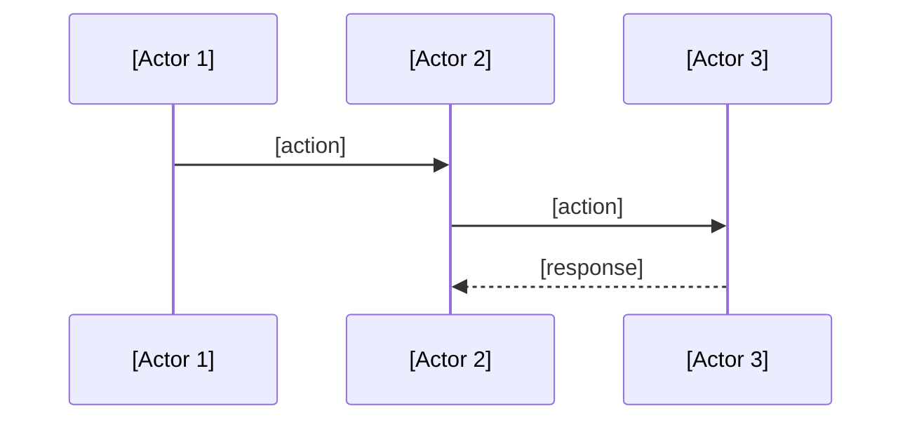

Adhere with strict discipline: keep everything robust, coherent, simplest possible. If anything complicates or is vague, stop immediately.

Template: Technical Solution Design
Goal: capture technical solution design in minimalest possible way
Criteria: 0 unnecessary verbiage, 0 unnecessary characters

# Technical Solution: [Name]

## Architecture
- [Actor 1] does [single responsibility]
- [Actor 2] does [single responsibility]
- [Actor 3] does [single responsibility]
...



## Types
```typescript
interface [Name] {
  [field]: [type]
}
```

## Behaviors
- When [event], [actor] does [action] → [result]
- When [event], [actor] does [action] → [result]

## Edge Cases
- When [failure], system [fallback behavior]
- When [failure], system [fallback behavior]

## ...
