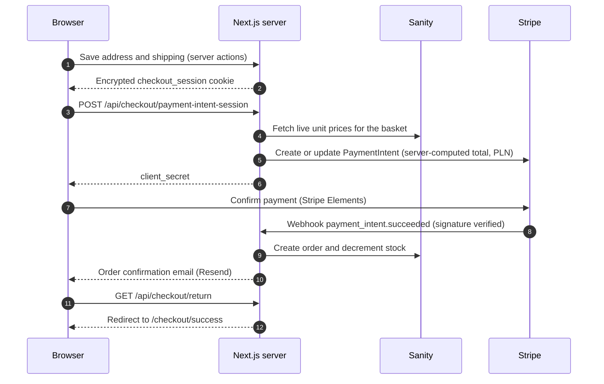

# Sang Logium

Production e-commerce platform for high-end audio gear (IEMs, headphones, DACs and amps, players, accessories), built and maintained solo over 18+ months.

**Live:** https://www.sanglogium.com

## Highlights

- **Custom checkout** (basket → address → shipping → payment → confirmation) on Stripe Payment Intents. Totals are re-derived on the server from live catalogue prices; the client's number is never trusted.
- **500+ product catalogue** with URL-driven faceted filtering and sorting, search, brand pages and product pages. Content is managed in Sanity, with the Studio embedded at `/studio`.
- **Own authentication** (Better Auth on Turso): email verification, password reset, optional Google sign-in, two-factor, and an account area with orders, addresses, wishlist, data export and account deletion.
- **Polish market first:** PLN pricing, Polish address validation against the TERYT registry, live AlleKurier shipping rates. Packlink PRO covers non-Polish destinations.
- **Engineering guardrails:** a custom ESLint plugin that encodes architecture rules, written ADRs, contract-style tests and web-vitals performance budgets.
- **AI-assisted delivery:** Claude plans and audits, Devin implements. See [How it's built](#how-its-built).

## Architecture

### Repository map

| Path | What lives there |
| --- | --- |
| `app/(store)/` | Public storefront: home, `products/[...slug]`, `product/[slug]`, `brand/[slug]`, search, account, sign-in/up, policy pages |
| `app/checkout/` | Checkout funnel pages: `address`, `shipping`, `payment`, `success` |
| `app/api/` | Route handlers: checkout, Stripe webhook, auth, shipping rates, address autocomplete, newsletter, account export, cache revalidation |
| `app/actions/` | Server actions (address and checkout steps) |
| `app/components/` | UI: `ui`, `common`, `layout`, `features`, `skeletons`, `analytics` |
| `app/(studio)/studio/` | Embedded Sanity Studio |
| `lib/` | Domain logic: `checkout`, `shipping`, `address`, `auth`, `catalogue`, `filter-sort`, plus `session.ts`, `stripe.ts`, `email.ts` |
| `sanity-cms/` | Sanity schemas (`schemaTypes/`), clients (`lib/`), and import, update and migration scripts |
| `data/` | Generated catalogue index and per-brand product datasets |
| `store/` | Zustand basket store |
| `tests/` | Playwright and integration tests, fixtures, test conventions |
| `docs/` | ADRs, system synopses, UX audits, diagrams (see [Documentation](#documentation)) |
| `_project/` | Build methodology, plans, audits, lessons learned |
| `scripts/` | Build-time catalogue index, one-off data maintenance and audit scripts |

### Checkout flow



- Checkout state lives in an encrypted, HTTP-only iron-session cookie (`checkout_session`, 1 hour TTL). Each page guards against funnel-jumping, and editing the address invalidates every downstream shipping field.
- Both the webhook and the return handler call `createOrderFromPaymentIntent`, which skips creation if an order for that PaymentIntent already exists.
- Full trace with session fields, guards and diagrams: [`docs/checkout/CHECKOUT-SYNOPSIS.md`](docs/checkout/CHECKOUT-SYNOPSIS.md).

### Catalogue: build-time index

`npm run build` first runs [`scripts/build-catalogue-index.mjs`](scripts/build-catalogue-index.mjs), which reads the category structure from Sanity, validates that every product's `catalogueLocationKeys` point at real slots, and writes `data/catalogue-index.json` (tree, slug-to-id map, slot metadata). [`data/catalogue.ts`](data/catalogue.ts) serves it, so navigation and slug resolution need no runtime query. A Sanity webhook calls `/api/revalidate`, which revalidates the `catalogue-index` cache tag.

### Key decisions

| Decision | Where |
| --- | --- |
| **Server-authoritative pricing.** The Payment Intent amount is recomputed from Sanity prices plus the session's shipping cost. | [`app/api/checkout/payment-intent-session/route.ts`](app/api/checkout/payment-intent-session/route.ts) |
| **Payment Intents are created in a Route Handler, not during Server Component rendering**, because the session cookie can't be written mid-render. | [`app/api/checkout/`](app/api/checkout) |
| **Signature-verified webhook on the raw body**, plus a Stripe idempotency key per checkout session. | [`app/api/webhooks/stripe/route.ts`](app/api/webhooks/stripe/route.ts) |
| **Tiered inventory concurrency** for restockable vs. rare single-unit items. | [`docs/checkout/ADR-002-checkout-inventory-concurrency.md`](docs/checkout/ADR-002-checkout-inventory-concurrency.md) |
| **Build-time catalogue index** instead of live-querying the category tree per request. | [`scripts/build-catalogue-index.mjs`](scripts/build-catalogue-index.mjs) |
| **Architecture rules as lint rules:** no direct Sanity access from client components, GROQ reference syntax, no `cloneElement`, server components by default. | [`eslint-plugin-sang-logium.cjs`](eslint-plugin-sang-logium.cjs) |
| **Native `inlineCss` instead of `optimizeCss`.** The critters post-processor buffers the whole response and defeats streaming. | [`next.config.ts`](next.config.ts) |
| **Custom image loader** for Sanity's CDN, with AVIF/WebP output and a one-year cache TTL. | [`next.config.ts`](next.config.ts) |
| **Category listings stream product chunks** through Suspense. | [`app/components/features/products/ChunkedProductGrid.tsx`](app/components/features/products/ChunkedProductGrid.tsx) |

## Tech stack

**Framework & language:** Next.js 15 (App Router) · React 19 · TypeScript · Node 22

**CMS & data:** Sanity v3 (`next-sanity`, embedded Studio) · Turso / libSQL (auth database, via Kysely)

**Payments:** Stripe (Payment Intents, Elements, webhooks), PLN

**Auth & session:** Better Auth (email and password, Google OAuth, two-factor) · iron-session (encrypted checkout cookie)

**Email:** Resend (auth, order confirmation, newsletter audience)

**Shipping:** AlleKurier (Poland) · Packlink PRO (non-Polish destinations and fallback)

**Address handling:** TERYT registry validation (default) · Photon / OpenStreetMap street autocomplete · Nominatim validator · Google Address Validation (kept behind `ADDRESS_VERIFY_MODE=google`)

**State, forms, URL:** Zustand · React Hook Form · Zod · nuqs (filter and sort state in the URL) · SWR

**UI:** Tailwind CSS 3 · Radix UI primitives · vaul · Phosphor icons

**Observability:** Sentry (errors and traces) · Vercel Speed Insights · Google Analytics · web-vitals reporting endpoint · checkout event tracing

**Testing:** Vitest and Testing Library (unit, component, integration) · Playwright (E2E, checkout, performance)

**Hosting & CI:** Vercel, deployed from GitHub Actions

## Getting started

**Prerequisites:** Node 22 (see `.node-version`), npm, a Sanity project you control, a Turso database, Stripe test keys and the [Stripe CLI](https://docs.stripe.com/stripe-cli).

```bash
git clone https://github.com/munrhalls/sang-logium.git
cd sang-logium
npm install --legacy-peer-deps   # same flag Vercel uses (see vercel.json)
```

1. Create a `.env` file in the repo root and fill in the [environment variables](#environment-variables). Use `.env`, not `.env.local`: both Next.js and the catalogue prebuild script (which loads `.env` explicitly) read it.
2. Catalogue content lives in Sanity, not in this repo. Schemas are in [`sanity-cms/schemaTypes/`](sanity-cms/schemaTypes); import helpers are in [`sanity-cms/upload/`](sanity-cms/upload) and [`sanity-cms/utils/`](sanity-cms/utils).
3. Start the dev server:

   ```bash
   npm run dev
   ```

   Don't pass `--turbo`. The custom image loader path (`images.loaderFile`) doesn't resolve under Turbopack on Windows.
4. In a second terminal, forward Stripe webhooks and copy the printed signing secret into `STRIPE_WEBHOOK_SECRET`:

   ```bash
   stripe listen --forward-to localhost:3000/api/webhooks/stripe
   ```
5. Pay with a Stripe test card such as `4242 4242 4242 4242`, any future expiry, any CVC.

Production build: `npm run build && npm start`. The build needs `NEXT_PUBLIC_SANITY_PROJECT_ID` and `NEXT_PUBLIC_SANITY_DATASET` in `.env` and network access to Sanity, because the prebuild step reads the catalogue.

## Environment variables

The app fails fast when a required variable is missing.

| Group | Variable | Notes |
| --- | --- | --- |
| Sanity | `NEXT_PUBLIC_SANITY_PROJECT_ID` | **Required** |
| | `NEXT_PUBLIC_SANITY_DATASET` | Defaults to `production` (`test` under Vitest when unset) |
| | `NEXT_PUBLIC_SANITY_API_VERSION` | Optional, defaults to `2024-11-14` |
| | `SANITY_STUDIO_READ_WRITE` | **Required.** Server-side write token used for orders, stock and profiles |
| | `SANITY_STUDIO_READ_WRITE_CREATE`, `SANITY_API_TOKEN` | Optional. Tokens for the Studio client and import scripts |
| | `SANITY_STUDIO_PROJECT_ID`, `SANITY_STUDIO_DATASET` | Optional. Used by the Sanity CLI |
| App | `NEXT_PUBLIC_BASE_URL` | Public origin. Used in emails and auth |
| Auth | `DATABASE_URL` | **Required.** Turso `libsql://…` URL |
| | `TURSO_AUTH_TOKEN` | **Required** |
| | `BETTER_AUTH_SECRET` | **Required** |
| | `BETTER_AUTH_URL` | Optional. Overrides `NEXT_PUBLIC_BASE_URL` for auth |
| | `BETTER_AUTH_SECRETS` | Optional. Versioned secrets for rotation, as `version:secret,…` |
| | `GOOGLE_CLIENT_ID`, `GOOGLE_CLIENT_SECRET` | Optional. Both together enable Google sign-in |
| Checkout | `SESSION_SECRET` | Set in every environment. Long random string that encrypts the checkout cookie |
| | `STRIPE_SECRET_KEY` | **Required** |
| | `NEXT_PUBLIC_STRIPE_PUBLISHABLE_KEY` | **Required** |
| | `STRIPE_WEBHOOK_SECRET` | **Required** for order creation via webhook |
| Email | `RESEND_API_KEY` | Emails are logged to the console when unset |
| | `RESEND_FROM_EMAIL` | Defaults to `onboarding@resend.dev` |
| | `RESEND_AUDIENCE_ID` | Newsletter signup |
| Shipping | `ALLEKURIER_EMAIL`, `ALLEKURIER_PASSWORD` | Polish rate quotes |
| | `PACKLINK_PRO_API` | Non-Polish rate quotes and fallback |
| | `SENDER_ADDRESS_PL_NAME`, `_STREET`, `_CITY`, `_ZIP`, `_PHONE`, `_EMAIL` | Origin address for Polish shipments. `SENDER_ADDRESS_DEFAULT_*` is the fallback (see `app/api/shipping/rates/route.ts`) |
| Address | `ADDRESS_VERIFY_MODE` | `teryt` (default) or `google` |
| | `TERYT_USER`, `TERYT_PASS`, `TERYT_ENDPOINT` | TERYT registry access |
| | `GOOGLE_ADDRESS_VALIDATION_API_KEY` | Only for `ADDRESS_VERIFY_MODE=google` |
| | `AUTOCOMPLETE` | Set to `off` to disable street autocomplete |
| Observability | `NEXT_PUBLIC_SENTRY_DSN` | Sentry |
| | `NEXT_PUBLIC_GA_MEASUREMENT_ID` | Google Analytics |
| | `NEXT_PUBLIC_WEB_VITALS_SAMPLE_RATE`, `NEXT_PUBLIC_DISABLE_WEB_VITALS` | Web-vitals reporting |
| | `LOG_LEVEL` | `log`, `warn` (default) or `error` |
| Dev only | `CHECKOUT_SEED_SECRET` | Guards the `/checkout-seed` test route, which is disabled in production |
| | `ANALYZE=true` | Enables the bundle analyzer |

## Scripts

| Command | What it does |
| --- | --- |
| `npm run dev` | Dev server on `localhost:3000` |
| `npm run build` | Builds the catalogue index (`prebuild`), then `next build` |
| `npm start` / `npm run prod` | Serve a production build / build then serve |
| `npm run lint` / `lint-strict` | ESLint, including the custom `sang-logium` rules (`lint-strict` fails on warnings) |
| `npm run ts-check` | `tsc --noEmit` |
| `npm run typegen` | Extract the Sanity schema and generate types |
| `npm run analyze` | Production build with the bundle analyzer |
| `npm test` / `test:watch` / `test:coverage` | Vitest unit and component tests |
| `npm run test:integration` | Vitest integration suite (sequential, single worker) |
| `npm run test:e2e` | Playwright basket-page E2E (starts the dev server) |
| `npm run test:checkout:fast` | Playwright checkout tests. Expects a dev server already running |
| `npm run test:performance` | Playwright web-vitals budgets |

## Testing

- **Vitest** runs unit, component and integration tests. The integration suite runs sequentially against real services, so point it at a dedicated Sanity dataset. The search robustness suite queries real Sanity data instead of mocks.
- **Playwright** covers the basket page, the checkout address flow (including a regression suite) and performance budgets on the home, category and product pages: LCP ≤ 3 s, FCP ≤ 2 s, TTFB ≤ 600 ms, CLS ≤ 0.1.
- **Conventions:** contract-style `describe` blocks named after the system and its operations, and Arrange-Act-Assert in every test. See [`tests/AGENTS.md`](tests/AGENTS.md), [`tests/TestsContractConvention.md`](tests/TestsContractConvention.md) and [`docs/testing/`](docs/testing).

## CI/CD and hosting

Vercel's own Git auto-deploy is turned off (`vercel.json` sets `git.deploymentEnabled: false`). [`.github/workflows/vercel-deploy.yml`](.github/workflows/vercel-deploy.yml) deploys production on every push to `main`, and can also be run manually. It runs `vercel pull`, `vercel build --prod` and `vercel deploy --prebuilt --prod`, and needs three repository secrets: `VERCEL_TOKEN`, `VERCEL_ORG_ID` and `VERCEL_PROJECT_ID`.

## Documentation

| Topic | Start here |
| --- | --- |
| Checkout system (source-derived trace) | [`docs/checkout/CHECKOUT-SYNOPSIS.md`](docs/checkout/CHECKOUT-SYNOPSIS.md) |
| Inventory concurrency ADR | [`docs/checkout/ADR-002-checkout-inventory-concurrency.md`](docs/checkout/ADR-002-checkout-inventory-concurrency.md) |
| Basket architecture ADR | [`docs/basket/MAJOR ADR.md`](docs/basket/MAJOR%20ADR.md) |
| Homepage data fetching and composition | [`docs/homepage-structure.md`](docs/homepage-structure.md) |
| Design system | [`docs/design-system.md`](docs/design-system.md) |
| Layout and vertical-space gotchas | [`docs/vertical-space-lg-touch.md`](docs/vertical-space-lg-touch.md) |
| Performance monitoring | [`docs/performance/MONITORING_SETUP.md`](docs/performance/MONITORING_SETUP.md) |
| Testing principles | [`docs/testing/TEST_FIRST_PRINCIPLES.md`](docs/testing/TEST_FIRST_PRINCIPLES.md) |
| Auth and account audits | [`docs/auth/`](docs/auth) |
| Diagrams | [`docs/diagrams/`](docs/diagrams) |

## How it's built

Development follows a plan, execute, audit loop. Claude does planning, task breakdown and audits. Devin (and Claude Code) implement, working from written specs and Mermaid diagrams that act as execution blueprints.

- Method: [`_project/00-MOST-IMPORTANT-lean-tracer-bullet-methodology.md`](_project/00-MOST-IMPORTANT-lean-tracer-bullet-methodology.md)
- Agent rules and repo conventions: [`AGENTS.md`](AGENTS.md), [`CLAUDE.md`](CLAUDE.md)
- Lessons that cost real time: [`_project/AI_LESSONS.md`](_project/AI_LESSONS.md)

## Status and known limitations

- Poland is the primary market. GB and DE destinations are quoted through Packlink at checkout, and the basket-page shipping estimate for those countries is still a placeholder.
- Content and order management run through Sanity Studio. The `app/(admin)` route group is a placeholder for a future custom back-office.
- Google Address Validation is retained but frozen until a multi-country launch.
