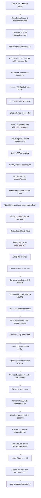

```mermaid
flowchart TD
    A[User clicks Checkout Button] --> B[EventDeduplicator: 1-second debounce]
    B --> C[Generate UUIDv4 idempotency key]
    C --> D[POST /api/checkout/reserve]
    D --> E[API validates Content-Type & Idempotency-Key]
    E --> F[API parses clientBasket from body]
    F --> G[Initialize FIFOQueue with Redis]
    G --> H[Check circuit breaker state]
    H --> I[Check idempotency cache]
    I --> J[Store idempotency key with empty response]
    J --> K[Enqueue job to BullMQ normal queue]
    K --> L[Return 202 processing]
    L --> M[BullMQ Worker receives job]
    M --> N[processJob calls processRequest]
    N --> O[handleReservationCreation called]
    O --> P[AtomicReservationManager.reserveStock]
    P --> Q[Phase 1: Fetch products from Sanity]
    Q --> R[Calculate available stock]
    R --> S[Redis WATCH on stock_lock keys]
    S --> T[Check for conflicts]
    T --> U[Redis MULTI transaction]
    U --> V[Set stock_lock keys with 5-min TTL]
    V --> W[Set reservation key with 10-min TTL]
    W --> X[Phase 2: Sanity transaction]
    X --> Y[Increment reservedStock for each product]
    Y --> Z[Commit Sanity transaction]
    Z --> AA[Phase 3: Commit Redis locks]
    AA --> AB[Update reservation status to active]
    AB --> AC[Update idempotency cache with success]
    AC --> AD[Reset circuit breaker]
    AD --> AE[API returns 200 with reserved basket]
    AE --> AF[CheckoutButton receives response]
    AF --> AG[Zustand store saves reserved basket]
    AG --> AH[ReservedBasketView reads basketStatus]
    AH --> AI[basketStatus === full]
    AI --> AJ[Render full state with Proceed button]
    AJ --> AK[User proceeds to next step]
```
