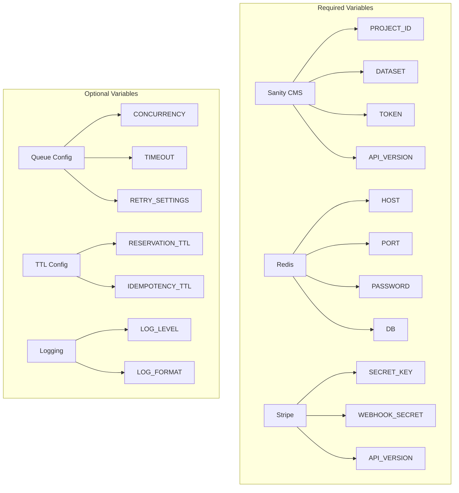
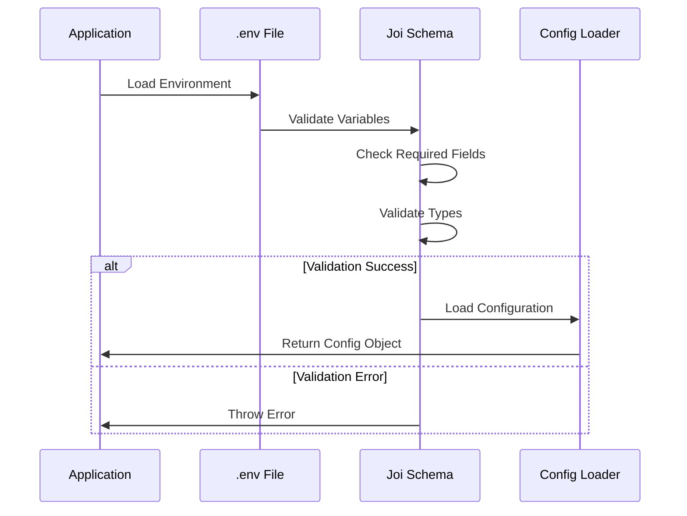
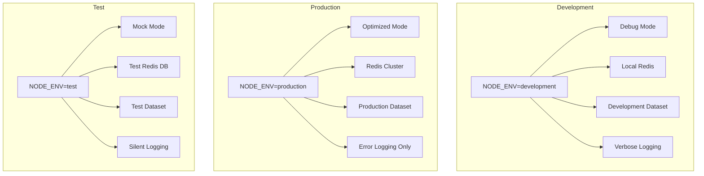
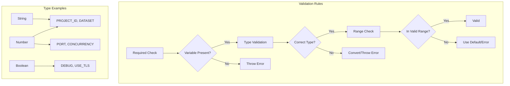
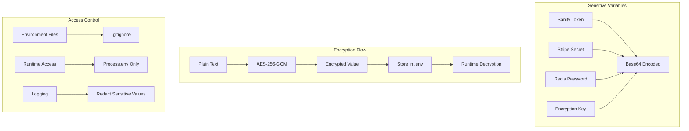
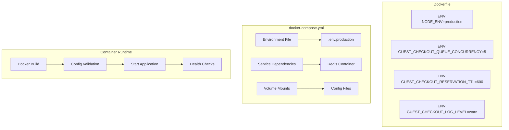
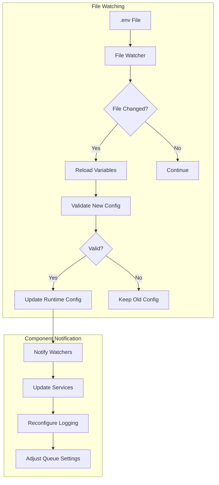
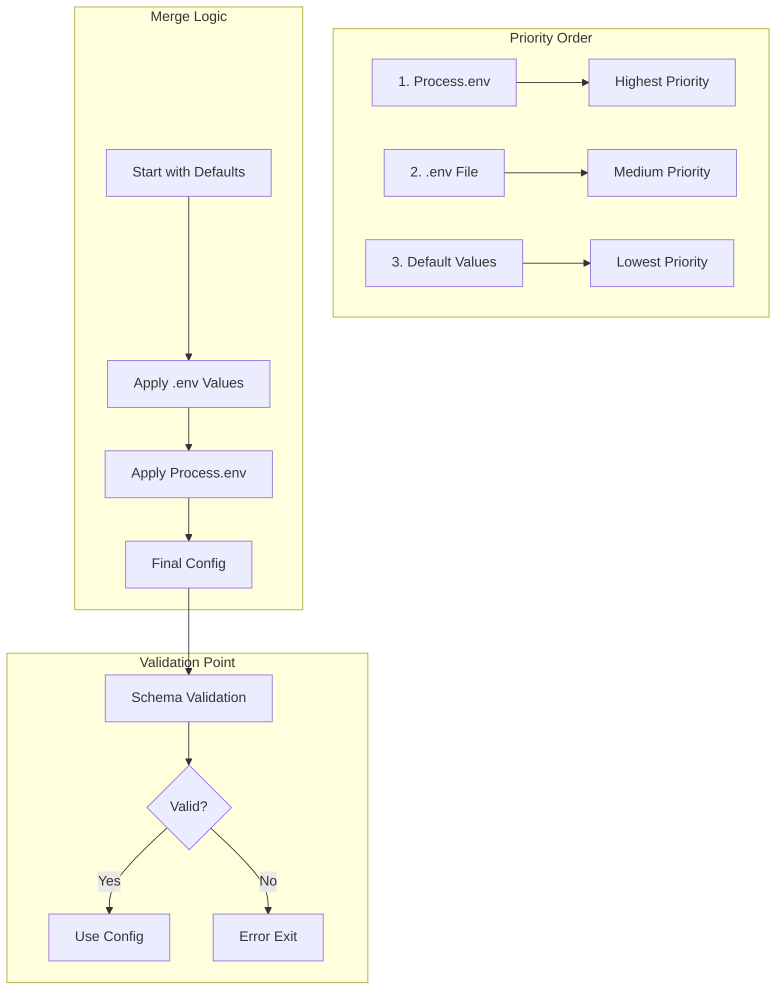
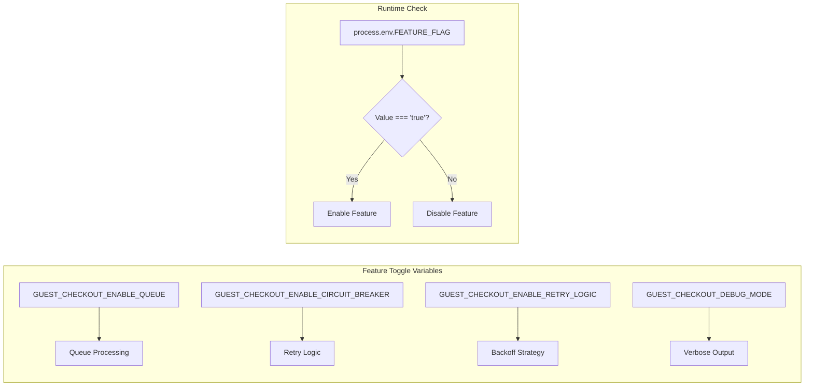
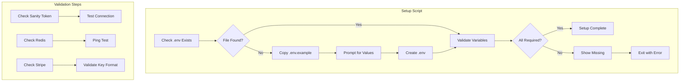

# Environment Variables Diagram

## Variable Categories

## Configuration Loading Flow

## Environment-Specific Configurations

## Variable Validation Schema

## Security Configuration

## Docker Configuration

## Runtime Configuration Updates

## Configuration Hierarchy

## Feature Flags

## Environment Setup Script

