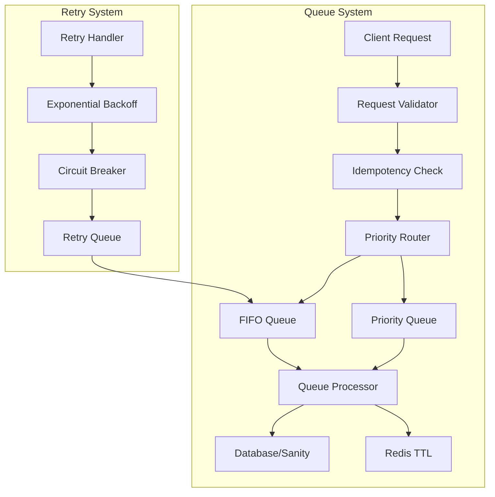
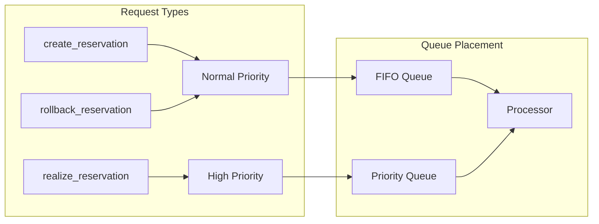
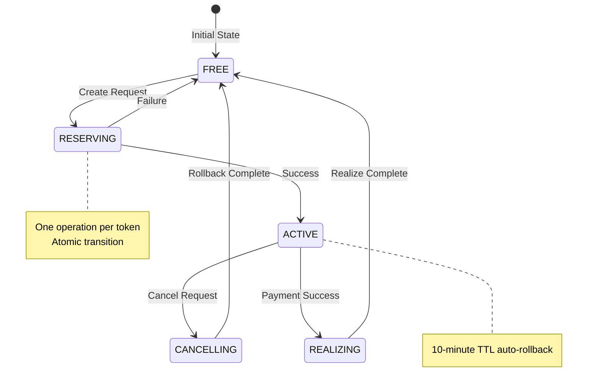
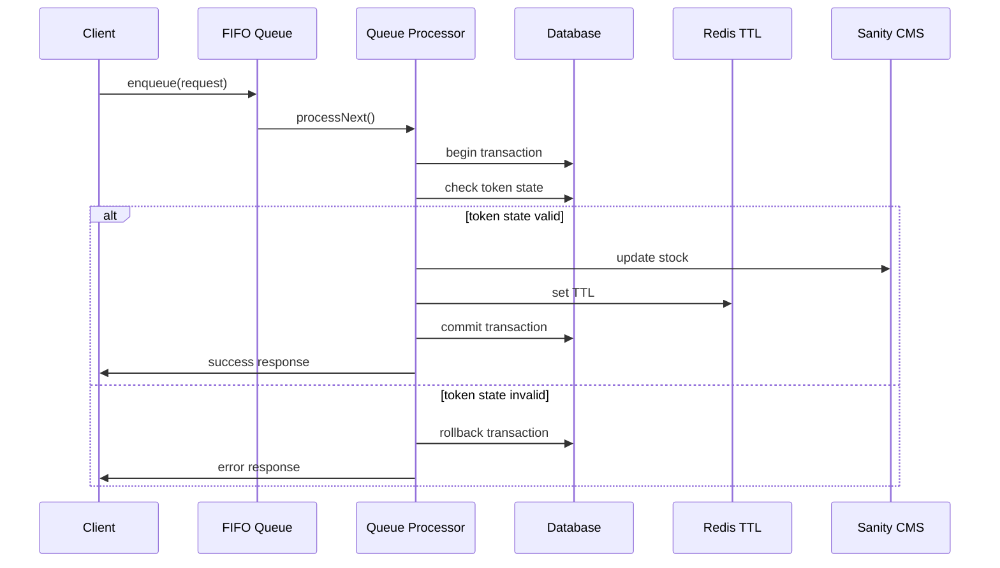
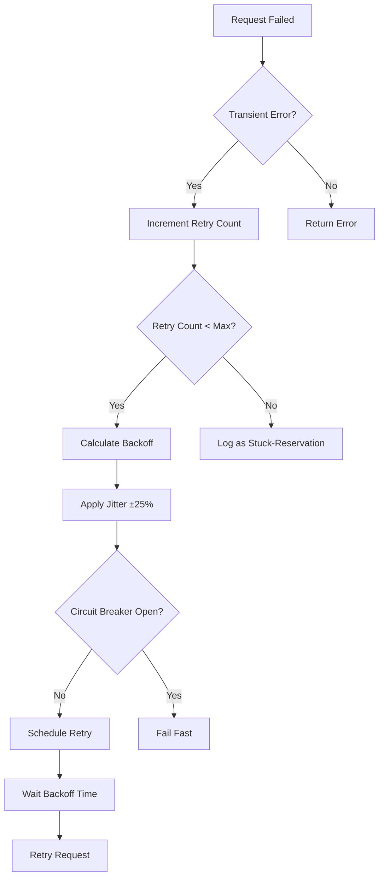
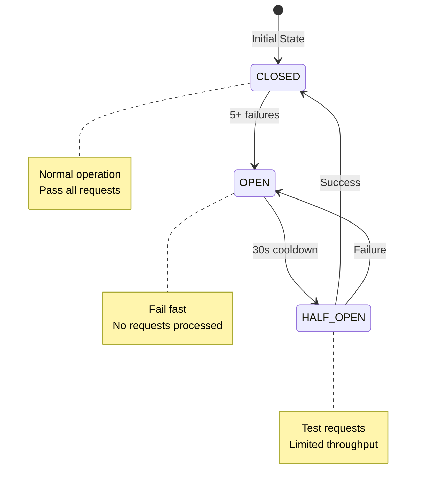
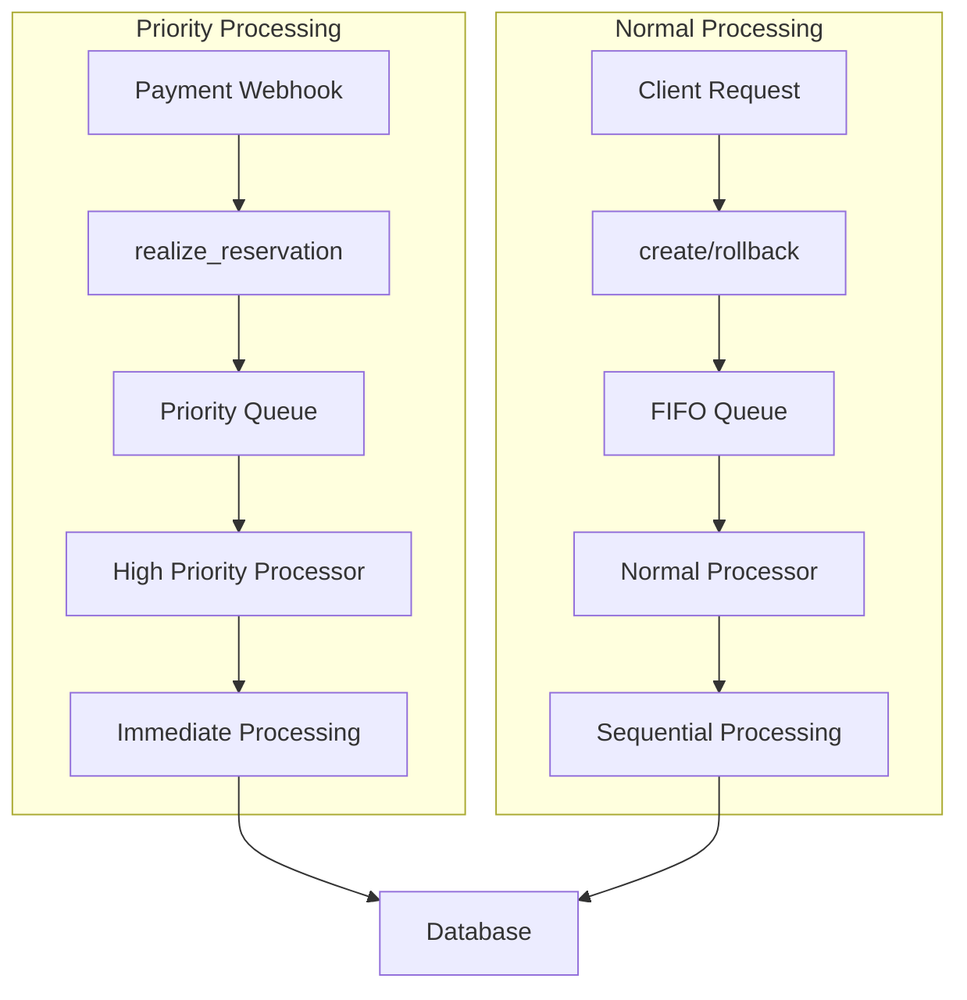
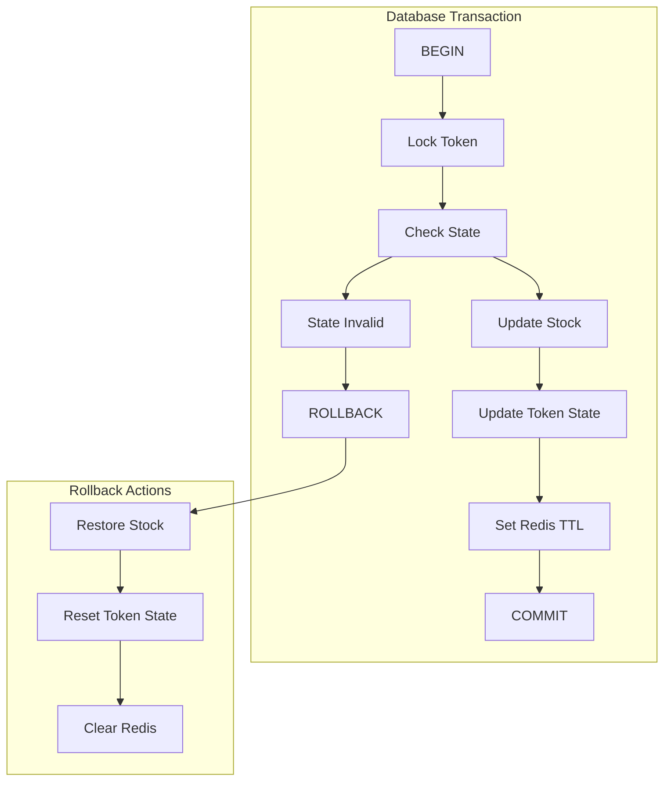
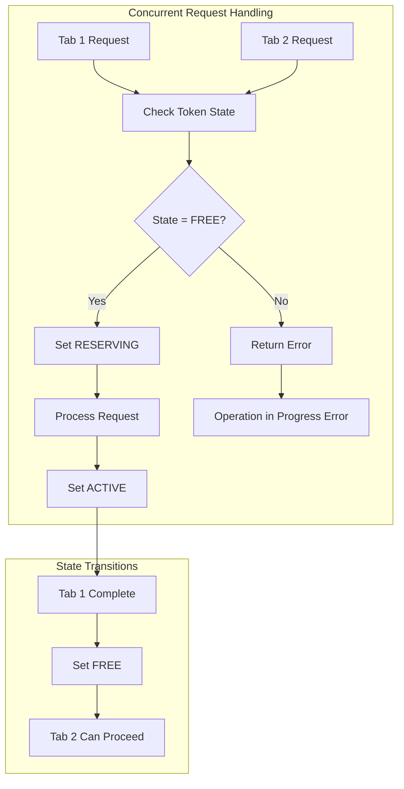
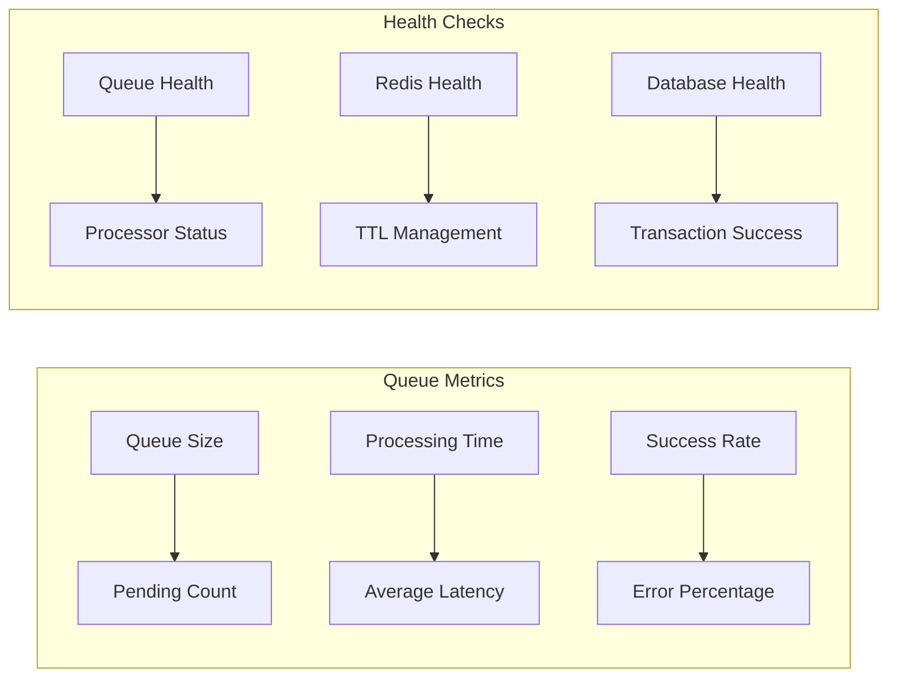

# FIFO Queue Functionality Diagram

## Queue Architecture Overview



## Request Flow Types



## Queue Request Structure

```mermaid
graph TD
    subgraph "QueueRequest"
        A[id: UUID]
        B[type: QueueRequestType]
        C[reservationToken?: string]
        D[idempotencyKey: string]
        E[payload: ClientBasket | metadata]
        F[priority: 'normal' | 'high']
        G[createdAt: Date]
        H[retryCount: number]
        I[lastRetryAt?: Date]
    end

    subgraph "QueueRequestType"
        B --> J[create_reservation]
        B --> K[rollback_reservation]
        B --> L[realize_reservation]
    end
```

## Token State Machine



## Queue Processing Flow



## Retry Logic Flow



## Circuit Breaker States



## Priority Queue Processing



## Atomic Operations



## Multi-tab Protection



## Monitoring and Health


