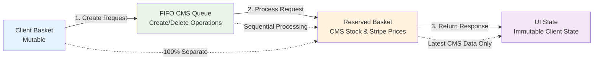
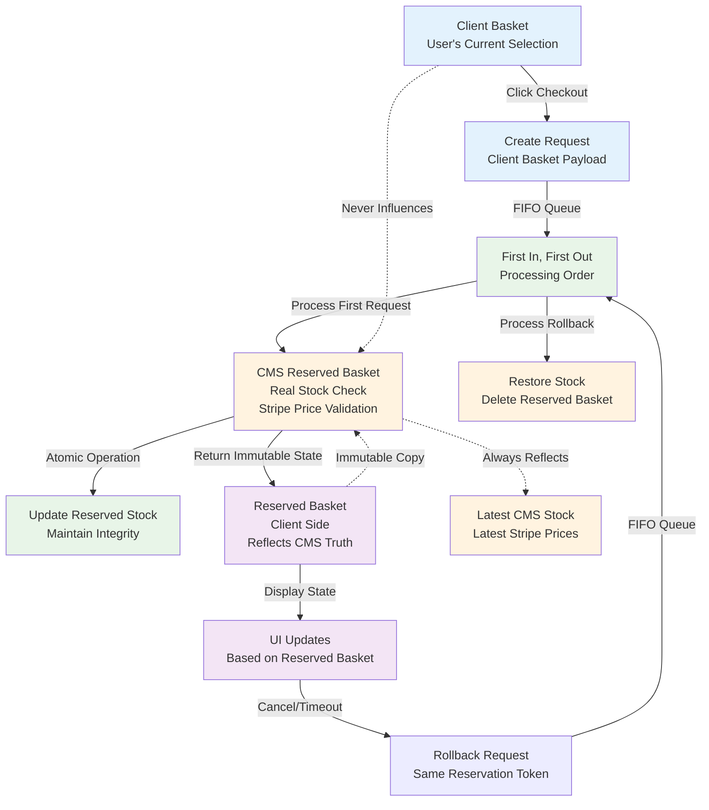
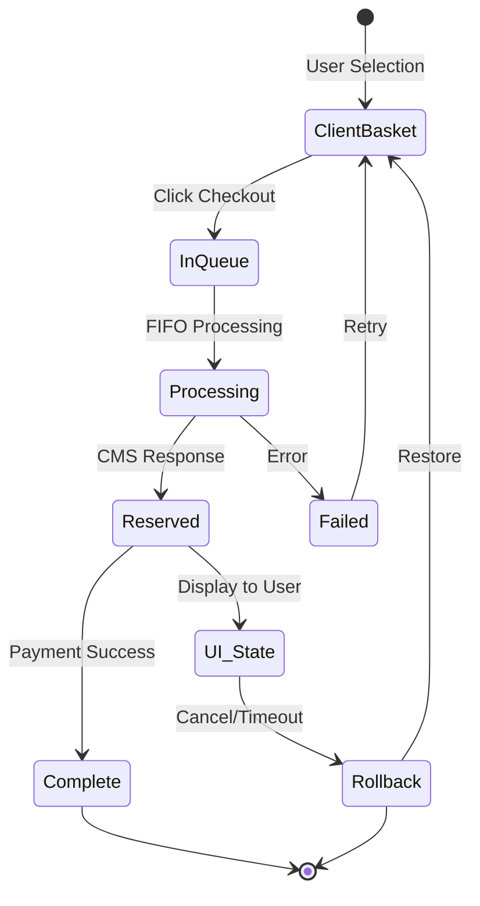

# Guest Checkout Inventory Reservation - Core Idea Diagram

## Invariant Relationships

## Core Flow

## Key Invariant Rules

### 1. Client Basket Separation
- **Rule**: Client basket NEVER influences reserved basket
- **Flow**: Client basket is input only, never referenced again
- **Purpose**: Prevents stale data from affecting reservations

### 2. CMS Data Authority
- **Rule**: Reserved basket ALWAYS reflects latest CMS data
- **Flow**: Fresh stock check and price validation on each reservation
- **Purpose**: Ensures inventory accuracy and pricing consistency

### 3. FIFO Queue Processing
- **Rule**: Requests processed sequentially, never concurrently
- **Flow**: First request completes before second starts
- **Purpose**: Maintains data integrity and prevents race conditions

### 4. Immutable Client State
- **Rule**: Reserved basket state is immutable on client
- **Flow**: Only replaced by new CMS response, never modified
- **Purpose**: Prevents client-side corruption of reservation data

## State Transformations

## Data Flow Invariants

| Component | Input | Output | Invariant |
|-----------|-------|--------|-----------|
| Client Basket | User Selection | Request Payload | Mutable, user-controlled |
| FIFO Queue | Request Payload | Processing Order | Sequential, first-in-first-out |
| Reserved Basket | CMS Data | Immutable State | Latest stock & prices only |
| UI State | Reserved Basket | User Display | Immutable copy of CMS data |
