# Monitoring and Logging Diagram

## Logging Architecture

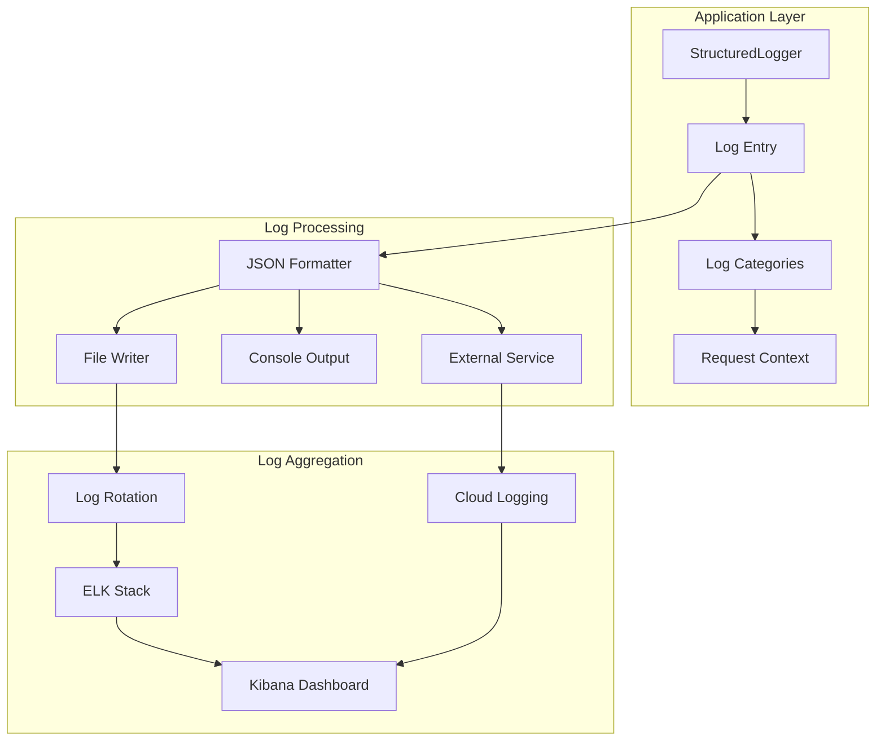

## Log Entry Structure

```mermaid
graph TD
    subgraph "LogEntry"
        A[timestamp: ISO 8601]
        B[level: LogLevel]
        C[category: LogCategory]
        D[message: string]
        E[requestId?: string]
        F[reservationToken?: string]
        G[userId?: string]
        H[component: string]
        I[duration?: number]
        J[error?: ErrorObject]
        K[metadata?: Record]
        L[tags?: string[]]
    end
    
    subgraph "ErrorObject"
        J --> M[name: string]
        J --> N[message: string]
        J --> O[stack?: string]
        J --> P[code?: string]
    end
```

## Log Levels and Categories

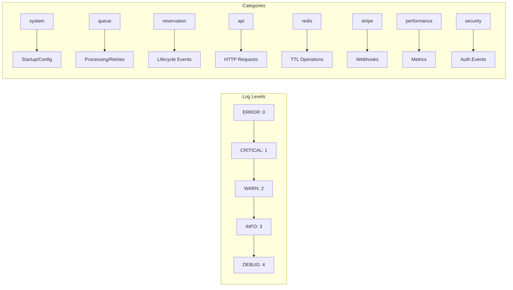

## Request Context Logging

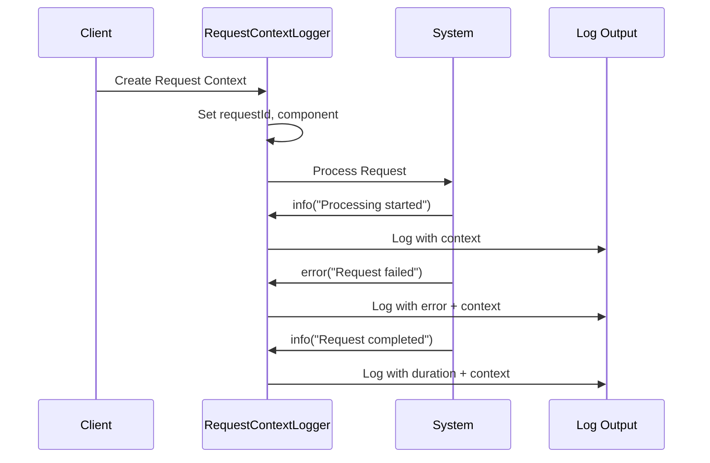

## Metrics Collection Architecture

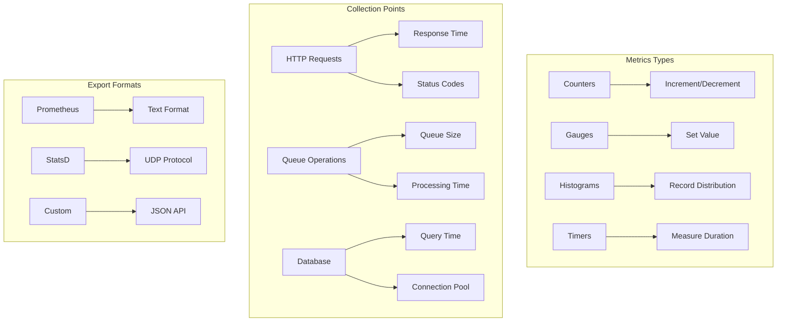

## Application Metrics

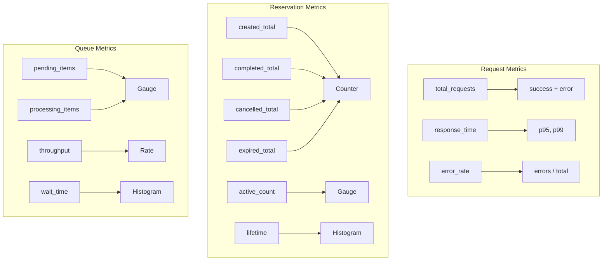

## Health Check System

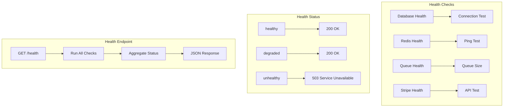

## Alerting System

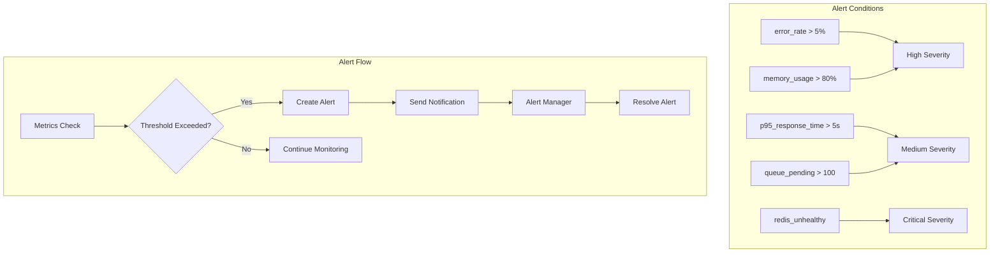

## Dashboard Configuration

```mermaid
graph TD
    subgraph "Grafana Panels"
        A[Request Rate] --> B[rate(http_requests_total)]
        C[Response Time] --> D[histogram_quantile(0.95)]
        E[Active Reservations] --> F[active_reservations]
        G[Queue Status] --> H[queue_pending + queue_processing]
        I[Error Rate] --> J[rate(http_errors_total)]
        K[Reservation Lifecycle] --> L[rate(reservations_*_total)]
    end
    
    subgraph "Dashboard Layout"
        M[Row 1: Traffic] --> N[Request Rate + Response Time]
        O[Row 2: Business] --> P[Reservations + Conversions]
        Q[Row 3: System] --> R[Queue + Errors]
        S[Row 4: Infrastructure] --> T[Memory + CPU]
    end
```

## Log Aggregation Pipeline

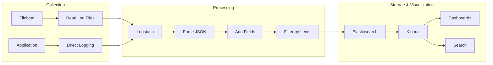

## APM Integration

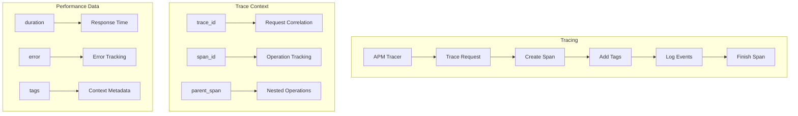

## Error Tracking Flow

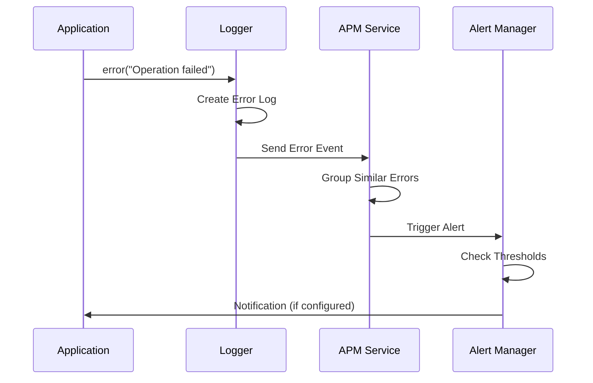

## Performance Monitoring

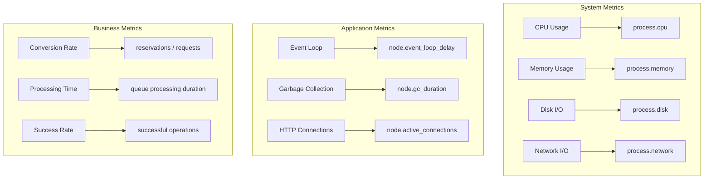
