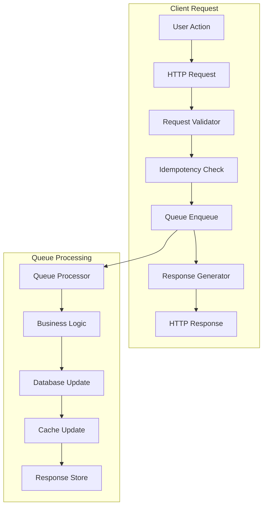
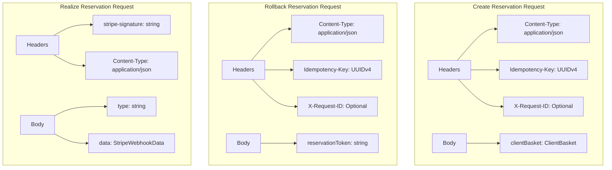
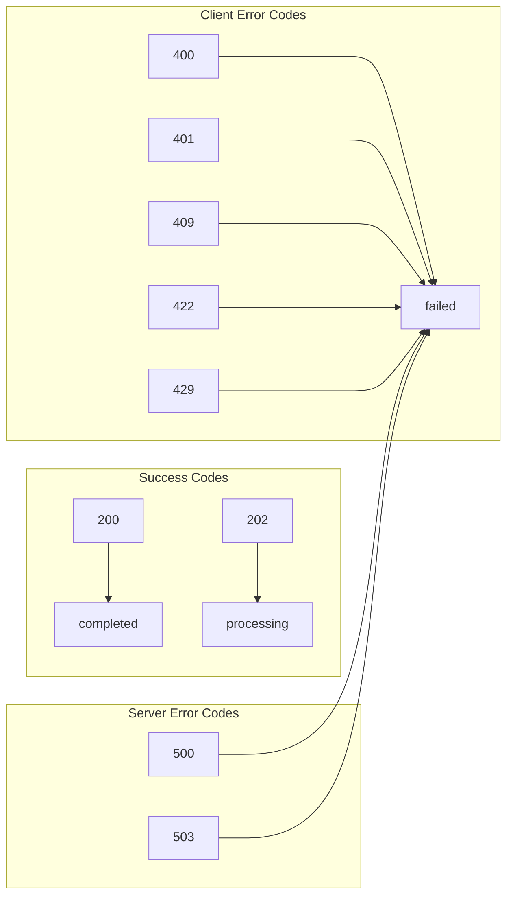
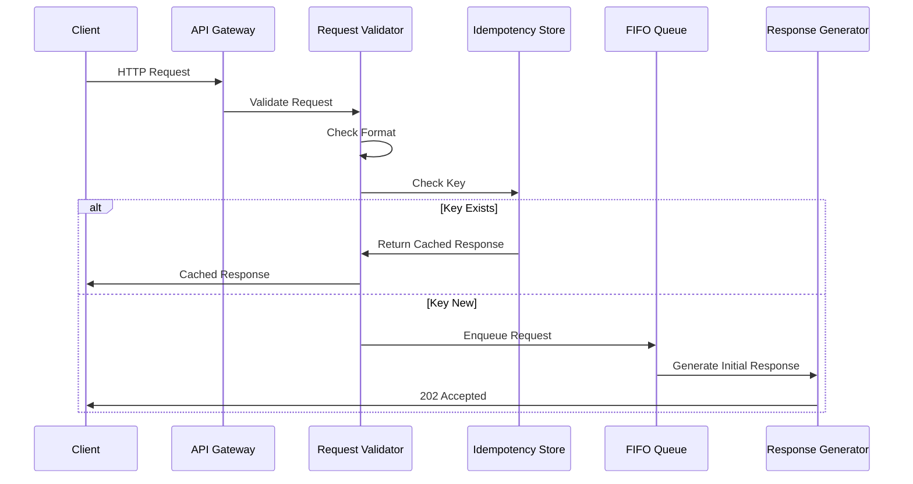
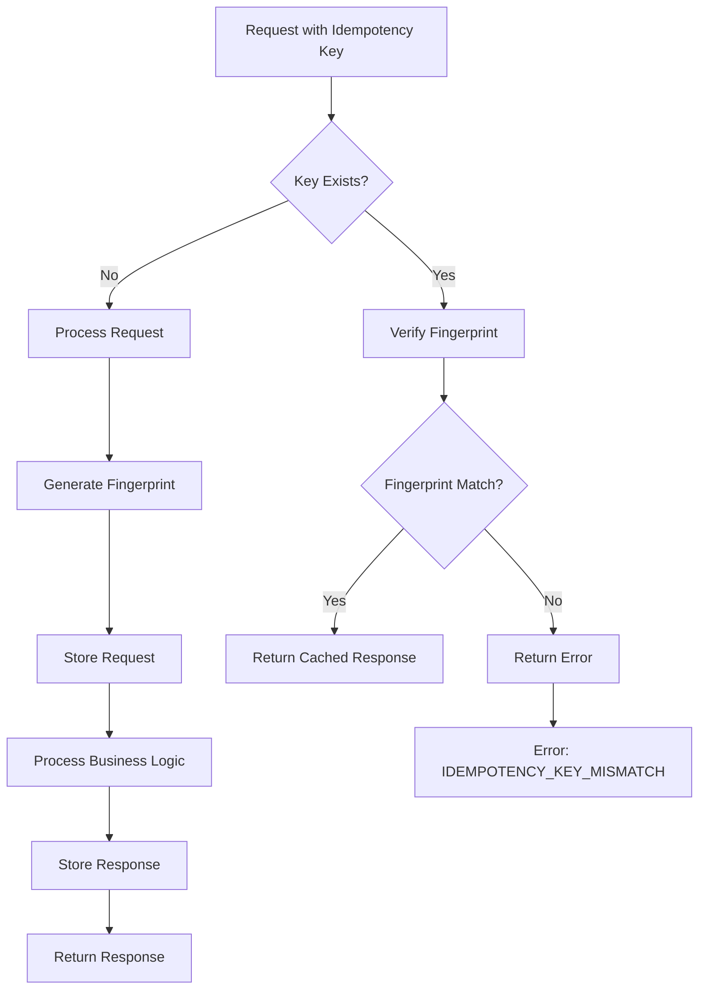
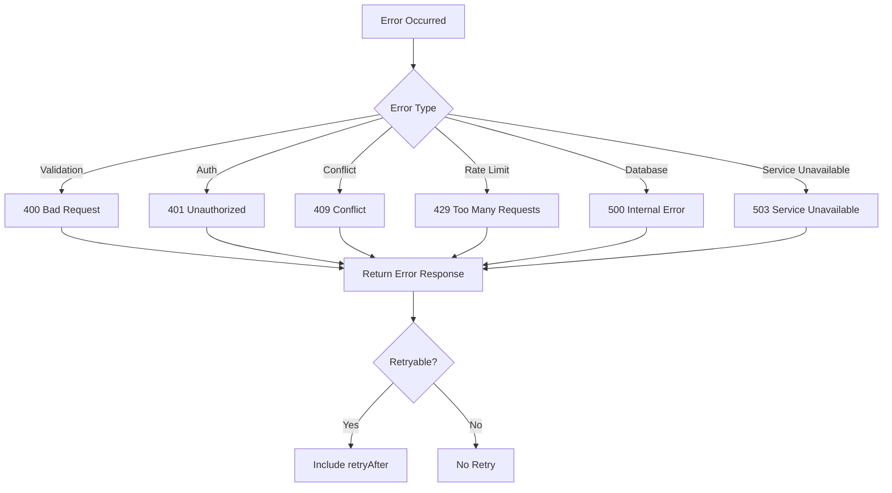
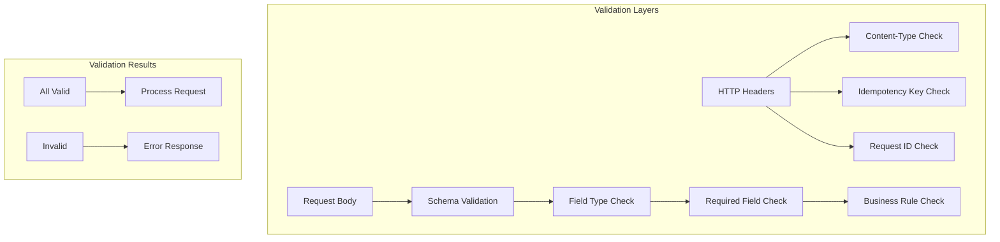
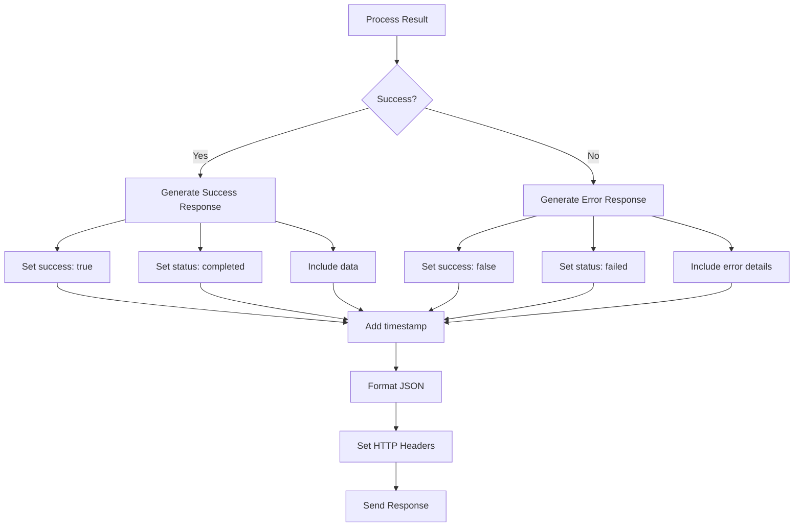
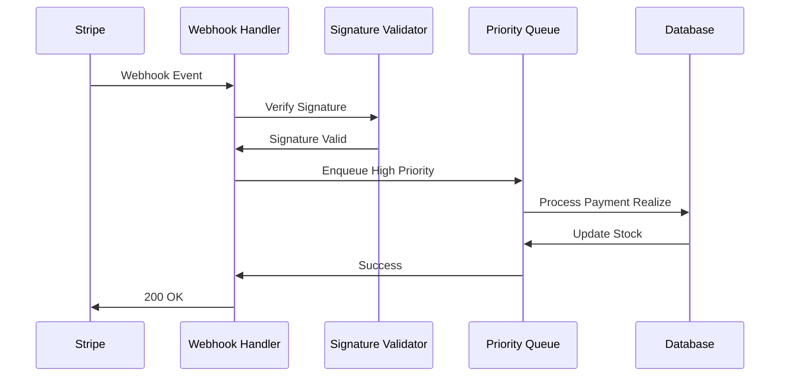
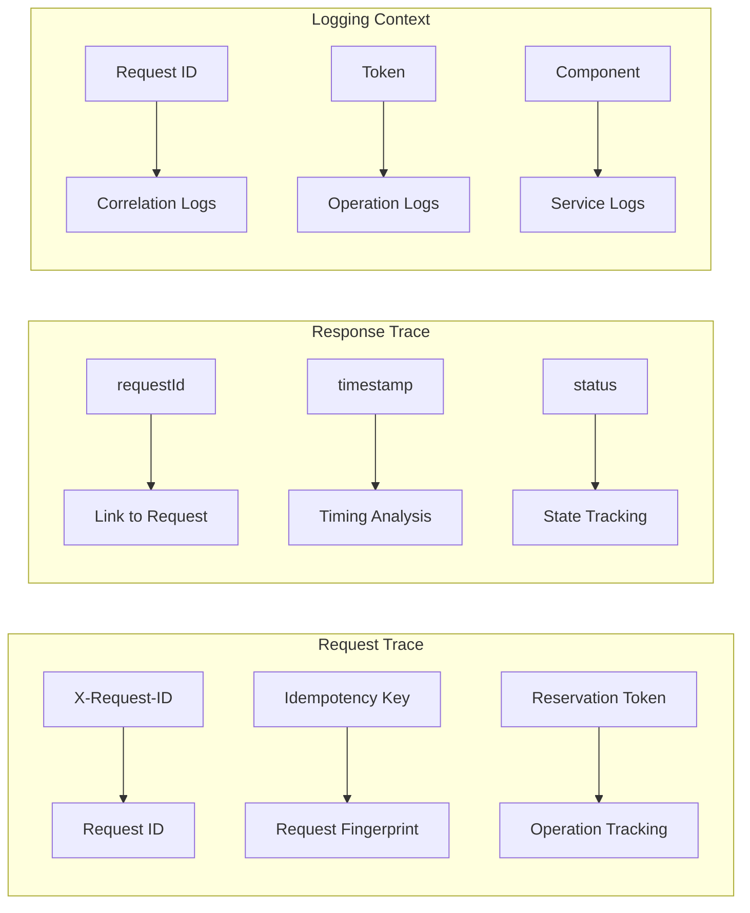

# Queue Request/Response Handling Diagram

## Request Flow Overview



## Request Structures



## Response Structures

```mermaid
graph TD
    subgraph "Success Response"
        A[success: true]
        B[requestId: string]
        C[status: 'completed' | 'processing']
        D[data: ReservedBasket]
        E[timestamp: string]
    end
    
    subgraph "Error Response"
        F[success: false]
        G[requestId: string]
        H[status: 'failed']
        I[error: ErrorObject]
        J[timestamp: string]
    end
    
    subgraph "Error Object"
        I --> I1[code: ErrorCode]
        I --> I2[message: string]
        I --> I3[details?: object]
        I --> I4[retryable?: boolean]
        I --> I5[retryAfter?: number]
    end
```

## HTTP Status Code Mapping



## Request Processing Flow



## Idempotency Flow



## Error Handling Flow



## Request Validation



## Response Generation



## Webhook Processing



## Request Trace Flow


