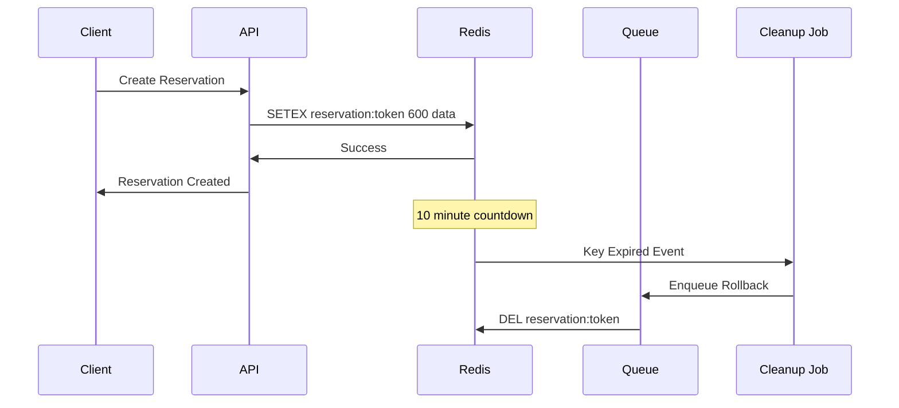
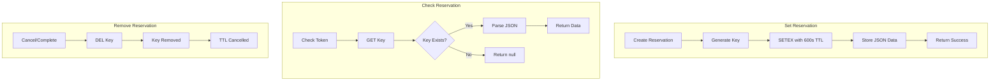
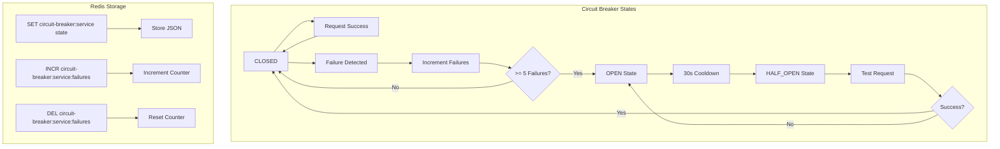
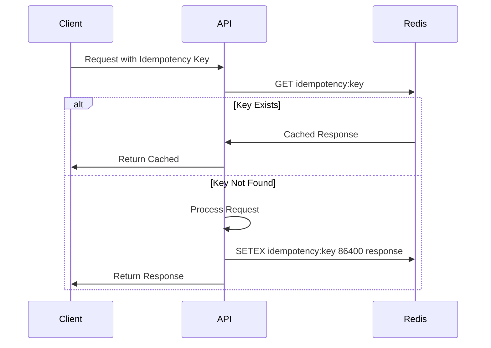
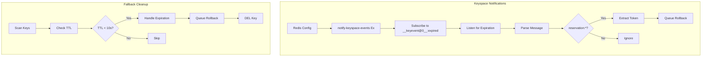
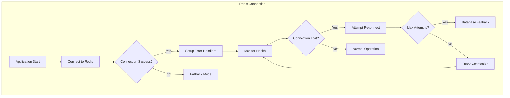
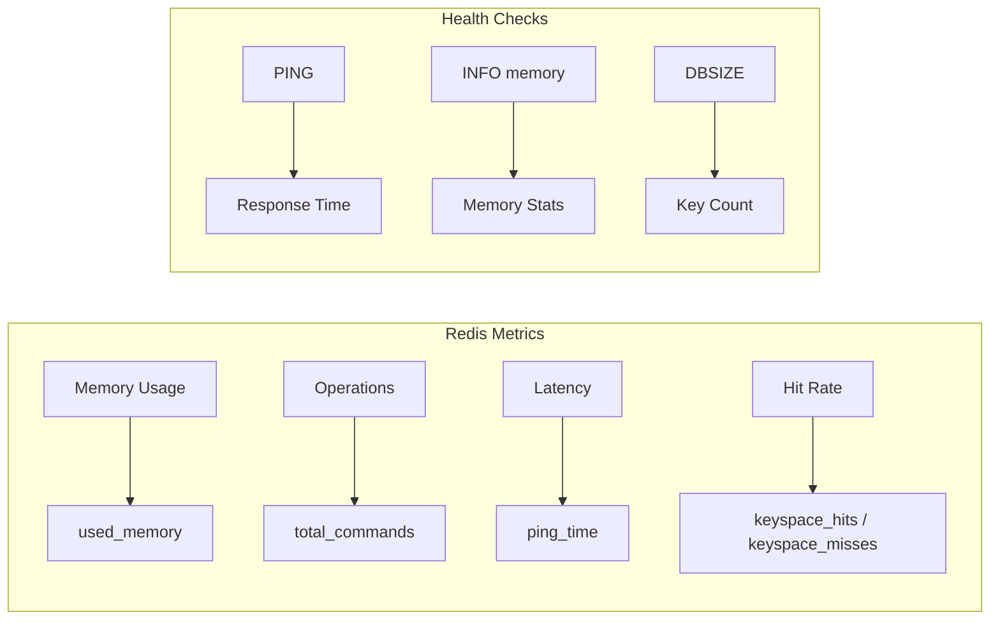
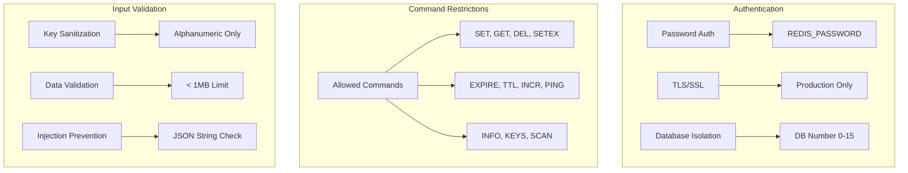

# Redis Schema Diagram

## Redis Key Structure

```mermaid
graph TD
    subgraph "Key Patterns"
        A[reservation:{token}] --> B[Reservation TTL]
        C[circuit-breaker:{service}] --> D[Circuit Breaker State]
        E[idempotency:{key}] --> F[Response Cache]
        G[circuit-breaker:{service}:failures] --> H[Failure Counter]
    end
    
    subgraph "TTL Values"
        B --> I[600 seconds / 10 minutes]
        F --> J[86400 seconds / 24 hours]
        D --> K[No expiry]
        H --> L[No expiry]
    end
```

## Reservation TTL Flow



## Data Structures

```mermaid
graph TD
    subgraph "Reservation TTL Data"
        A[state: 'ACTIVE']
        B[token: UUID]
        C[createdAt: ISO String]
        D[expiresAt: ISO String]
    end
    
    subgraph "Circuit Breaker Data"
        E[state: 'CLOSED' | 'OPEN' | 'HALF_OPEN']
        F[failureCount: number]
        G[lastFailureTime: ISO String]
        H[nextAttemptTime: ISO String]
    end
    
    subgraph "Idempotency Cache Data"
        I[requestFingerprint: string]
        J[response: JSON]
        K[createdAt: ISO String]
        L[expiresAt: ISO String]
    end
```

## Redis Operations Flow



## Circuit Breaker Operations



## Idempotency Cache Flow



## Expiration Handling



## Connection Management



## Performance Monitoring



## Security Configuration


