# UI User Interaction Events Diagram

## Event Flow Architecture

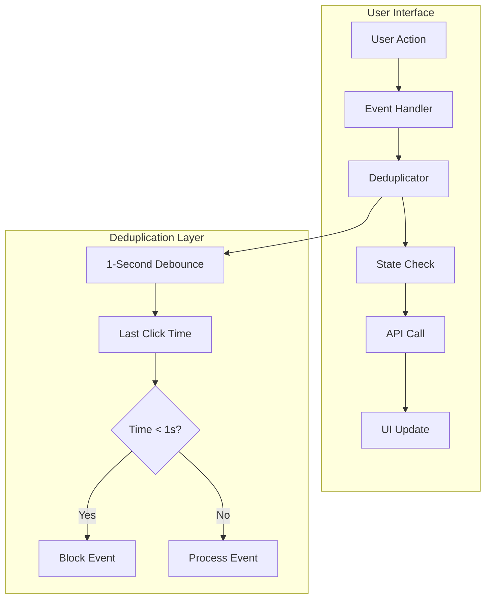

## Button Event Handlers

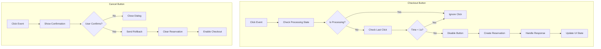

## State Management Flow

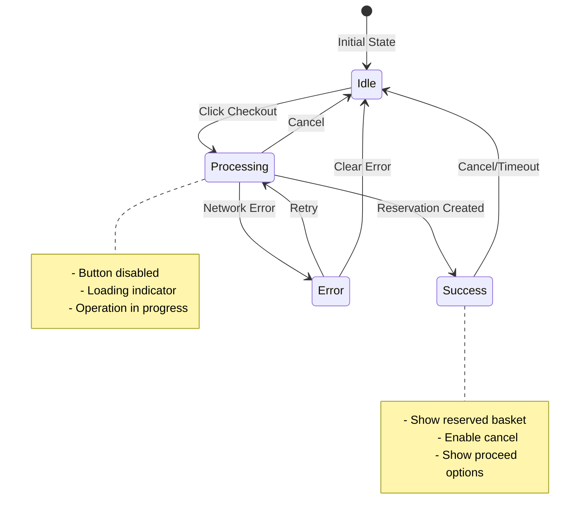

## Event Deduplication System

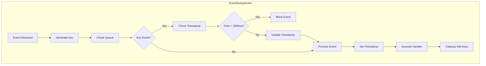

## UI State Transitions

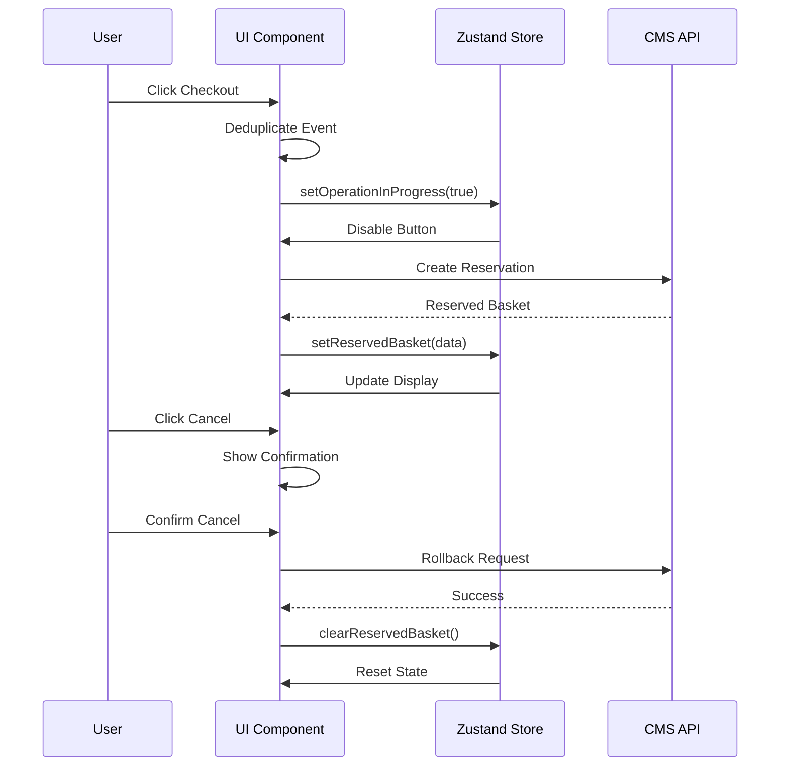

## Modal Dialog Flows

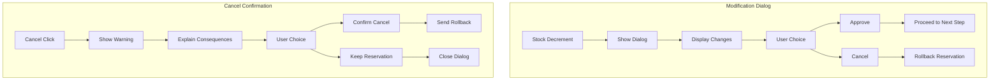

## Error Handling Flow

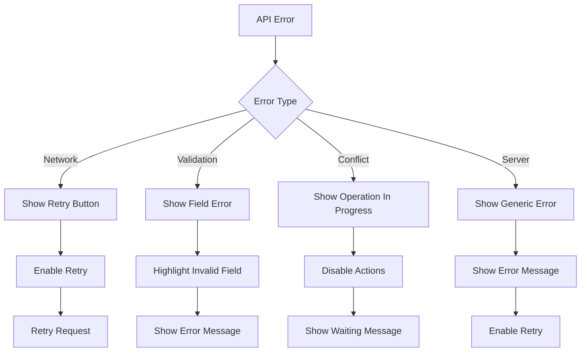

## Notification System

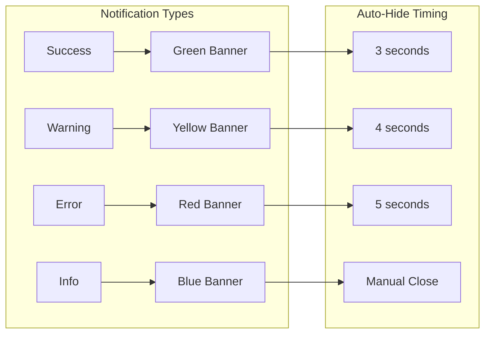

## Accessibility Flow

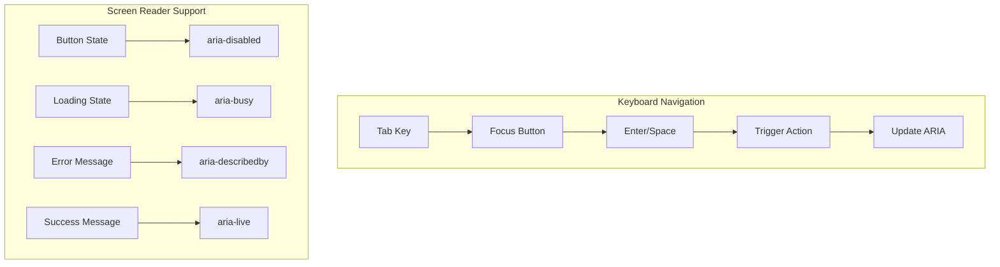

## Component Integration

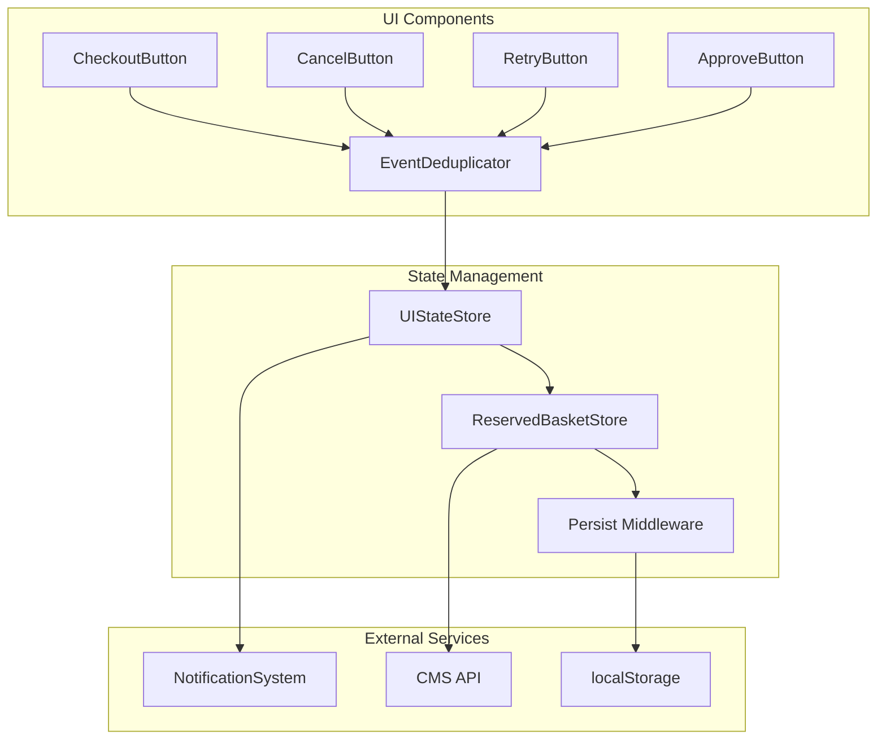

## Cross-Tab Synchronization

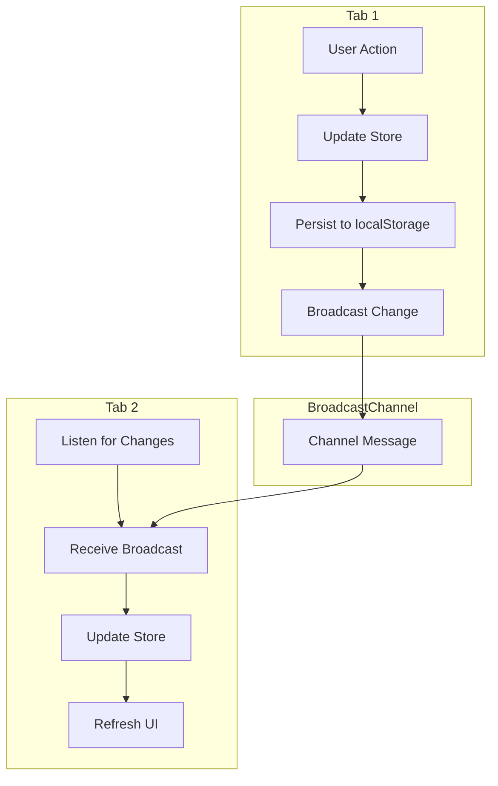
