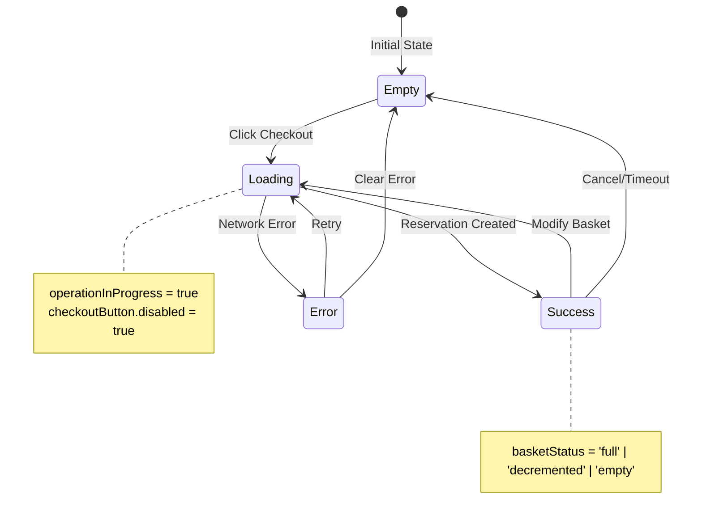
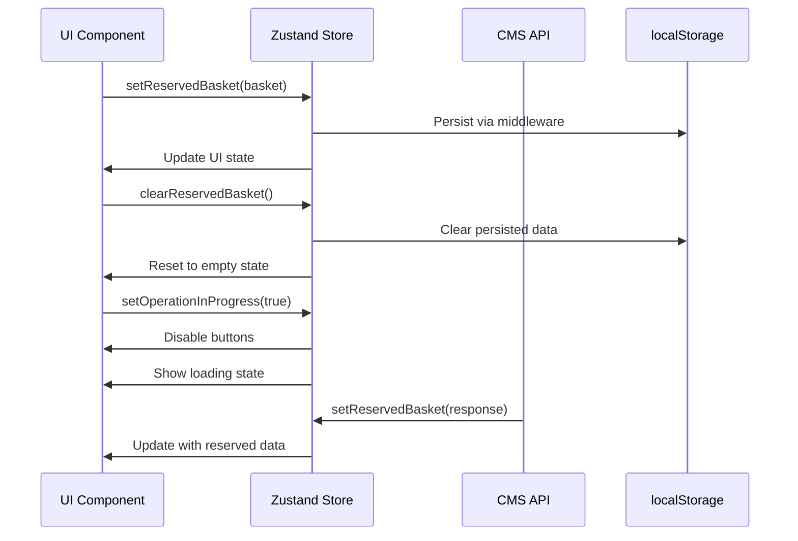
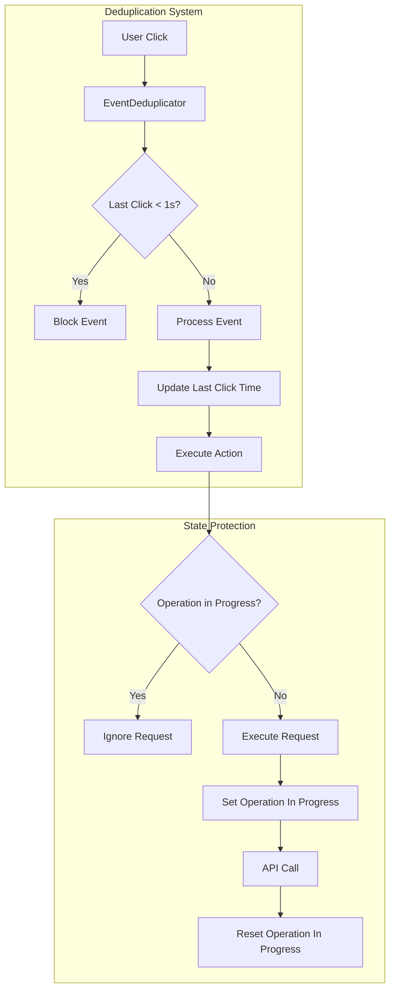
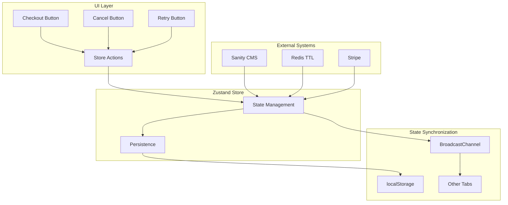

# Zustand Store Slice Diagram

## Store Structure Overview

```mermaid
graph TD
    subgraph "Zustand Store"
        A[ReservedBasketState] --> B[State]
        A --> C[Actions]
        A --> D[Computed]
    end
    
    subgraph "State Properties"
        B --> B1[reservedBasket: ReservedBasket | null]
        B --> B2[isLoading: boolean]
        B --> B3[error: string | null]
        B --> B4[operationInProgress: boolean]
    end
    
    subgraph "Actions"
        C --> C1[setReservedBasket]
        C --> C2[setLoading]
        C --> C3[setError]
        C --> C4[setOperationInProgress]
        C --> C5[clearReservedBasket]
    end
    
    subgraph "Computed Properties"
        D --> D1[hasReservedBasket: boolean]
        D --> D2[basketStatus: 'none' | 'full' | 'decremented' | 'empty']
    end
```

## Reserved Basket Data Structure

```mermaid
graph TD
    subgraph "ReservedBasket"
        A[reservationToken: string]
        B[idempotencyKey: string]
        C[expiresAt: string]
        D[amountPln: number]
        E[products: ReservedProduct[]]
        F[createdAt: string]
        F2[updatedAt: string]
    end
    
    subgraph "ReservedProduct"
        G[id: string]
        H[name: string]
        I[stripePriceId: string]
        J[requestedQuantity: number]
        K[reservedQuantity: number]
        L[availableQuantity: number]
        M[pricePln: number]
        N[totalPricePln: number]
        O[imageUrl: string | null]
        P[slug: string]
        Q[brand: BrandRef]
    end
    
    subgraph "BrandRef"
        Q --> Q1[id: string]
        Q --> Q2[name: string]
        Q --> Q3[slug: string]
    end
```

## State Flow Diagram



## Action Flow



## Persistence Layer

```mermaid
graph LR
    subgraph "Client Side"
        A[Zustand Store] --> B[Persist Middleware]
        B --> C[localStorage]
    end
    
    subgraph "Storage Structure"
        C --> D["guest-checkout-reserved-basket"]
        D --> E[version: 1]
        D --> F[state: {...}]
        D --> G[timestamp: ...]
    end
    
    subgraph "Cross-tab Sync"
        B --> H[BroadcastChannel]
        H --> I[Other Tabs]
        I --> J[Store Update]
    end
```

## Event Deduplication



## Integration Points


