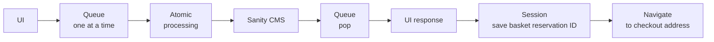
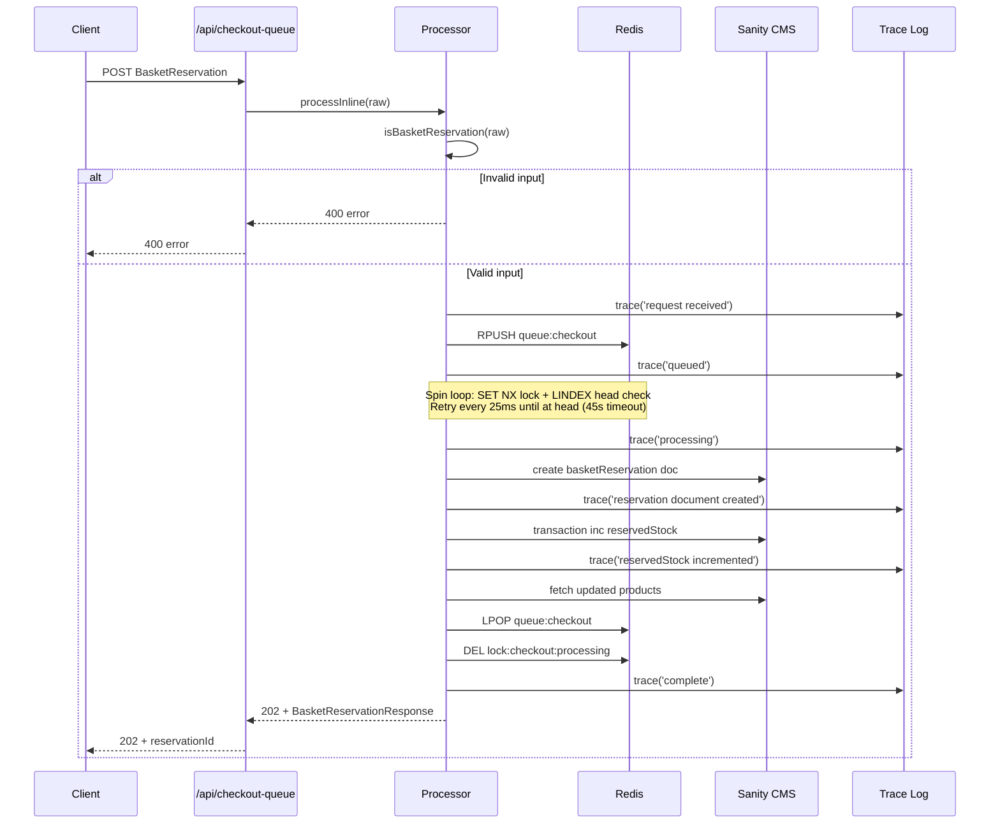
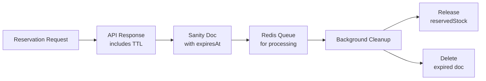
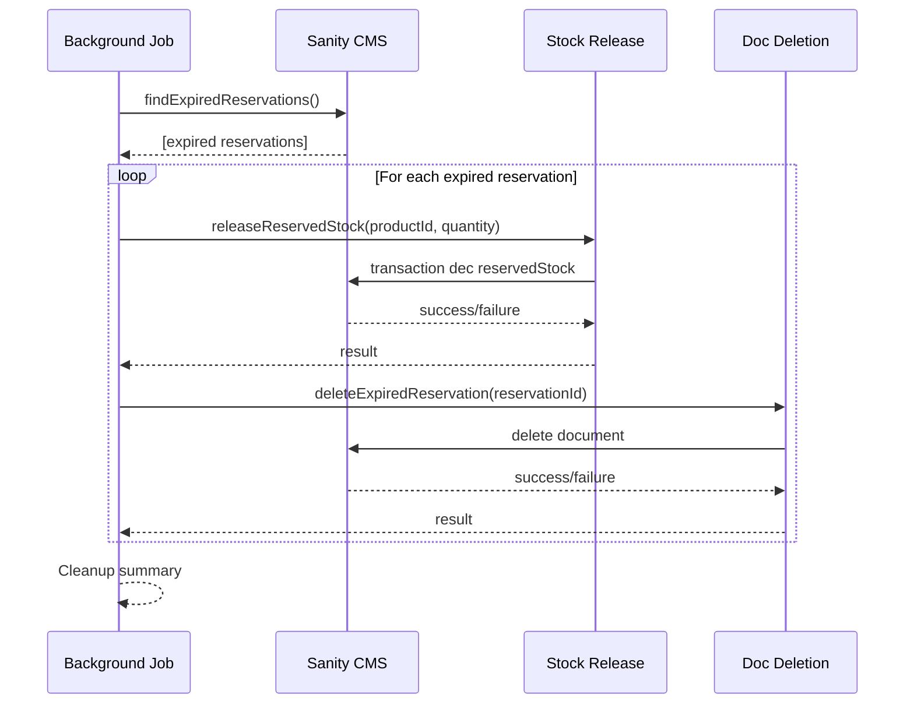
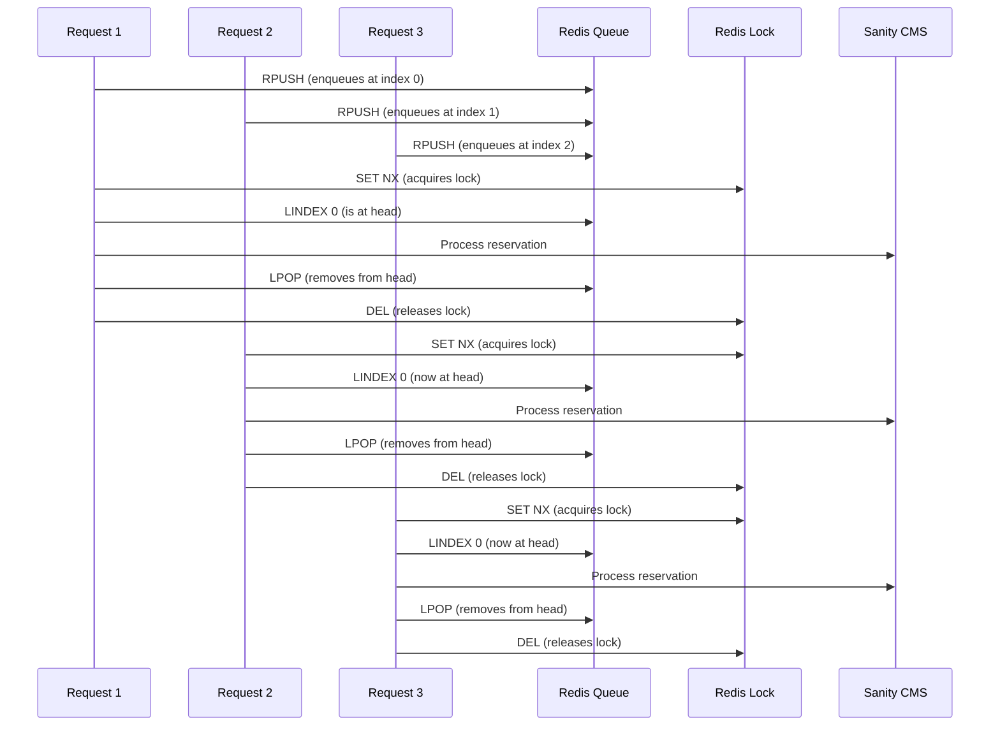

# Technical Diagrams: Checkout Queue

## Happy Path Flow

## Atomic FIFO Processing

## TTL Expiration Flow

## Cleanup Infrastructure

## Concurrent Request Serialization

Note: This diagram shows the ideal sequential processing. In reality, requests retry every 25ms until they reach the head, ensuring only one request processes at a time.
