# Elite vs Amateur Workday Structure

## Purpose
Compare the 9.5-hour journal against an elite practitioner's expected output in the same window. Objective truth only.

```mermaid
graph LR
    classDef large font-size:20px,padding:15px,stroke-width:2px;
    classDef logic fill:#fff4dd,stroke:#d4a017,font-size:20px;
    classDef state fill:#e1f5fe,stroke:#01579b,font-size:20px;
    classDef action fill:#e8f5e9,stroke:#2e7d32,font-size:20px;
    classDef danger fill:#ffebee,stroke:#b71c1c,font-size:20px;
    classDef success fill:#e8f5e9,stroke:#1b5e20,font-size:20px;
    classDef neutral fill:#f5f5f5,stroke:#616161,font-size:20px;

    subgraph Amateur [Journal — 9.5 Hours]
        direction TB
        A1[05:12–06:10<br/>Spaghetti / rage]:::danger
        A2[06:10–06:37<br/>Trauma spiral]:::danger
        A3[06:37–07:02<br/>Food + 1 task done]:::action
        A4[07:02–10:19<br/>DNS migration done]:::success
        A5[10:19–14:40<br/>5 domains,<br/>0 closed]:::danger
        A6[14:40–14:42<br/>Adjustments note]:::neutral
    end

    subgraph Elite [Elite Baseline — 9.5 Hours]
        direction TB
        E1[05:12–05:15<br/>Block contract written]:::action
        E2[05:15–07:00<br/>Vertical slice:<br/>logging system<br/>spec + impl + test<br/>VERIFIED CLOSED]:::success
        E3[07:00–07:15<br/>Break]:::state
        E4[07:15–10:15<br/>Vertical slice:<br/>Netlify cleanup<br/>checklist + exec<br/>VERIFIED CLOSED]:::success
        E5[10:15–10:30<br/>Break]:::state
        E6[10:30–13:30<br/>Vertical slice:<br/>Vercel hardening<br/>VERIFIED CLOSED]:::success
        E7[13:30–14:30<br/>Buffer / review /<br/>next-day contract]:::state
    end

    Amateur ~~~ Elite
```

## Output Comparison

| Metric | Journal | Elite Baseline |
|--------|---------|---------------|
| Verified deliverables | 1 (DNS) | 3+ complete vertical slices |
| Domains touched | 6 | 3 (sequential, closed) |
| Breaks taken | 5+ (frustration-escape) | 2 (scheduled, post-milestone) |
| Open loops at end | 5+ | 0 |
| Shame spirals | 3+ | 0 |
| AI interactions | 4+ vague, all failed | 1–2 spec-driven, all implemented |

## Key Delta

Elite practitioners finish in 3 hours what the journal attempted in 9.5. The delta is not typing speed. It is **ambiguity elimination before the block starts** and **emotional compartmentalization**.
