# Vertical vs Horizontal Slicing

## Purpose
One open loop maximum. Complete one domain before touching the next. Horizontal thrashing = six domains, zero closed.

```mermaid
graph LR
    classDef large font-size:20px,padding:15px,stroke-width:2px;
    classDef logic fill:#fff4dd,stroke:#d4a017,font-size:20px;
    classDef state fill:#e1f5fe,stroke:#01579b,font-size:20px;
    classDef action fill:#e8f5e9,stroke:#2e7d32,font-size:20px;
    classDef danger fill:#ffebee,stroke:#b71c1c,font-size:20px;
    classDef success fill:#e8f5e9,stroke:#1b5e20,font-size:20px;

    subgraph Amateur [Amateur Pattern — 6 Domains, 0 Closed]
        direction TB
        A1[DNS]:::danger
        A2[Netlify]:::danger
        A3[Vercel]:::danger
        A4[Logs]:::danger
        A5[Dalio Book]:::danger
        A6[AI Prompts]:::danger
    end

    subgraph Elite [Elite Pattern — 1 Domain, Verified Closed]
        direction LR
        E1[Specify]:::action --> E2[Implement]:::action
        E2 --> E3[Test]:::action
        E3 --> E4[Verify]:::logic
        E4 -->|Pass| E5[Close & Document]:::success
        E4 -->|Fail| E2
    end

    Amateur ~~~ Elite
```

## Rule

**If you start checkout logging, DNS / Netlify / Vercel / books / AI experiments do not exist until checkout logging is verified done.**

## Journal Evidence

| Time | Domain Switched To | Previous Domain State |
|------|-------------------|----------------------|
| 07:02 | DNS migration | — |
| 10:19 | Netlify cleanup | DNS done (1 closed) |
| 10:23 | Vercel build minutes | Netlify abandoned |
| 11:40 | Checkout logs | Vercel abandoned |
| 13:15 | Dalio book | Logs abandoned |
| 14:28 | Logging system "N-th attempt" | Book abandoned |

**Result:** 1 verified closed (DNS), 5 abandoned mid-flight.
