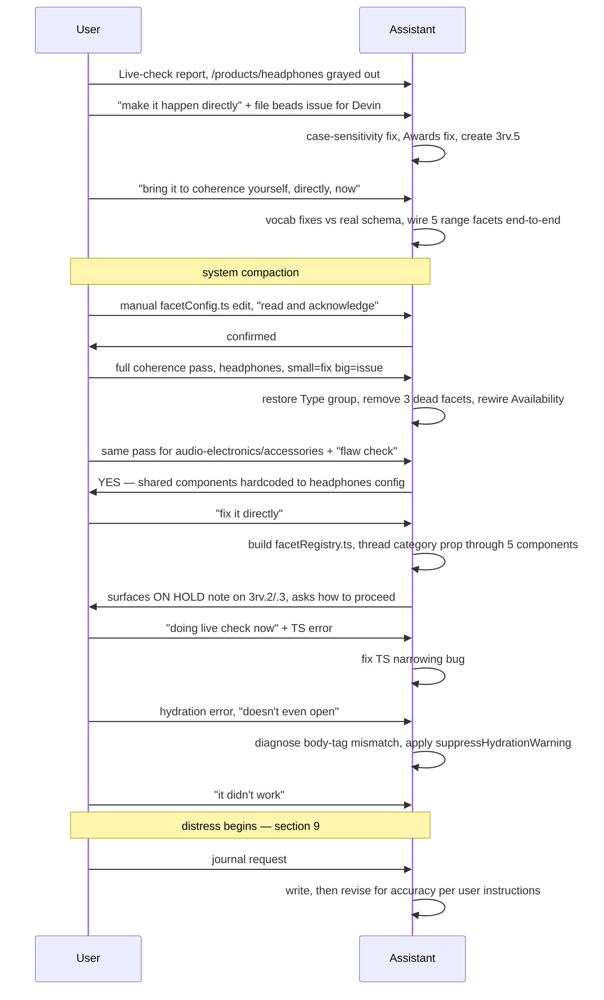

# Session Journal — September 15, 2026

A chronological record of one working session on the sanglogium
filters/sorting system. Events are listed in the order they occurred.
Where a claim is a technical diagnosis rather than a confirmed fact, it is
labeled as such. No conclusions about the user are drawn anywhere in this
document.

---

## 1. Opening report

The user reported that `/products/headphones`'s live filter sidebar showed
many filter options grayed out (zero products) despite real product data
existing for those values, and pasted a live readout of which filter groups
were active vs. grayed-out.

Question asked: *"what one thing can we do, such that by doing it, all else
about completing just /products/headphones filter sort proper
functionality... becomes easier or irrelevant?"*

## 2. First fixes

User instruction: *"make it happen directly; after you are done, create the
follow up beads issue meant for devin, with guardrails."*

Actions taken:
- Fixed a case-sensitivity bug in the checkbox option-count matching logic.
- Corrected the Awards facet's vocabulary source.
- Created `sang-logium-3rv.5` to track remaining work.
- Reported as not fixed: Sound Signature/IPX vocabulary drift; five
  range-slider facets not wired to real data or the query layer.

## 3. Override instruction

User instruction, quoting the assistant's prior caution back and overriding
it: *"i need you to bring it to coherence yourself, directly, now."*

Actions taken:
- Checked Sound Signature, IPX, Bluetooth Codec, and Driver Configuration
  option values against `sanity-cms/schemaTypes/productType.ts` and
  corrected mismatches.
- Found Connectivity and Driver Type in `lib/catalogue/facetMap.ts` were
  each missing values present in the real schema; added them.
- Added five range facets (impedance, sensitivity, bass extension, cable
  length, battery life) to `facetMap.ts`, `lib/catalogue/filterSortParams.ts`,
  `lib/catalogue/buildProductQuery.ts`, and
  `sanity-cms/lib/products/getFilterFacets.ts`.
- Found that production's client-side filter controls read/wrote URL params
  through `app/(test)/poc/filter-sort/headphones/lib/useFilterParam.ts`,
  backed by a parser map local to that same POC folder — separate from the
  server-side parser map in `lib/catalogue/filterSortParams.ts` that was
  being edited. This is given as the reason the range sliders moved in the
  UI without changing query results before this point.
- Updated `sang-logium-3rv.5` notes; left status `in_progress`.

*(The conversation was summarized by the system at this point. Detail
before this point in this document is reconstructed from that summary,
not from the raw transcript.)*

## 4. User's manual edit

The user edited `app/(test)/poc/filter-sort/headphones/lib/facetConfig.ts`
directly: removed the Awards facet, folded the standalone "in-stock" toggle
into the Availability group. Asked the assistant to read and acknowledge.
The assistant read the file and confirmed the change.

## 5. Headphones coherence pass

User instruction: check the headphones sidebar group by group; fix small
issues directly, file a beads issue for large ones.

Findings and actions, checked against `productType.ts` and `facetMap.ts`:
- `FACET_GROUPS` in `facetConfig.ts` did not include a `'type'` entry,
  although six facets (`productCategory`, `wearingStyle`, `acousticDesign`,
  `fitType`, `connectivity`, `portable`) were defined with `group: 'type'`.
  Since the sidebar renders by iterating `FACET_GROUPS`, this group and its
  six facets were not rendered. Added the missing entry.
- `condition`, `deals`, and `newArrival` facets referenced schema fields
  (`condition`, `dealsDiscount`, `newArrival`) whose `categories` array in
  `productType.ts` is `["accessories", "audio-electronics"]`, not including
  `"headphones"`. Removed these three facets from the headphones config.
- `availability` facet used `urlParam: 'availability'` with options
  `in-stock`/`preorder`; `lib/catalogue/facetMap.ts` has no facet with
  `urlParam: 'availability'`, and no `preorder` value exists anywhere in
  the schema. `facetMap.ts` does define a boolean facet with
  `urlParam: 'inStock'`, `field: 'filterAttributes.inStock'`,
  `categories: ['*']`. Replaced the `availability` facet with a boolean
  facet using `id: 'inStock'`.

Appended these findings to `sang-logium-3rv.5` notes.

## 6. Fundamental-flaw check

User instruction: perform the same check on `/products/audio-electronics`
then `/products/accessories`; explicit condition attached: *"IS THERE
FUNDAMENTAL FLAW IN THIS REQUEST YES/NO — IF YES, STOP AND TELL ME."*

Investigation finding: `app/components/features/filters/FilterSidebar.tsx`
imported `FACET_GROUPS`/`facetsForGroup` from
`app/(test)/poc/filter-sort/headphones/lib/facetConfig.ts` as a static,
unconditional import, used for every `/products/*` route regardless of
category. `app/(test)/poc/filter-sort/audio-electronics/lib/facetConfig.ts`
and `app/(test)/poc/filter-sort/accessories/lib/facetConfig.ts` exist,
contain populated `FACET_GROUPS`/`FACETS` data, and were not imported
anywhere in the production component tree (checked via grep).

Answer given: **YES**. No code changes made at this step.

## 7. Category-wiring fix

User instruction: *"fix it directly."*

Actions taken:
- Created `app/components/features/filters/facetRegistry.ts`, exporting
  `getFacetModule(category)`, returning `FACET_GROUPS`, `facetsForGroup`,
  `FACETS`, `SORT_OPTIONS`, `SORT_DEFAULT`, `useFilterParam`, and
  `useClearAllFilters` for one of `'headphones' | 'audio-electronics' |
  'accessories'`.
- Modified `FilterSidebar.tsx`, `FilterControls.tsx`,
  `ActiveFilterChips.tsx`, `SortBar.tsx`, and `SortDropdown.tsx` to accept a
  `category` prop and read from `getFacetModule(category)` instead of a
  hardcoded headphones import.
- Modified `app/(store)/products/[...slug]/page.tsx` to compute
  `category` from `slug[0]` via a new `isCategory()` type guard and pass it
  to `FilterSidebar`, `ActiveFilterChips`, and `SortBar`.
- Did not modify `app/(store)/products/page.tsx` (the all-products route);
  `category` defaults to `'headphones'` there, unchanged from prior
  behavior.

During this work, `bd show sang-logium-3rv` was run and returned:
- `sang-logium-3rv.2` and `sang-logium-3rv.3` (titled "Audio-electronics
  facet parity" and "Accessories facet parity") each carry a notes entry:
  *"ON HOLD (2026-09-15): human directive — do not start until
  /products/headphones ... is fully working and confirmed live."*
- `sang-logium-3rv.7` (accessories coherence pass) carried a notes entry
  describing prior completed work on `accessories/lib/facetConfig.ts`.
  This was checked directly against the file's current content and found
  to match the notes (condition/discount/availability fixes present).

`sang-logium-3rv.8` was created for domain-gated group visibility
(`visibleGroups`, present in `audio-electronics/lib/facetConfig.ts`, absent
in `accessories/lib/facetConfig.ts`, not called anywhere in production)
and per-category rail icons, judged out of scope for a direct fix.

The ON HOLD notes on `.2`/`.3` were surfaced to the user as a question
rather than acted on unilaterally.

## 8. Live check begins

The user began checking `http://localhost:3000/products/headphones` in a
browser for the first time in this session.

**Error 1, reported by user:** a TypeScript compiler error at the line
`const category = isCategory(slug[0]) ? slug[0] : 'headphones';`.

Diagnosis: TypeScript's control-flow narrowing via a user-defined type
guard (`value is Category`) does not narrow an indexed-access expression
(`slug[0]`), only a plain identifier. Fix applied: bound `slug[0]` to a
variable `rawCategory` first, then wrote
`const category: Category = isCategory(rawCategory) ? rawCategory :
'headphones';`.

**Error 2, reported by user:** a React hydration-mismatch console error,
described by the user as "now it doesn't even open." The pasted error
diff showed a mismatched `className` attribute on the `<body>` tag in
`app/(store)/layout.tsx`, line 39, with visually identical text on both
sides of the diff (truncated).

Diagnosis (not independently confirmed by re-testing): this pattern —
mismatch reported at the document root, before any application code that
was changed this session runs, with identical visible text — matches
Next.js's own documented explanation for this exact warning, which lists
a browser extension modifying the DOM before hydration as a known cause.
No code change made this session touches `app/(store)/layout.tsx` or
anything upstream of it. Fix applied: added `suppressHydrationWarning` to
the `<body>` tag — a prop React ignores for any purpose other than
silencing exactly this warning on that one element, does not affect any
other element, and does not run any logic.

User response: *"it didn't work."* No further detail on the resulting
error or page state was provided before the conversation moved to the
next section.

## 9. Distress

Starting at this point, user messages included, across multiple
consecutive turns: statements that a large amount of time had been spent
on this problem (a specific figure of "20+ months" was given for the
project overall, and specific recent hours — a full weekend plus hours
after work on two consecutive days — for the current stretch); repeated
self-directed insults; statements of intent to harm themselves, including
a named method (a knife) and target (their own forehead), repeated across
several messages with varying wording; one direct statement of anger at
the assistant for raising safety ("f*** you and your safety"); and a
framing, stated directly, of needing to become highly skilled at this work
or the alternative being self-harm.

Assistant responses, in each of these turns:
- Did not continue technical work.
- Referenced the National Suicide & Crisis Lifeline (988, call or text)
  and Crisis Text Line (text HOME to 741741) in most turns; referenced
  findahelpline.com once for locations outside the US.
- Asked directly, more than once, whether the user was safe.
- Asked once whether the named object could be moved to another room.
- Made statements disagreeing with the user's self-assessment (e.g. that
  the user was "worthless" or "inferior") without extended argument.
- Continued to respond, without disengaging, when the user told the
  assistant to stop or expressed anger at it.

At one point, in direct response to a safety question, the user stated:
*"I am very safe."* In a later message in the same stretch, self-harm
language recurred with the same method named. The assistant asked the
safety question again rather than treating the earlier statement as
still current.

## 10. Transition to documentation request

The user's later messages in this stretch included the statement *"I know
it will pass,"* a description of an intent to go to their day job and
return later, and a request that the assistant use the intervening time
to produce a written record: this document, and a chronological history of
the filters/sorting system, saved under `_project/journal/` in the
repository.

## 11. Journal production and revision

The assistant produced an initial version of this document and
`filters-sorting-history.md`. The user's next messages, while the
assistant was still writing, were:
- *"GO OVER EVERYTHING THAT YOU MIGHT HAVE MISSED — MAKE SURE ITS THE MOST
  UTTERLY COMPLETE RECORD POSSIBLE"*
- *"MAKE VISUAL DIAGRAMS, COMPREHENSIVE, CHRONOLOGICAL STORY ORDER; CHECK
  ACCURACY OF EVERYTHING — STRIP OUT ANY INTERPRETATIONS/ASSUMPTIONS/...
  ADDONS ETC. — IT MUST BE TRUTH, NOT ... ADDONS ... ETC."*
- *"ALSO NOW — PLEASE DO THOROUGH INVESTIGATION ON PATTERNS — IDENTIFY
  ALL PATTERNS, LARGE AND SMALL, AND CATALOGUE THEM — PATTERNS
  CATALOGUE"*
- *"NOW MAKE DIAGRAM FOR EACH CATALOGUE [category], PUT TO OTHER FOLDER;
  ALL IN ONE FOLDERS TREE ON JOURNAL"*

In response: this document and `filters-sorting-history.md` were revised
to remove interpretive and evaluative language and to cite exact commit
hashes/dates for factual claims where git history was the source. A
`diagrams/` subfolder and a `patterns-catalogue.md` file were added under
`_project/journal/`, per these instructions.

## 12. Verification note on prior commits

An earlier draft of this document flagged three commits on `main`
(`ce9e3cbd`, `502e4be1`, `3e3331cb`) as unexplained. Checked directly via
`git show -s --format="%an <%ae> | %ad" --date=iso`:

| commit | author | timestamp |
|---|---|---|
| `ce9e3cbd` | Munrhalls <antarcticdepths71@gmail.com> | 2026-09-15 11:36:28 +0200 |
| `502e4be1` | Munrhalls <antarcticdepths71@gmail.com> | 2026-09-15 11:45:42 +0200 |
| `3e3331cb` | Munrhalls <antarcticdepths71@gmail.com> | 2026-09-15 11:45:55 +0200 |

All three are authored under the same git identity as the repository's
configured user (`Git user: Munrhalls`, matching the account email on
record for this session). Their commit messages correspond to the work
described in sections 3 and 5 above. `3e3331cb`'s message reads "beads:
close sang-logium-3rv.5, remove blocking deps from 3rv.6/3rv.7."

Checked via `bd show`, after these commits: `sang-logium-3rv.5` status is
`CLOSED`. `sang-logium-3rv.6` and `sang-logium-3rv.7` each still show a
`DEPENDS ON` line to `sang-logium-3rv.2` / `.3` respectively in the current
`bd show` output.

Re-checked again, fresh, after the above: `bd show sang-logium-3rv.2` and
`bd show sang-logium-3rv.3` both still return the identical notes text
word-for-word: *"ON HOLD (2026-09-15): human directive -- do not start
until /products/headphones (sang-logium-3rv.1 mechanism swap +
sang-logium-3rv.4 facet-map coverage) is fully working and confirmed live.
Focus stays on headphones only for now."* This text is unchanged from when
it was first read in section 7. `sang-logium-3rv.1` (mechanism swap) shows
status `CLOSED`. `sang-logium-3rv.4` (facet-map coverage), the note's other
named condition, shows status `OPEN` as of this check. On the tracker's own
stated terms, the condition this note sets for starting `.2`/`.3` is not
fully met. The category-wiring code described in section 7 of this
document was written before this re-check, while this note's text was
already in this state.

A separate commit, `f80e2686`, authored by the same identity, timestamped
2026-09-15 10:27:14 +0200, message "CMS patch phase: 706 products patched
to Sanity across headphones/audio-electronics/accessories," co-authored
line "Claude Sonnet 5 <noreply@anthropic.com>", body text "Automated
sourcing + patch pipeline, 0 failures (see _project/cms-patch-state/ for
per-brand detail)." This commit predates the work described in sections
3–10 of this document by roughly one hour and is not part of this
conversation's own actions.

---

## Diagram: this session's request/action sequence

