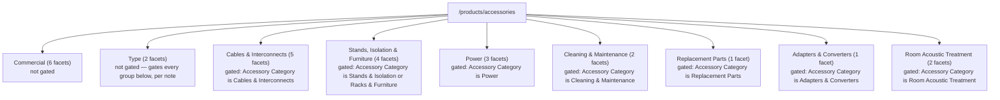

# Diagram: Accessories facet structure

Source: `app/(test)/poc/filter-sort/accessories/lib/facetConfig.ts`, read
directly, 2026-09-15. Facet counts per group verified via
`grep -oE "group: '[a-zA-Z]+'" ... | sort | uniq -c`. This file's own
`FACET_GROUPS` `note` field states which groups are intended to be
domain-gated; those are marked below. This session made no edits to this
file's facet list; an earlier, separately-tracked pass (`sang-logium-3rv.7`
notes) is recorded as having edited this file before this session began —
not independently re-verified against a prior git revision in this pass.

No `visibleGroups` function exists in this file (checked via grep — no
match, unlike the audio-electronics file). All 9 groups render
unconditionally in production as of 2026-09-15, and no gating mechanism
exists in this file to call even if one were wired in.

Sidebar wiring: as of this session, `category="accessories"` is passed to
`FilterSidebar` from `app/(store)/products/[...slug]/page.tsx` when
`slug[0] === 'accessories'`, which resolves this file via
`app/components/features/filters/facetRegistry.ts`. Before this session's
changes, this route received the headphones file's data instead, per the
same mechanism described in `diagrams/audio-electronics.md`.
