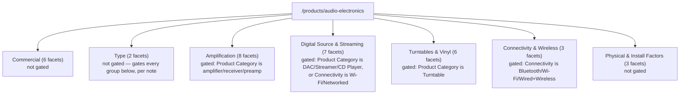

# Diagram: Audio-Electronics facet structure

Source: `app/(test)/poc/filter-sort/audio-electronics/lib/facetConfig.ts`,
read directly, 2026-09-15. Facet counts per group verified via
`grep -oE "group: '[a-zA-Z]+'" ... | sort | uniq -c`. This file's own
`FACET_GROUPS` `note` field states which groups are intended to be
domain-gated; those are marked below. This session made no edits to this
file's facet list.

This file exports a `visibleGroups(state)` function (checked via grep,
present at approximately line 113). As of 2026-09-15, no code under
`app/components/features/filters/` or `app/(store)/products/` calls this
function (checked via grep across those directories) — all 7 groups render
unconditionally in production regardless of gating intent stated in this
file.

Sidebar wiring: as of this session, `category="audio-electronics"` is
passed to `FilterSidebar` from `app/(store)/products/[...slug]/page.tsx`
when `slug[0] === 'audio-electronics'`, which resolves this file via
`app/components/features/filters/facetRegistry.ts`. Before this session's
changes (section 7 of the companion session journal), this route received
the headphones file's `FACET_GROUPS`/`facetsForGroup` instead — checked via
grep of the previous hardcoded import in `FilterSidebar.tsx`, not
independently re-tested against a pre-session git revision in this pass.
