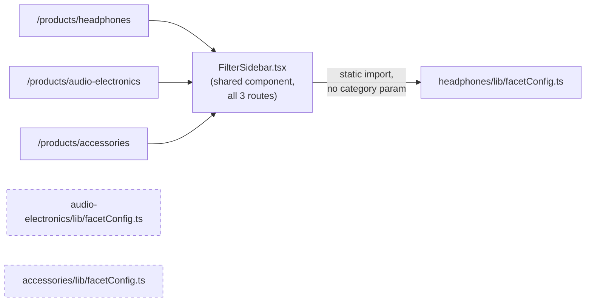
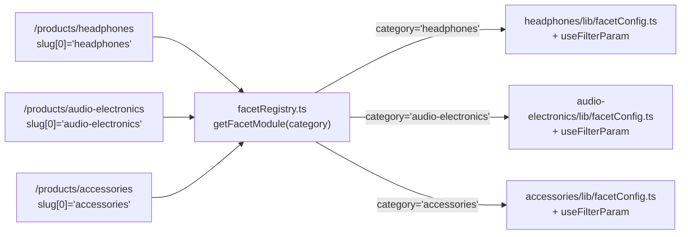
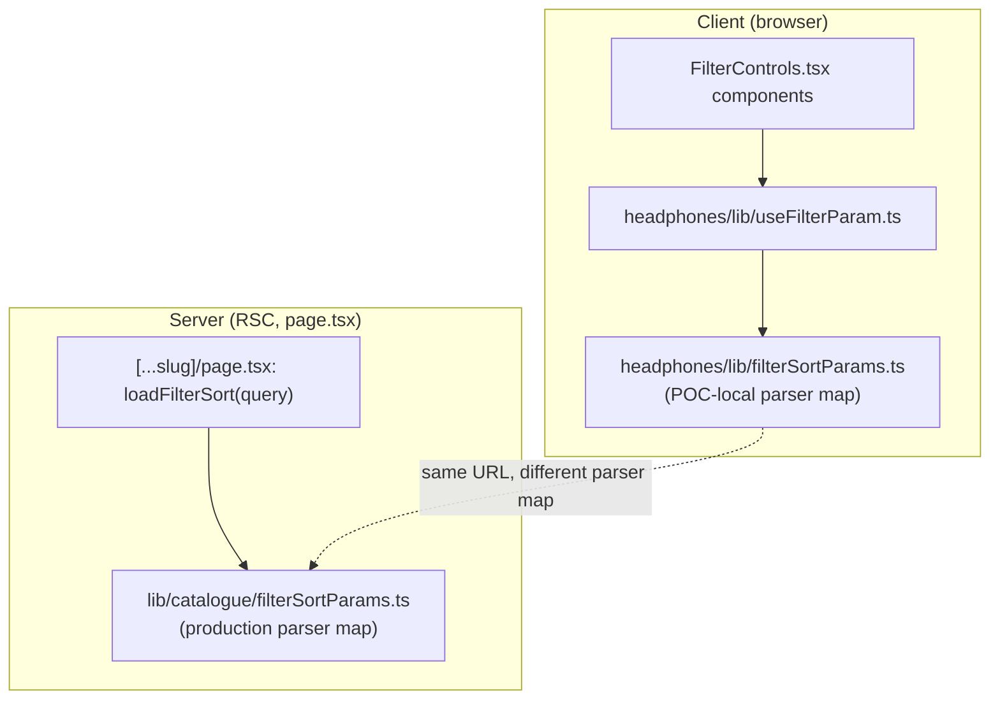

# Diagram: category-wiring bug and fix

Source: this session's own reads of `app/components/features/filters/
FilterSidebar.tsx`, `FilterControls.tsx`, `ActiveFilterChips.tsx`,
`SortBar.tsx`, `SortDropdown.tsx`, and `app/(store)/products/[...slug]/
page.tsx`, before and after this session's edits (section 7 of the
companion session journal).

## Before (found this session, all three category routes)

Dashed nodes: files existed, contained populated data (checked directly),
were never imported by any production component (checked via grep across
`app/components/`).

## After (this session's edit)

`category` is computed once, in `app/(store)/products/[...slug]/page.tsx`,
from `slug[0]`, and passed as a prop to `FilterSidebar`, `FilterControls`
(via `FilterSidebar`'s render), `ActiveFilterChips`, `SortBar`, and
`SortDropdown`. `app/(store)/products/page.tsx` (the all-products route,
one route, no single category) was not modified; it does not pass a
`category` prop, and `getFacetModule` defaults to `'headphones'` when none
is given — the same behavior that route had before this session, checked
by reading its `<FilterSidebar>` call site directly.

## Separate, related bug found the same session: dual URL-param maps

Before this session's edit to `lib/catalogue/filterSortParams.ts` (adding
the five range facets' `Min`/`Max` parsers), the client-side map already
had entries for these — meaning the range sliders visibly moved and wrote
to the URL, while the server-side map did not parse those same URL keys,
so `buildProductQuery` never received them and no product was ever
filtered by them. This is stated as the assistant's diagnosis, reached by
tracing both files' contents directly; not independently reproduced by
loading the pre-fix code in a browser.
