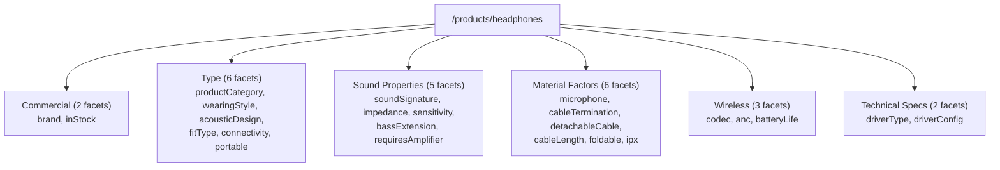

# Diagram: Headphones facet structure

Source: `app/(test)/poc/filter-sort/headphones/lib/facetConfig.ts`, read
directly, 2026-09-15, after this session's edits. Facet counts per group
verified via `grep -oE "group: '[a-zA-Z]+'" ... | sort | uniq -c`.

No group in this file has a `note` describing domain-gating. No
`visibleGroups` function exists in this file (checked via grep). All 6
groups render unconditionally in production as of 2026-09-15.

Bespoke controls not counted above (rendered directly by the panel, not
part of the `FACETS` array): Price, Customer Rating.
