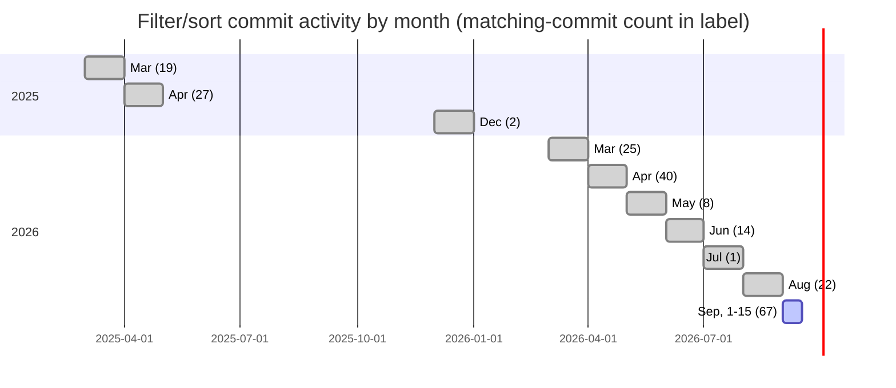
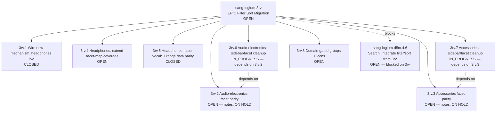

# Filters & Sorting: Commit History

Source: `git log --all --grep="filter" --grep="sort" --grep="facet" -i`
against the sanglogium repository, checked 2026-09-15. 225 commits matched,
dated 2025-03-03 to 2026-09-15. Repository's first commit overall:
2024-11-14. Every date below is pulled directly from `git show`, not
estimated. Every commit message is quoted verbatim from `git log`.

Commit-message conventions in this repository include a self-reported
"Difficulty" rating and DoD (Definition of Done) reference on many commits;
these are the commit author's own labels, reproduced as written, not an
independent assessment.

---

## Monthly commit count, filter/sort-matching commits

| Month | Commits |
|---|---|
| 2025-03 | 19 |
| 2025-04 | 27 |
| 2025-12 | 2 |
| 2026-03 | 25 |
| 2026-04 | 40 |
| 2026-05 | 8 |
| 2026-06 | 14 |
| 2026-07 | 1 |
| 2026-08 | 22 |
| 2026-09 | 67 |

No filter/sort-matching commits exist between 2025-04 and 2025-12, or
between 2025-12 and 2026-03, in this grep result.



---

## Named milestone commits, chronological, with exact hash and date

| Date | Hash | Message (verbatim) |
|---|---|---|
| 2024-11-14 | `b050b539` | Initial commit from Create Next App |
| 2025-03-03 | — | first filter-matching commits (3 same-day: "filters work at a basic level", "two filter interfaces now, radio and multiselect", "categories filters via script experiments - actually works") |
| 2025-12-12 | `51dd4028` | (THAT TOOK 3 FURTHER FULL DAYS OF LEARNING + ORGANIZING) RE-DESIGN & RE-MAKE ENTIRE SANITY SCHEMA - FILTERS & SORTS ON PRODUCTS GRID |
| 2026-08-21 | `e625f0f8` | Difficulty: 5 - C, Refactor (filters-sorting): archive entire filters/sorting system — relocate 56 files to product-building-center/filters_archived/ → DoD:0 infrastructure/deferred |
| 2026-08-21 | `536aecba` | Difficulty: 5 - C, Refactor (products/search/sanity): remove filter/sort imports and GROQ clauses from product pages, search, and Sanity queries → DoD:0 infrastructure/deferred |
| 2026-08-22 | `9d0dfb89` | Filters and sorting - restart |
| 2026-08-22 | `82c6e96e` | Filters and sorting - filters-ui-visual-only |
| 2026-08-26 | `f4f3026a` | Difficulty: 5 - C, Refactor (catalogue filters-sorting, filters_archived, filter docs, Sanity filter modules): remove legacy filters/sorting system, its archived copy, filter/search docs and Sanity filter query modules -> DoD:0 infrastructure/deferred |
| 2026-08-30 | `78f88746` | preparing filters and sorting epic |
| 2026-08-30 | `5fe4a7f4` | Filters sorting epic |
| 2026-08-30 | `103ca2b6` | sang-logium-dqf - done. ux desktop filter sorts done |
| 2026-09-13 | `f1df4b9d` | Difficulty: 2 - D, Configuration (docs/filters-sort): add TMB -> Cline handoff doc -> DoD:0 filters-sorting |
| 2026-09-13 | `fd993139` | Difficulty: 4 - D, Configuration (sanity-cms/schemaTypes/productType): accessories + audio-electronics filterAttributes schema complete vs should-be docs + migration blueprint docs -> DoD:0 filters-sorting |
| 2026-09-13 | `039b4a60` | filters sort |
| 2026-09-13 | `675f6002` | filter sort poc, vertical scroll interface |
| 2026-09-13 | `fd2c7ef2` | filter sort poc - fixed scroll bugs |
| 2026-09-15 | `f80e2686` | CMS patch phase: 706 products patched to Sanity across headphones/audio-electronics/accessories |
| 2026-09-15 | `ce9e3cbd` | [Filter Sort] Headphones: real-data facet parity and sidebar UX cleanup |
| 2026-09-15 | `502e4be1` | [Filter Sort] Headphones: drop schema-absent facets, restore Type and In Stock Only |
| 2026-09-15 | `3e3331cb` | beads: close sang-logium-3rv.5, remove blocking deps from 3rv.6/3rv.7 |

Between `9d0dfb89`/`82c6e96e` (2026-08-22, "restart" / "visual-only") and
`fd2c7ef2` (2026-09-13, "poc - fixed scroll bugs") there are 26 further
commits in `git log` sharing the identical message `filter sort poc -
fixed scroll bugs`, each preceded by `index on main: fd2c7ef2`. This
repetition pattern was observed directly in `git log --oneline` output and
is reproduced here as observed; its cause (rebase/sync tooling, or
something else) was not investigated further in this document.

---

## Beads issue tree, `sang-logium-3rv`, as of 2026-09-15 (checked via `bd show`)



`sang-logium-3rv.1`'s notes field, quoted in part (full text available via
`bd show sang-logium-3rv.1`): a note titled "FALSE COMPLETE (2026-09-15)"
states an earlier pass on this issue concluded no work was needed because
production already contained components named `FilterSidebar`/`SortBar`,
without noticing two separate component trees shared those names; a human
is recorded as having confirmed live on `localhost:3000` that the old
sidebar was still rendering. A later note titled "IMPLEMENTED (2026-09-15)"
describes production's old filter components at
`app/components/features/filters/*` being deleted and replaced with copies
of the POC's components. A further note titled "DEVIN POST-SWAP FINDING
(2026-09-15)" records a check against one product's Sanity data (not a
browser check) finding most facets render but several are greyed out, and
attributes this to two causes: some fields not existing for the headphones
category by schema design, and others existing in the schema but missing
from `lib/catalogue/facetMap.ts`'s `FILTER_FACETS` list, the latter filed
as `sang-logium-3rv.4`.

---

## Facet-vocabulary corrections made in this session, before/after

Source: `sanity-cms/schemaTypes/productType.ts` (schema, read directly) vs.
`app/(test)/poc/filter-sort/headphones/lib/facetConfig.ts` (UI config, read
directly, before and after edit).

| Facet | Before (in facetConfig.ts) | After (matches productType.ts) |
|---|---|---|
| Sound Signature | lowercase-kebab values from a POC-local mock-data type (`./types.ts`), not the schema | `Neutral`, `Warm`, `Bright/Analytical`, `Dark`, `V-Shaped`, `Basshead`, `Mid-Forward` |
| IPX rating | missing `IPX2`, lowercased `IPX4`/`IPX5`/`IPX7`, included `ip67` (not a schema value) | `none`, `IPX2`, `IPX4`, `IPX5`, `IPX7`, `IPX8` |
| Bluetooth Codec | missing `aptX LL`; `aptX HD`/`aptX Adaptive` hyphenated | `SBC`, `AAC`, `aptX`, `aptX HD`, `aptX Adaptive`, `aptX LL`, `LDAC`, `LC3` |
| Driver Configuration | included `tribrid` (not a schema value); missing `planar`, `other` | `single-dynamic`, `single-ba`, `multi-ba`, `hybrid-config`, `planar`, `other` |
| Connectivity (`lib/catalogue/facetMap.ts`) | `wired`, `wireless` | `wired`, `wireless`, `true-wireless`, `hybrid` |
| Driver Type (`lib/catalogue/facetMap.ts`) | 5 of 8 schema values | all 8: `dynamic`, `planar-magnetic`, `electrostatic`, `balanced-armature`, `hybrid`, `amt`, `bone-conduction`, `electret` |

---

## Current per-category facet-group structure (`facetConfig.ts` files, read directly, 2026-09-15)

```mermaid
graph LR
    subgraph Headphones
        H0[Commercial] --> H1[Type] --> H2[Sound Properties] --> H3[Material Factors] --> H4[Wireless] --> H5[Technical Specs]
    end
    subgraph "Audio-Electronics"
        A0[Commercial] --> A1[Type] --> A2["Amplification*"] --> A3["Digital Source & Streaming*"] --> A4["Turntables & Vinyl*"] --> A5["Connectivity & Wireless*"] --> A6[Physical & Install Factors]
    end
    subgraph Accessories
        B0[Commercial] --> B1[Type] --> B2["Cables & Interconnects*"] --> B3["Stands, Isolation & Furniture*"] --> B4["Power*"] --> B5["Cleaning & Maintenance*"] --> B6["Replacement Parts*"] --> B7["Adapters & Converters*"] --> B8["Room Acoustic Treatment*"]
```
`*` = group's own `note` field in `facetConfig.ts` states it is
domain-gated (conditional on another field's value); as of 2026-09-15, no
production code calls the gating function for any of these groups — every
group in every category renders unconditionally. `visibleGroups()` exists
as an exported function in `audio-electronics/lib/facetConfig.ts` only;
no equivalent function exists in `accessories/lib/facetConfig.ts`, checked
via grep.

---

## Scope note

This document is built from git commit metadata and beads issue text, plus
direct reads of the current repository files named above. It does not
include commits outside the filter/sort grep match, does not include
non-commit activity (issues without a corresponding commit, discussion
outside this tracked history), and does not draw conclusions about cause,
effort, or outcome beyond what is stated in the sources quoted.
