# AI Agentic Workflow Papers - Thematic Analysis

**Analysis Date:** April 30, 2026
**Source Papers:** 6 high-impact papers on AI agentic workflows

---

## Theme 1: Reasoning Patterns

### Overview
All papers converge on the necessity of structured reasoning patterns to enable LLMs to perform complex, multi-step tasks. Two foundational patterns emerge: Chain-of-Thought (CoT) and ReAct.

### Key Concepts

**Chain-of-Thought (CoT)**
- Generates intermediate reasoning steps before final answer
- Emerges naturally in sufficiently large models
- Improves performance on arithmetic, commonsense, and symbolic reasoning
- Example: "Let me think step by step..."

**ReAct Pattern**
- Interleaves reasoning traces with actions
- Thought → Action → Observation loop
- Enables agents to plan, execute, and adapt
- Handles exceptions through reasoning

### Comparison Diagram

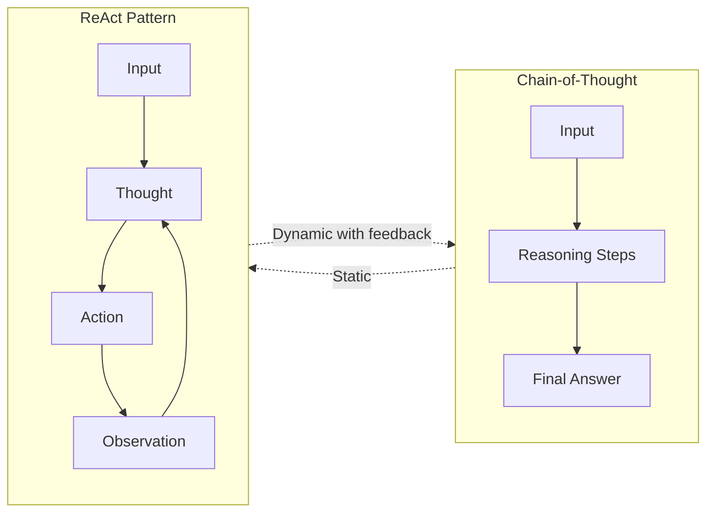

### Summary
**CoT** is for static reasoning - given a problem, think through it step by step. **ReAct** is for dynamic interaction - think, act, observe, and adjust. ReAct extends CoT by adding tool interaction and feedback loops.

### Key Insight
ReAct achieves 34% improvement on ALFWorld and 10% on WebShop over baselines by combining reasoning with acting, proving that interleaved thought-action loops outperform pure reasoning or pure acting.

---

## Theme 2: Agent Architecture

### Overview
WebAgents Survey establishes a universal three-component architecture for AI agents: Perception, Planning & Reasoning, and Execution.

### Architecture Diagram

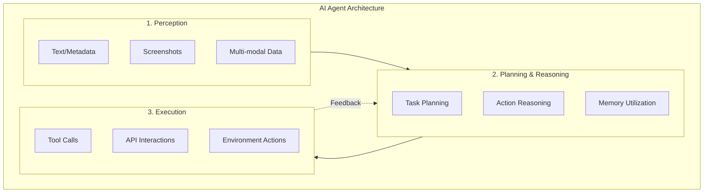

### Component Details

**1. Perception**
- **Text-based:** DOM elements, metadata, page content
- **Visual-based:** Screenshots, OCR on images
- **Multi-modal:** Combining text + vision (e.g., GPT-4V + Gemini Vision)
- **Example:** WebVoyager uses Set-of-Mark prompting to overlay bounding boxes on interactive elements

**2. Planning & Reasoning**
- **Task Planning:** Decompose complex tasks into sub-goals
  - Explicit: ScreenAgent decomposes into structured workflow
  - Implicit: WebWISE feeds task directly without decomposition
- **Action Reasoning:** Generate appropriate actions based on state
- **Memory Utilization:**
  - Internal: Previous actions, current state
  - External: Web search, open-world knowledge

**3. Execution**
- Tool invocation (APIs, databases, file systems)
- Environment interaction (clicking, typing, navigating)
- State modification (updating data, changing UI)

### Planning Approaches Diagram

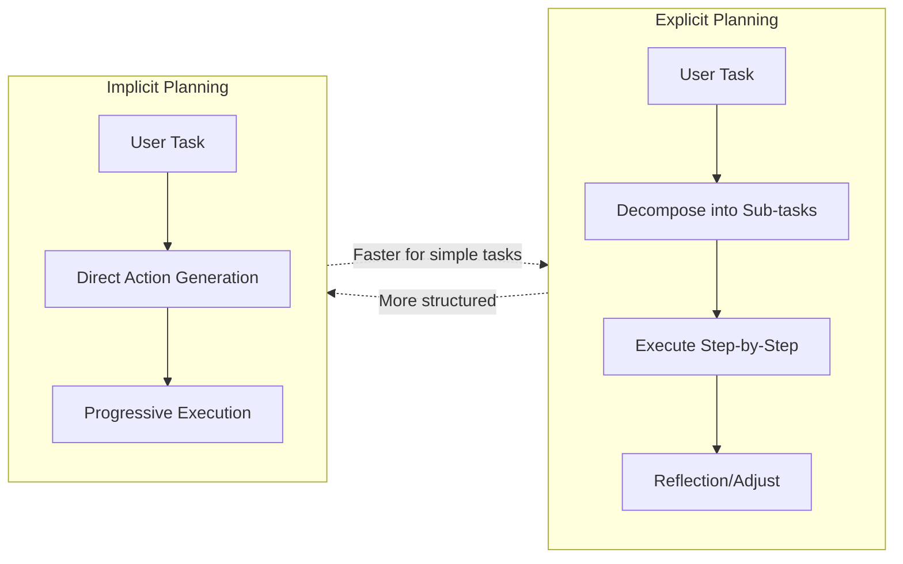

### Summary
All agents follow Perception → Planning → Execution, but differ in planning granularity. Explicit planning (decomposition) works for complex tasks; implicit planning (direct action) works for simple tasks. Memory bridges the gap between perception and execution.

---

## Theme 3: Tool/Function Calling

### Overview
Function calling enables LLMs to interact with external systems, extending their capabilities beyond training data.

### Tool Calling Flow

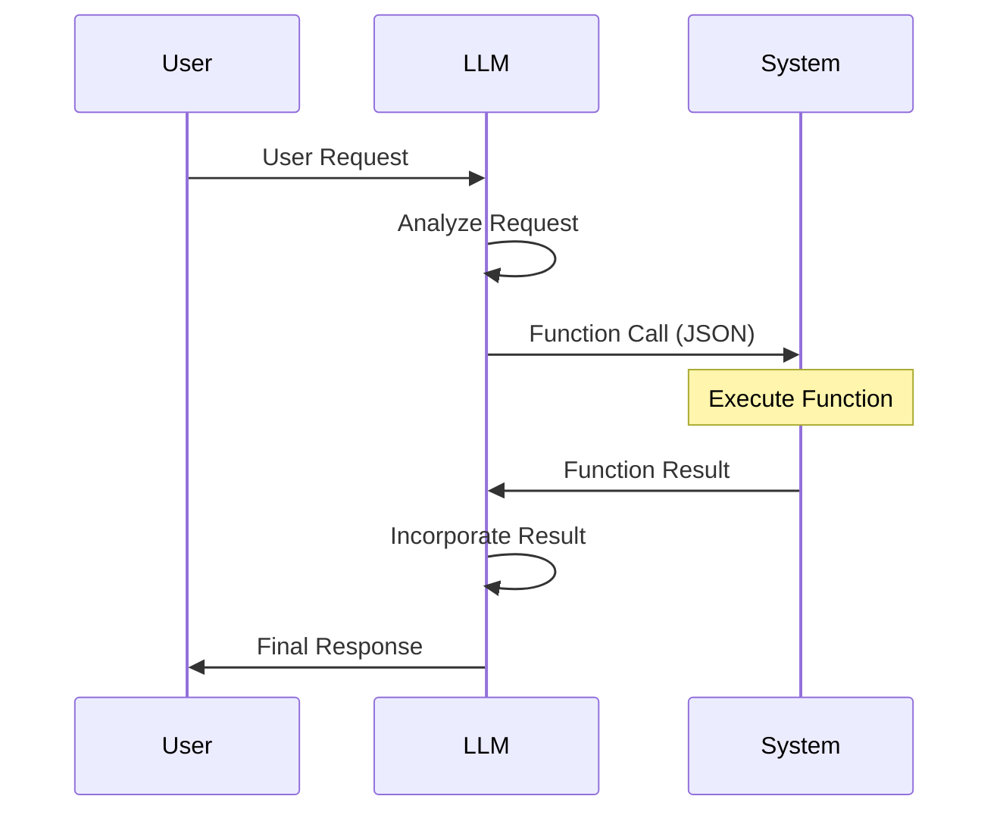

### Key Components

**Function Schema**
- Name, description, parameters
- JSON schema for validation
- Type checking

**Execution Flow**
1. Model decides to call function
2. Outputs JSON with function name and arguments
3. System validates and executes
4. Returns result to model
5. Model incorporates into response

### Edge Cases & Mitigations

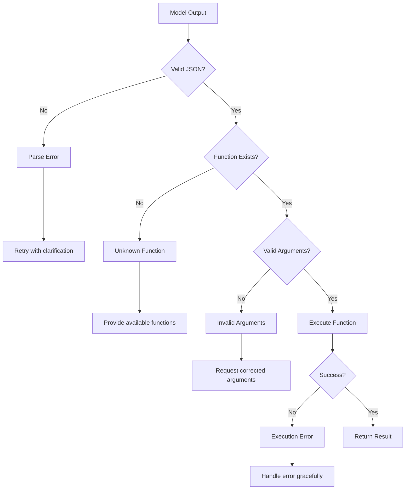

### Summary
Tool calling transforms LLMs from text generators to system integrators. Critical for web development workflows (git, APIs, databases). Requires robust error handling and validation to prevent hallucination and invalid calls.

---

## Theme 4: Memory Systems

### Overview
Agents need memory to maintain context across interactions and learn from experience.

### Memory Architecture

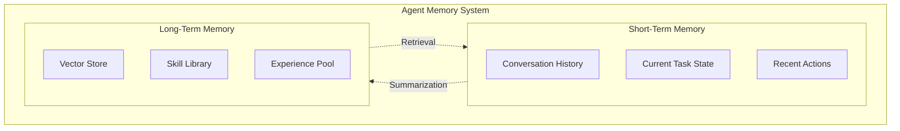

### Short-Term Memory
- **Implementation:** Conversation context in prompt window
- **Capacity:** Limited by context window (4K-128K tokens)
- **Use:** Immediate task context, recent actions
- **Challenge:** Context window limits, token cost

### Long-Term Memory
- **Implementation:** Vector embeddings in database (Pinecone, Weaviate, pgvector)
- **Capacity:** Unlimited (bounded by storage)
- **Use:** Historical knowledge, learned skills, past experiences
- **Challenge:** Retrieval quality, staleness

### Memory Management Strategies

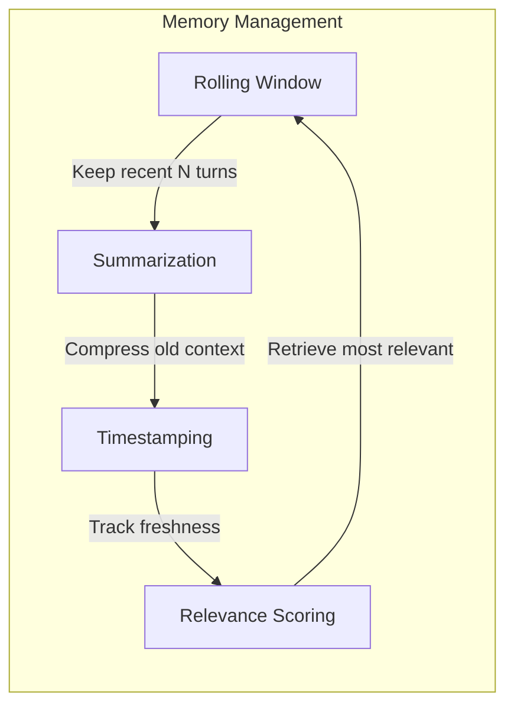

### Summary
Short-term memory = conversation context (what happened recently). Long-term memory = vector database (what's known generally). Both are required: short-term for immediate coherence, long-term for accumulated knowledge and skills.

---

## Theme 5: Multi-Agent Systems

### Overview
Multiple specialized agents collaborating on complex tasks, each with distinct roles and capabilities.

### Multi-Agent Patterns

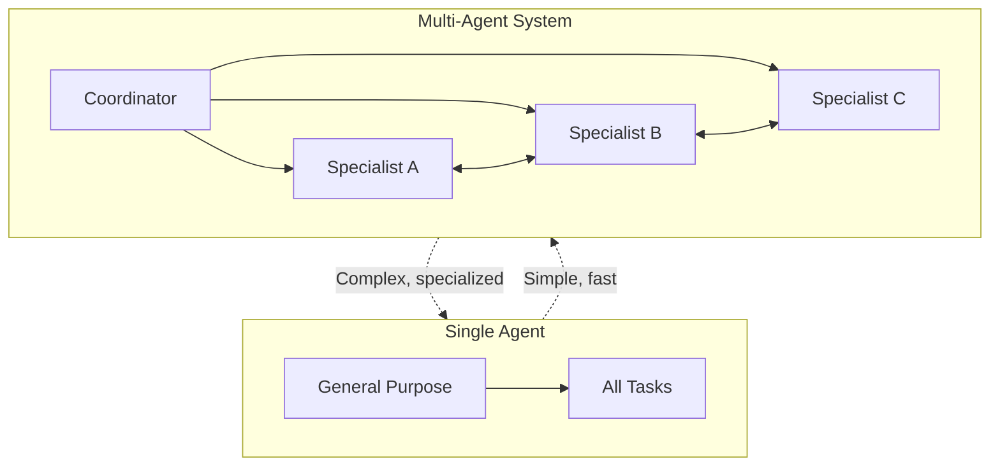

### Common Architectures

**1. Hierarchical**
- Manager agent delegates to worker agents
- Manager: Planning, coordination
- Workers: Execution, specialized tasks

**2. Collaborative**
- Peer agents work together
- Communication and negotiation
- Shared state/memory

**3. Competitive**
- Agents compete to find best solution
- Multiple approaches explored in parallel
- Best result selected

### Trade-offs

| Aspect | Single-Agent | Multi-Agent |
|--------|--------------|-------------|
| Complexity | Low | High |
| Coordination Overhead | None | Significant |
| Parallelization | Limited | High |
| Specialization | General | Specialized |
| Debugging | Simple | Complex |
| Scalability | Limited | High |

### Summary
Multi-agent systems enable parallelization and specialization but introduce coordination complexity. Use for complex tasks requiring multiple perspectives (code review + generation + testing). Avoid for simple workflows where overhead outweighs benefits.

---

## Theme 6: Training and Evaluation

### Overview
Agents require specialized training and evaluation beyond standard LLM fine-tuning.

### Training Approaches

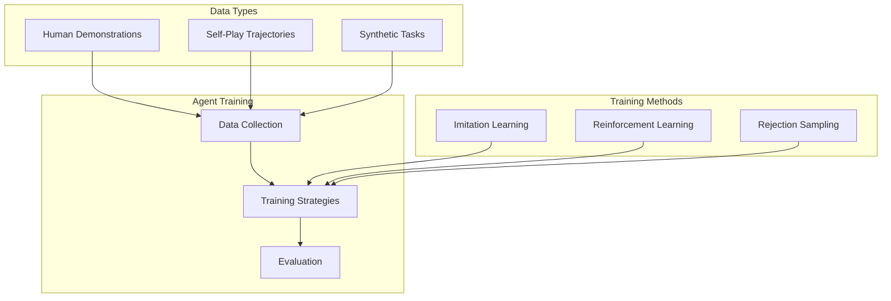

### Evaluation Metrics

**Success Rate**
- Task completion percentage
- Binary: success/failure
- Simple but limited

**Efficiency Metrics**
- Token cost per task
- Time to completion
- Number of tool calls

**Quality Metrics**
- Code correctness (tests pass)
- Solution elegance
- Adherence to constraints

**Robustness Metrics**
- Error recovery rate
- Graceful degradation
- Edge case handling

### Evaluation Framework

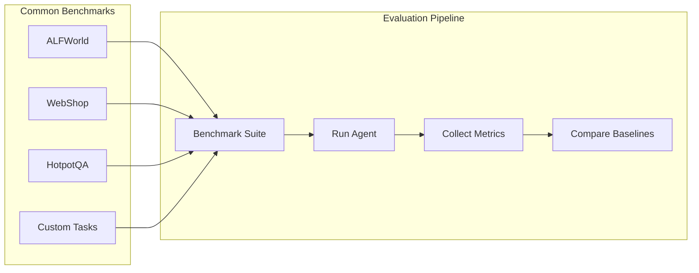

### Summary
Agent training requires trajectory data (action sequences), not just text. Evaluation needs task-specific metrics beyond accuracy. Benchmark suites (ALFWorld, WebShop) provide standardized comparison but may not reflect real-world complexity.

---

## Theme 7: Framework Orchestration

### Overview
LangGraph and similar frameworks provide structured orchestration for agent workflows using graph-based state machines.

### LangGraph Architecture

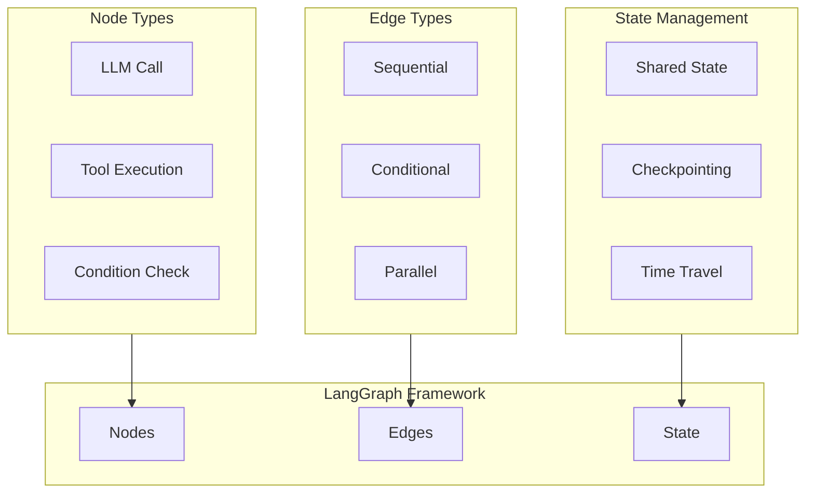

### Key Features

**Graph-Based Orchestration**
- Nodes: Individual steps (LLM calls, tool executions)
- Edges: Transitions between steps
- Conditional routing based on state

**State Management**
- Shared state across nodes
- Checkpointing for recovery
- Time travel for debugging

**Built-in Patterns**
- ReAct loops (standard pattern)
- Tool calling (native support)
- Multi-agent coordination (graph structure)

### Framework vs Custom

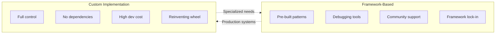

### Summary
Frameworks like LangGraph provide graph-based orchestration with built-in state management and debugging. Trade framework lock-in for development speed and reliability. Use for production systems; consider custom only when frameworks can't support requirements.

---

## Cross-Paper Synthesis

### Universal Agent Components

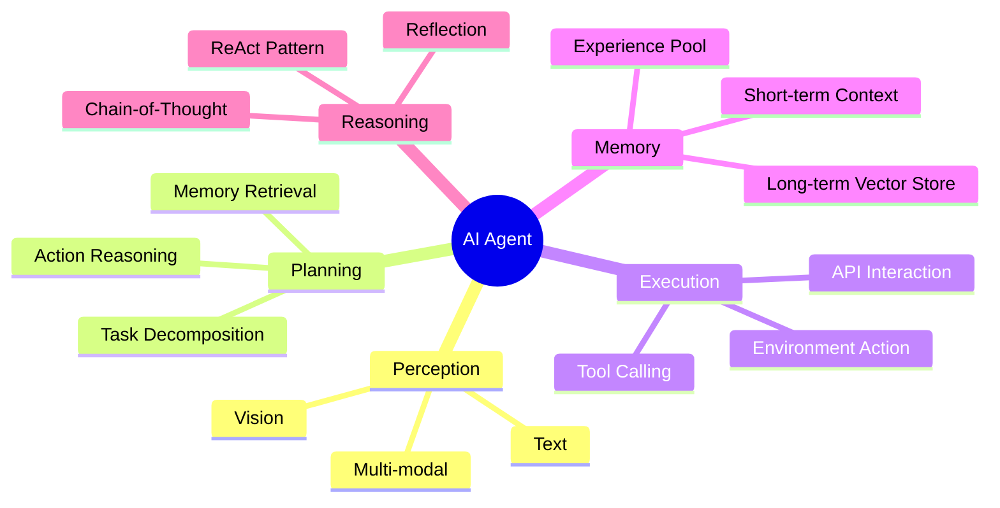

### Pattern Hierarchy

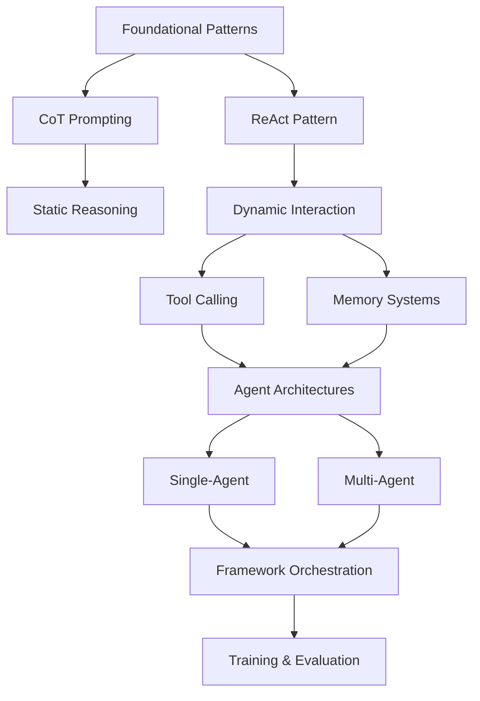

### Implementation Priority for Web Developers

1. **Start with ReAct** - Thought→Action→Observation loop for multi-step workflows
2. **Add Tool Calling** - Function calling for git, APIs, databases
3. **Implement RAG** - Vector store for codebase knowledge
4. **Add Memory** - Short-term context + long-term vector store
5. **Consider Framework** - LangGraph for production orchestration
6. **Multi-Agent Later** - Only if complex tasks require specialization

---

## Key Takeaways

### For Web Development Workflows

**Immediate Implementation**
- ReAct pattern for debugging, refactoring, multi-step tasks
- Function calling for tool integration (git, file system, APIs)
- RAG for codebase queries and documentation lookup

**Phase 2 Implementation**
- Memory systems for context retention across sessions
- Explicit task planning for complex workflows
- Reflection mechanism for self-correction

**Advanced Implementation**
- Multi-agent systems for specialized tasks
- Framework orchestration (LangGraph) for production
- Custom training for domain-specific workflows

### Critical Insights

1. **ReAct > CoT for workflows** - Interactive tasks need feedback loops
2. **Explicit planning for complexity** - Decompose tasks >3 steps
3. **Memory is non-negotiable** - Both short-term and long-term required
4. **Tool calling is essential** - LLMs can't operate in isolation
5. **Frameworks save time** - Don't rebuild orchestration from scratch
6. **Multi-agent is overkill** - Start single, scale only when needed

---

## References

1. ReAct: Synergizing Reasoning and Acting in Language Models. arXiv:2210.03629
2. Chain-of-Thought Prompting Elicits Reasoning in Large Language Models. arXiv:2201.11903
3. A Survey of WebAgents: Towards Next-Generation AI Agents for Web Automation. arXiv:2503.23350
4. From LLMs to LLM-based Agents for Software Engineering: A Survey. arXiv:2408.02479
5. Large Language Model-Based Agents for Software Engineering: A Survey. arXiv:2409.02977
6. Agent AI with LangGraph: A Modular Framework. arXiv:2412.03801

---

**Analysis Complete:** April 30, 2026
