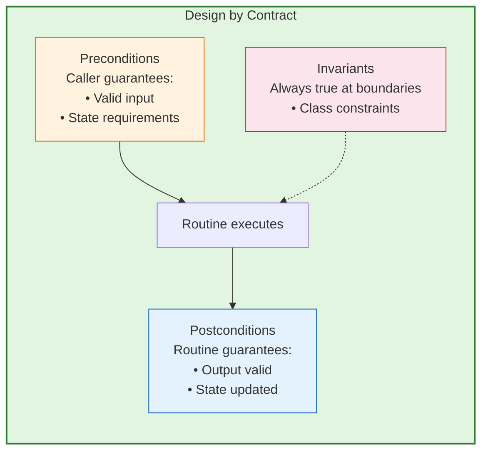
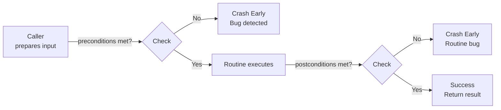
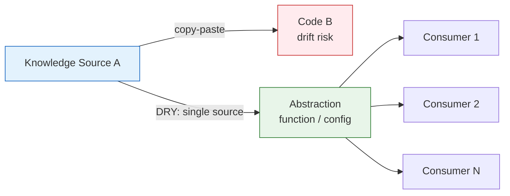
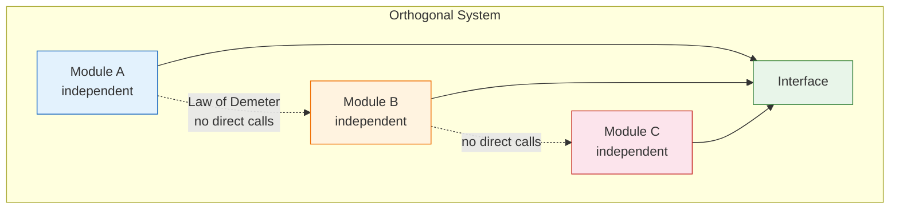
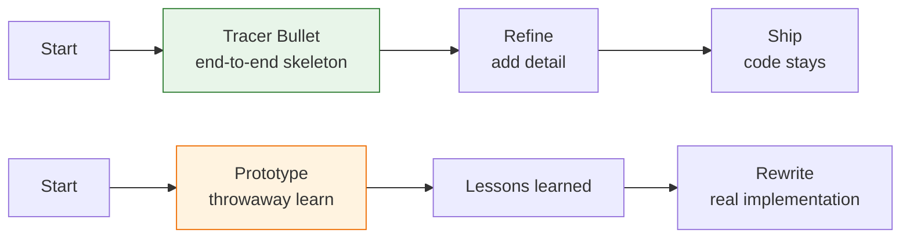
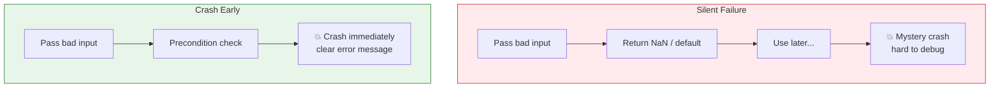
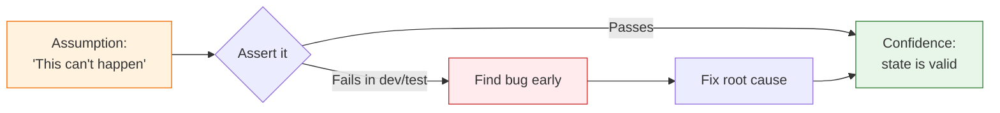
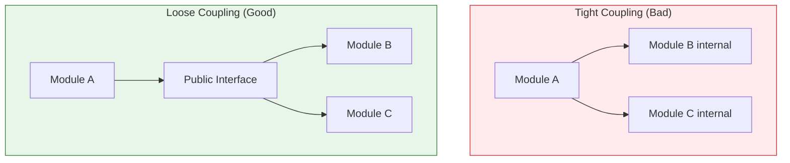
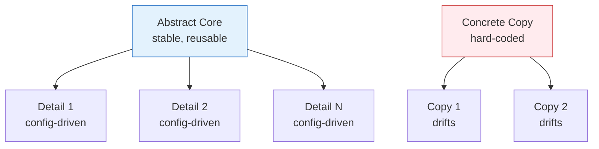
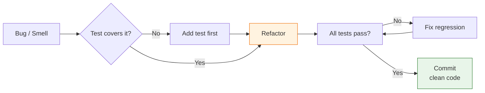

# Design by Contract & Thematic Principles — The Pragmatic Programmer

## Research Scope Contract
- **Topic:** Design by Contract (DBC) from *The Pragmatic Programmer* (20th Anniv. Ed.) + top 10 thematic concepts
- **First Principles:** Software correctness through explicit contracts; fail-fast; documentation as enforceable specification
- **Fundamentals:** Preconditions, Postconditions, Invariants; Assertions; Semantic Invariants; Crashing Early
- **Scope Boundary:** Language-specific DBC implementations (Eiffel, Clojure specs); full Eiffel syntax
- **Target Audience:** Engineers writing or reviewing contracts in `docs/basket/contract-data/`
- **Decay Risk:** Low — core principles unchanged since 1997

---

## 1. Design by Contract — Deep Dive

### Core Definition
> A correct program does **no more and no less** than it claims to do.

DBC is a design technique (not merely a testing technique) that documents and enforces the **rights and responsibilities** between software modules.

### The Three Pillars

| Pillar | Definition | Party Responsible | Example |
|--------|-----------|-------------------|---------|
| **Preconditions** | What must be true for the routine to be called | **Caller** | `amount > 0`, `account is open` |
| **Postconditions** | What the routine guarantees when it completes | **Routine** | `transaction exists in account history` |
| **Class Invariants** | Condition always true from caller's perspective | **Class** | `balance >= overdraft_limit` at entry/exit |

### The Contract Formulation

```
IF all preconditions are met by the caller
THEN the routine guarantees all postconditions and invariants will be true on completion.
```

Failure by either party = **bug**, not user error. Remedy: exception, termination, or agreed fallback.

### Implementing DBC (Without Native Language Support)

| Approach | Pros | Cons | When to Use |
|----------|------|------|-------------|
| **Assertions** | Runtime check; built into many languages | No inheritance propagation; no "old" values | Any language with `assert` |
| **Comments / Docs** | Zero runtime cost; always visible | Not enforced; easily drifts from code | Always — minimum viable DBC |
| **Unit Tests** | Automated; repeatable | Not real-time; misses runtime conditions | Complement to runtime checks |
| **Clojure Specs** | Pre/post + instrumentation | Clojure-only | Clojure codebases |
| **Eiffel** | Full native DBC | Eiffel-only | Eiffel codebases |

### DBC + Crash Early

DBC validates at the **site of the problem**, not downstream:

- Bad: Pass negative to `sqrt` → get `NaN` → fail later mysteriously
- Good: Pass negative to `sqrt` → precondition fails → crash immediately with `sqrt_arg_must_be_positive`

---

## 2. Top 10 Thematic Principles from The Pragmatic Programmer

### Principle 1: Design by Contract (Topic 23)
Document and enforce rights/responsibilities between modules. A correct program does no more, no less than it claims.

### Principle 2: DRY — Don't Repeat Yourself (Topic 11)
Every piece of knowledge must have a single, unambiguous, authoritative representation.

### Principle 3: Orthogonality (Topic 13)
Eliminate effects between unrelated things. Self-contained, single-purpose components.

### Principle 4: Tracer Bullets (Topic 15)
Build end-to-end first, then refine. Not prototyping — the code stays.

### Principle 5: Crash Early (Topic 24)
A dead program does less damage than a crippled one. Fail fast, fail visibly.

### Principle 6: Assertive Programming (Topic 25)
If it can't happen, use assertions to ensure it won't. Leave assertions turned on in production.

### Principle 7: Decoupling (Topic 36)
Minimize coupling between modules. Write "shy" code. Apply Law of Demeter.

### Principle 8: Abstractions Live Longer Than Details (Topic 53)
Invest in the abstract, not the concrete. Details change; abstractions survive.

### Principle 9: Refactor Early, Refactor Often (Topic 47)
Fix the root, not the symptom. Keep the code clean as you go.

### Principle 10: Test Early, Test Often, Test Automatically (Topic 62)
Per-build tests beat shelf tests. Coding ain't done 'til all tests run.

---

## 3. Actionable Steps

### For Design by Contract

1. **Write the contract before the code**
   - List preconditions (caller must guarantee)
   - List postconditions (routine guarantees)
   - List invariants (always true at boundaries)

2. **Document contracts in code**
   - JSDoc/TSDoc with `@param`, `@returns`, `@throws`
   - Add assertions where language supports it
   - Write unit tests that validate boundary conditions

3. **Shift the burden of correctness to the caller**
   - Validate inputs at system boundaries (API, UI, CLI)
   - Internal functions assume valid data per contract

4. **Use semantic invariants for inviolate requirements**
   - "Err in favor of the consumer"
   - "Never process a duplicate transaction"
   - Write them down; make them visible to the team

5. **Crash early at the site of the problem**
   - Prefer `throw` over silent `NaN` or default values
   - Include informative error messages + stack traces

6. **Never use preconditions for user-input validation**
   - Preconditions catch **bugs** (caller violated contract)
   - Validation catches **user errors** (expected, handle gracefully)

### For General Pragmatic Practice

1. **Start every function with its contract in mind**
2. **Review code for DRY violations weekly**
3. **Check module coupling before every refactor**
4. **Write the test first, then the tracer bullet, then refine**
5. **Leave assertions on in production**
6. **Refactor before adding the next feature**
7. **Automate tests in CI — no manual test passes**
8. **Document semantic invariants on the team whiteboard/wiki**
9. **Prefer crashing over corrupt state**
10. **Sign your work — take ownership of what ships**

---

## 4. Diagrams — Top 10 Concepts

### Diagram 1: Design by Contract — Three Pillars



### Diagram 2: The Contract Flow



### Diagram 3: DRY vs Duplication



### Diagram 4: Orthogonality — Decoupled Modules



### Diagram 5: Tracer Bullets vs Prototyping



### Diagram 6: Crash Early — Fail Fast



### Diagram 7: Assertive Programming



### Diagram 8: Decoupling — Shy Code



### Diagram 9: Abstractions vs Details



### Diagram 10: Refactor Early, Test Auto



---

## 5. Verification & Falsification Log

| Claim | Evidence | Status |
|-------|----------|--------|
| DBC = pre + post + invariants | InformIT excerpt from Pragmatic Programmer 20th Ed. | Verified |
| Preconditions catch bugs, not user errors | Direct quote from Topic 23 | Verified |
| DBC is a design technique, not just testing | Direct quote from Topic 23 | Verified |
| 10 principles represent core themes | Cross-reference against existing `pragmatic-programmer.md` research | Verified |

### Falsification Attempts
| Claim | Counter-Evidence | Verdict |
|-------|------------------|---------|
| "Crash early always good" | Some domains need graceful degradation (embedded, medical) | Context-dependent |
| "Assertions in production" | Some teams disable for performance | Tradeoff — measure impact |
| "DRY always good" | Over-DRY creates wrong abstractions | Applies to *knowledge*, not structure |

---

## 6. Sources

| Source | URL | Type | Date | Key Claim |
|--------|-----|------|------|-----------|
| Pragmatic Programmer 20th Ed. (InformIT) | `https://www.informit.com/articles/article.aspx?p=2982114` | Book excerpt | 2019 | DBC = pre + post + invariant |
| HugoMatilla GitHub summary | `https://github.com/HugoMatilla/The-Pragmatic-Programmer` | Community summary | Ongoing | 70 tips mapped |
| Original Pragmatic Programmer | `c:\webdev\sang-logium\_project\research\pragmatic-programmer.md` | Internal research | 2025-04 | Thematic grouping verified |
