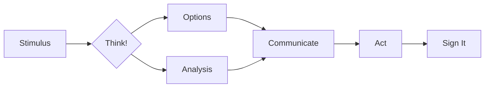
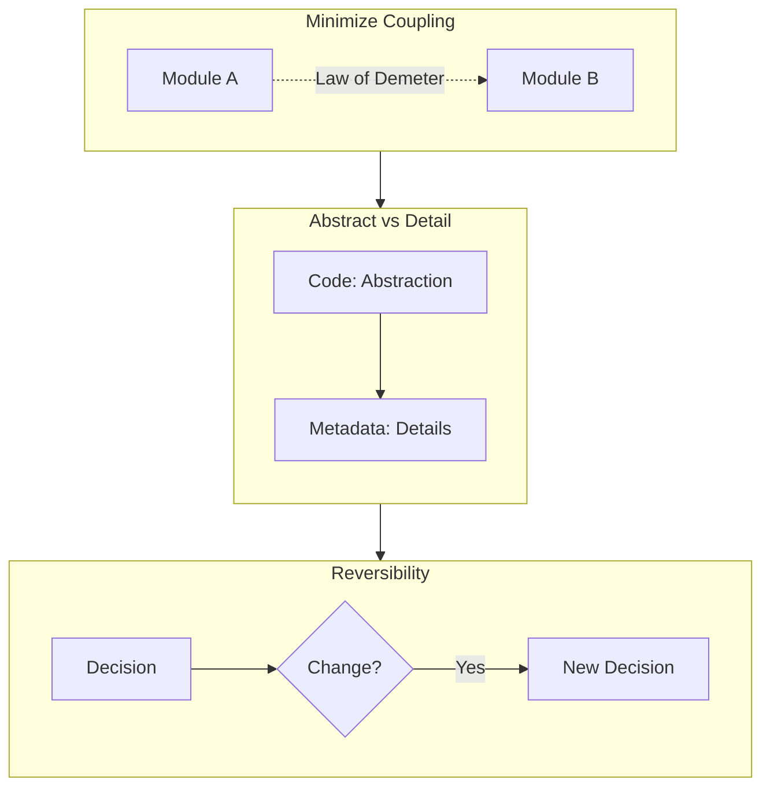
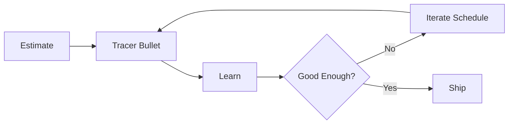
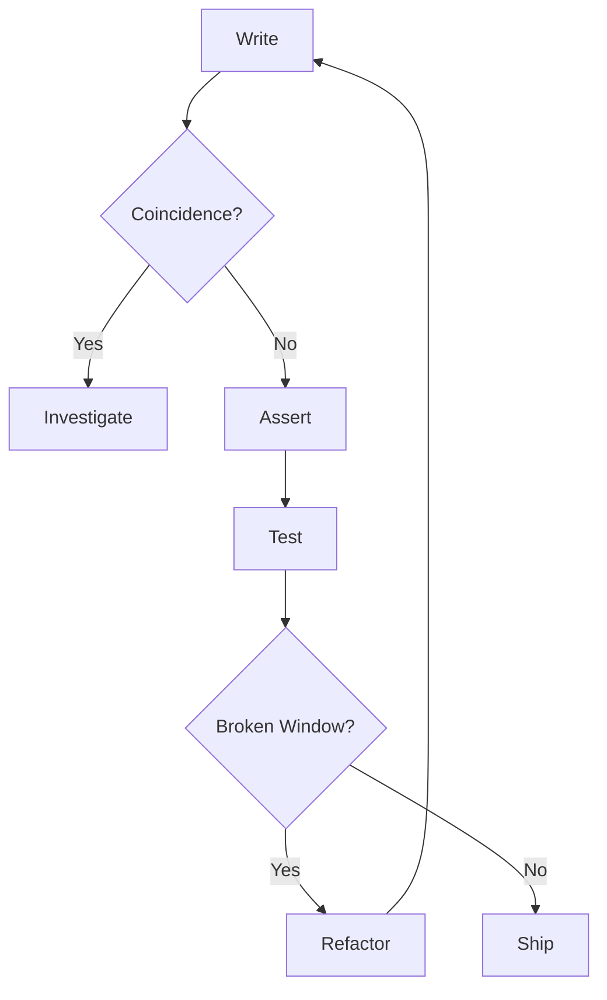
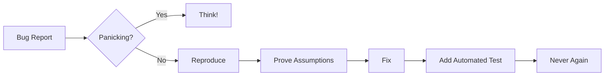
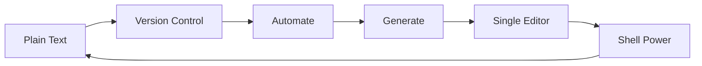
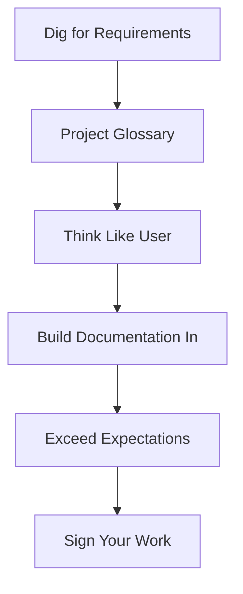
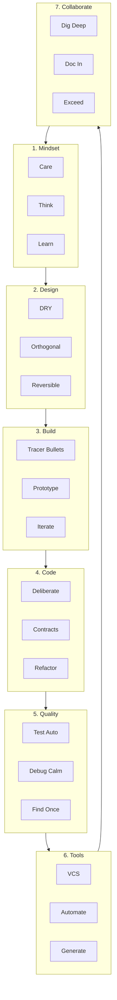

# Pragmatic Programmer: Thematic Principles

## Research Scope Contract
- **Topic:** Core principles from *The Pragmatic Programmer* (Hunt & Thomas, 1999 / 20th Anniv. 2019)
- **First Principles:** Take ownership of your craft; design for change; validate ruthlessly
- **Fundamentals:** DRY, Orthogonality, Tracer Bullets, Design by Contract, Automated Testing
- **Scope Boundary:** Language/framework specifics; full book summary
- **Target Audience:** Developers seeking a condensed, actionable reference
- **Decay Risk:** Low — principles are timeless

---

## 1. Mindset: Own Your Craft

**Take responsibility.** Think critically. Keep learning.

| # | Principle | Essence |
|---|-----------|---------|
| 1 | Care About Your Craft | Do it well or not at all |
| 2 | Think! About Your Work | Turn off autopilot; critique constantly |
| 3 | Provide Options, Not Excuses | "Can't" → "Here's what we can do" |
| 8 | Invest in Knowledge Portfolio | Make learning a habit |
| 9 | Critically Analyze Hype | Don't be swayed by vendors or dogma |
| 10 | Communicate Effectively | Ideas are worthless if poorly conveyed |
| 56 | Start When You're Ready | Trust experience; don't ignore doubts |
| 58 | Don't Be a Slave to Formal Methods | Adapt techniques to your context |
| 70 | Sign Your Work | Take pride in what you ship |

---

## 2. Design: Build for Change

**DRY. Orthogonal. Decoupled. Reversible. Abstract.**

| # | Principle | Essence |
|---|-----------|---------|
| 11 | DRY — Don't Repeat Yourself | One authoritative representation per knowledge piece |
| 13 | Eliminate Effects Between Unrelated Things | Self-contained, single-purpose components (Orthogonality) |
| 14 | There Are No Final Decisions | Design for reversibility |
| 36 | Minimize Coupling Between Modules | Write "shy" code; apply Law of Demeter |
| 37 | Configure, Don't Integrate | Technology choices as config, not engineering |
| 38 | Abstractions in Code, Details in Metadata | General case compiled; specifics external |
| 40 | Design Using Services | Independent, concurrent objects behind clean interfaces |
| 41 | Always Design for Concurrency | Cleaner interfaces, fewer assumptions |
| 42 | Separate Views from Models | MVC flexibility at low cost |
| 43 | Use Blackboards to Coordinate Workflow | Decouple disparate facts/agents |
| 53 | Abstractions Live Longer than Details | Invest in the abstract, not the concrete |
| 55 | Find the Box | Identify real constraints before "thinking outside" |

---

## 3. Build: Learn by Shipping

**Prototype. Estimate. Iterate. Stay close to the domain.**

| # | Principle | Essence |
|---|-----------|---------|
| 5 | Be a Catalyst for Change | Show the future; let people participate |
| 6 | Remember the Big Picture | Don't lose yourself in details |
| 7 | Make Quality a Requirements Issue | Users define real quality |
| 15 | Use Tracer Bullets to Find the Target | Build end-to-end, then refine |
| 16 | Prototype to Learn | Value is in lessons, not code |
| 17 | Program Close to the Problem Domain | Use the user's language |
| 18 | Estimate to Avoid Surprises | Spot problems upfront |
| 19 | Iterate the Schedule with the Code | Refine timelines using experience |
| 39 | Analyze Workflow to Improve Concurrency | Exploit natural concurrency in user flow |
| 57 | Some Things Are Better Done than Described | Stop speculating; start coding |

---

## 4. Code: Write Deliberately

**Be intentional. Refactor often. Don't trust magic.**

| # | Principle | Essence |
|---|-----------|---------|
| 4 | Don't Live with Broken Windows | Fix bad design/decisions/code immediately |
| 30 | You Can't Write Perfect Software | Design defensively; expect errors |
| 31 | Design with Contracts | Document what code does and doesn't do |
| 32 | Crash Early | A dead program does less damage than a crippled one |
| 33 | Use Assertions to Prevent the Impossible | Validate assumptions against an uncertain world |
| 34 | Use Exceptions for Exceptional Problems | Reserve exceptions for truly exceptional cases |
| 35 | Finish What You Start | Allocator deallocates; resource lifecycle ownership |
| 44 | Don't Program by Coincidence | Rely only on reliable things |
| 45 | Estimate Algorithm Order | Know Big-O before writing |
| 46 | Test Your Estimates | Benchmark in the target environment |
| 47 | Refactor Early, Refactor Often | Fix the root, not the symptom |
| 50 | Don't Use Wizard Code You Don't Understand | Understand every line you ship |

---

## 5. Quality: Verify Ruthlessly

**Debug systematically. Test automatically. Find bugs once.**

| # | Principle | Essence |
|---|-----------|---------|
| 24 | Fix the Problem, Not the Blame | Your problem regardless of fault |
| 25 | Don't Panic When Debugging | Breathe. Think. |
| 26 | "select" Isn't Broken | The bug is in your code, not the OS/compiler/lib |
| 27 | Don't Assume It — Prove It | Verify with real data and boundary conditions |
| 48 | Design to Test | Consider testing before writing code |
| 49 | Test Your Software, or Your Users Will | Ruthless testing beats user reports |
| 62 | Test Early. Test Often. Test Automatically | Per-build tests > shelf tests |
| 63 | Coding Ain't Done 'Til All the Tests Run | Non-negotiable |
| 64 | Use Saboteurs to Test Your Testing | Introduce bugs to verify test coverage |
| 65 | Test State Coverage, Not Code Coverage | Lines != significant states |
| 66 | Find Bugs Once | Human finds it once; automation catches it forever |

---

## 6. Tools: Sharpen Your Axe

**Master your environment. Automate everything.**

| # | Principle | Essence |
|---|-----------|---------|
| 20 | Keep Knowledge in Plain Text | Leverage, debug, test — no format lock-in |
| 21 | Use the Power of Command Shells | When GUIs don't cut it |
| 22 | Use a Single Editor Well | Extension of your hand: configurable, extensible, programmable |
| 23 | Always Use Source Code Control | Time machine for your work |
| 28 | Learn a Text Manipulation Language | Automate text-heavy workflows |
| 29 | Write Code That Writes Code | Generators boost productivity, reduce duplication |
| 61 | Don't Use Manual Procedures | Scripts execute identically, every time |

---

## 7. Collaborate: People Are Part of the System

**Dig for requirements. Think like users. Document in code.**

| # | Principle | Essence |
|---|-----------|---------|
| 12 | Make It Easy to Reuse | Environment matters; friction kills reuse |
| 51 | Don't Gather Requirements — Dig for Them | Beneath assumptions, misconceptions, politics |
| 52 | Work With a User to Think Like a User | Best insight into real usage |
| 54 | Use a Project Glossary | Single source of vocabulary |
| 59 | Costly Tools Don't Produce Better Designs | Judge on merits, not price tags |
| 60 | Organize Teams Around Functionality | Don't separate designers, coders, testers |
| 67 | English is Just a Programming Language | DRY, metadata, MVC apply to docs too |
| 68 | Build Documentation In, Don't Bolt It On | Separate docs rot; inline docs live |
| 69 | Gently Exceed Users' Expectations | Understand, then deliver +1 |

---

## Synthesis: The Pragmatic Flywheel

---

## Verification & Falsification Log

| Claim | Evidence | Status |
|-------|----------|--------|
| 70 tips from original book | GitHub summary @ HugoMatilla/The-Pragmatic-Programmer, Wikipedia | ✅ Verified |
| Thematic grouping preserves all tips | Cross-reference against source list | ✅ Verified — all 70 mapped |
| Principles are timeless | 20th Anniversary Edition (2019) reaffirmed core tips | ✅ Verified |

### Falsification Attempts
| Claim | Counter-Evidence | Verdict |
|-------|------------------|---------|
| "DRY is always good" | Over-DRY creates wrong abstractions; duplication < bad abstraction | ⚠️ Context-dependent — DRY applies to *knowledge*, not code structure |
| "Crash early is always good" | Some domains require graceful degradation over crashing | ⚠️ Context-dependent — default to failing fast, degrade where required |

### Knowledge Decay Assessment
| Section | Risk | Review Date |
|---------|------|-------------|
| Tool-specific tips (22, 28) | Med | When editor landscape shifts |
| Concurrency tips (39, 41) | Low | As hardware evolves |
| Core principles (1-70) | Low | Timeless |
