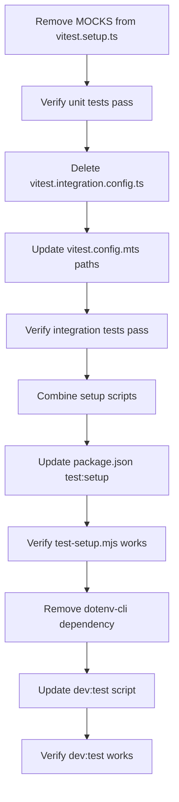

# Testing Setup Simplification Plan

## Plan

**Step 1:** Remove MOCKS from vitest.setup.ts (keep only jest-dom matchers)
**Step 2:** Verify vitest unit tests still pass after removing mocks
**Step 3:** Delete vitest.integration.config.ts (use single config)
**Step 4:** Update vitest.config.mts to include integration test paths
**Step 5:** Verify integration tests still pass with single config
**Step 6:** Combine setup scripts into single test-setup.mjs
**Step 7:** Update package.json to use single npm run test:setup command
**Step 8:** Verify test-setup.mjs creates and verifies test data
**Step 9:** Remove dotenv-cli dependency from package.json
**Step 10:** Update dev:test script to use Next.js built-in env loading
**Step 11:** Verify dev:test still works without dotenv-cli

## Diagram

## Verification Commands

**After Step 2:** `npm run test`
**After Step 5:** `npm run test:integration`
**After Step 8:** `npm run test:setup`
**After Step 11:** `npm run dev:test`

## Rollback Plan

- Each step changes single file
- Revert file if verification fails
- No cascade dependencies
- Independent rollback for each step
