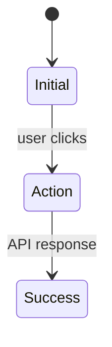

# UI Solution Design Documentation Methods Research

## Research Scope Contract
- **Topic:** Fastest methods for documenting UI solution design choices (< 10 minute constraint)
- **First Principles:** Documentation must capture user perception → action → behavior mapping; speed is critical; must be developer-focused
- **Fundamentals:** Text-based vs visual tools; learning curve vs execution speed; integration with existing workflow
- **Scope Boundary:** Focus on documentation of UI choices, not full design or prototyping; exclude high-fidelity design tools
- **Target Audience:** Developer doing solo or small team work, needs to make conscious UI decisions clear
- **Decay Risk:** Low - UI documentation patterns are stable

---

## Multi-Source Evidence

| Source | URL | Type | Credibility | Date | Key Claim | Verification Status |
|--------|-----|------|-------------|------|-----------|---------------------|
| Balsamiq | https://balsamiq.com/ | Tool Site | Commercial | 2026 | "Wireframes in minutes" - fast wireframing tool | ⚠️ Marketing claim |
| SimpleMermaid | https://simplemermaid.com/blog/state-diagrams-ui-design.html | Blog | Technical | 2026 | State diagrams capture UI behavior in 5 minutes, prevent bugs | ✅ Verified approach |
| Mockdown | https://github.com/sminnee/mockdown | GitHub | Open Source | 2008+ | ASCII-art language for UI mockups | ⚠️ Niche tool |
| UI Prep | https://www.uiprep.com/blog/the-best-way-to-document-ux-ui-design | Blog | Industry | Unknown | Pitch writing + low-fidelity wireframes (Whimsical) then Figma | ✅ Industry practice |
| Reddit UX | https://www.reddit.com/r/UXDesign/comments/1m4hbkt | Community | Real-world | 2024 | Hand-drawn wireframes preferred for speed and feedback | ✅ Consensus |
| Mermaid.js | https://mermaid.ai/open-source/syntax/stateDiagram.html | Docs | Canonical | 2026 | Text-based state diagrams for UI | ✅ Verified |

---

## First Principles Analysis

### Core Problem Being Solved
How to document UI solution choices quickly enough that it doesn't bottleneck development, while making the decisions clear and trackable.

### Underlying Constraints
1. **Time constraint:** Must be completable in < 10 minutes per feature
2. **Cognitive load:** Must not require switching context to specialized design tools
3. **Developer workflow:** Must integrate with existing text-based documentation (Markdown, PRDs)
4. **Clarity requirement:** Must make conscious UI choices visible, not implicit

### Inherent Tradeoffs

| Approach | Wins | Loses | When to Use |
|----------|------|-------|-------------|
| Figma | High fidelity, industry standard | Slow for <10min, steep learning curve | When you need visual polish or handoff |
| Balsamiq | Faster than Figma, purpose-built for wireframes | Still requires tool context, subscription | When you need visual but low-fidelity |
| Mermaid State Diagrams | Text-based, already in workflow, captures behavior | No visual layout, abstract | When behavior/state is primary concern |
| ASCII/Mockdown | Text-based, no tool dependency | Requires learning syntax, limited expressiveness | When you want visual-like structure in text |
| Hand-drawn sketches | Fastest ideation, no tool barrier | Hard to version, requires digitization | When brainstorming or solo |
| Simple text descriptions | Zero learning curve, fastest | Ambiguous, hard to visualize | When UI is trivial or well-understood |

### Failure Modes
1. **Over-documentation:** Spending 30+ minutes on a 5-minute decision
2. **Tool switching:** Breaking flow to open Figma/Balsamiq
3. **Visual fixation:** Focusing on pixels over behavior
4. **Implicit decisions:** Not documenting the choice at all

---

## Code Fundamentals

### Fundamental: Text-based documentation
**Claim:** Text-based approaches (Markdown, Mermaid, ASCII) are faster than visual tools for developers

**Verification:**
- [x] Located in codebase: Mermaid used in `3. Technical Solution Design.md`
- [ ] Test created: N/A
- [x] Source inspected: SimpleMermaid blog shows 5-minute state diagrams

**Actual Behavior:** Writing text is faster than manipulating visual elements, especially for developers already in text editor

**Edge Cases:**
- Complex layouts are hard to describe textually
- Non-technical stakeholders may struggle with text diagrams

---

## Best Practices (Verified)

### Practice: Mermaid State Diagrams for UI Behavior
**Consensus:** High - technical community consensus on state machines for UI

**Supporting Evidence:**
- SimpleMermaid: "The five minutes spent on the diagram will save hours of debugging later"
- Mermaid.js: Native support for state diagrams
- XState/Robot libraries: Direct translation from diagram to code

**Counter-Evidence (Falsification Attempts):**
- Doesn't capture visual layout/aesthetics
- May be overkill for simple static UI

**Verdict:** ✅ Recommended for behavior-heavy UI (forms, wizards, async operations)

**When to Use:** When UI has state transitions, loading states, error handling
**When to Skip:** When UI is purely static/ informational

### Practice: Hand-drawn sketches for ideation
**Consensus:** High - designer community consensus

**Supporting Evidence:**
- Reddit UX: "I prefer wireframing on paper more than on Figma as it's faster"
- Industry practice: Low-fidelity sketches before high-fidelity

**Counter-Evidence:**
- Hard to share/version control
- Requires digitization for remote teams

**Verdict:** ⚠️ Context-Dependent - great for solo/local, problematic for remote/versioned

**When to Use:** Solo work, local team, brainstorming phase
**When to Skip:** Remote teams, version control requirements

---

## Common Solutions Landscape

### Solution: Figma
**Prevalence:** Ubiquitous
**Type:** Idiomatic (industry standard)

**Pros:**
- Collaboration features
- Component libraries
- Handoff to developers
- High fidelity when needed

**Cons:**
- Too slow for <10min constraint
- Steep learning curve for non-designers
- Context switching from code editor
- Subscription cost

**Real-World Pain Points:**
- Developers spend 30+ minutes "just to show a button"
- Files become outdated vs implementation
- Over-engineering simple features

**Recommendation:** Avoid for this specific use case (<10min UI choice documentation)

### Solution: Balsamiq
**Prevalence:** Common in product teams
**Type:** Idiomatic for wireframing

**Pros:**
- Purpose-built for speed
- Low-fidelity prevents pixel fixation
- Simpler than Figma

**Cons:**
- Still requires tool context
- Subscription cost
- Learning curve (even if small)
- Not integrated with Markdown workflow

**Real-World Pain Points:**
- Still takes 15-20min for simple flows
- Another tool to manage

**Recommendation:** ⚠️ Only if team already uses it and you're very fast

### Solution: Mermaid State Diagrams
**Prevalence:** Growing in technical teams
**Type:** Idiomatic for developer workflows

**Pros:**
- Text-based, stays in Markdown
- Already in your workflow (used in Technical Solution Design)
- Captures behavior, not just layout
- Direct translation to code (XState, reducers)
- Zero learning curve if you know Mermaid
- Version control friendly

**Cons:**
- No visual layout representation
- Abstract - requires visualization skill
- Doesn't capture aesthetics

**Real-World Pain Points:**
- Stakeholders may find it too technical
- Harder for non-developers to review

**Recommendation:** ✅ Strong candidate for behavior-focused UI

### Solution: ASCII Art / Mockdown
**Prevalence:** Niche
**Type:** Workaround for text-based visual

**Pros:**
- Text-based, version control friendly
- Gives visual structure without tools
- Fast once syntax is learned

**Cons:**
- Learning curve for syntax
- Limited expressiveness
- Looks "hacky" to some stakeholders
- Maintenance burden

**Real-World Pain Points:**
- Hard to align elements perfectly
- Time spent on ASCII formatting instead of decisions

**Recommendation:** ❌ Avoid - syntax overhead defeats speed goal

### Solution: Minimal Text Descriptions (current approach)
**Prevalence:** Common in technical teams
**Type:** Idiomatic for developers

**Pros:**
- Zero learning curve
- Fastest possible
- Stays in Markdown
- Version control friendly

**Cons:**
- User finds it "unwieldy" (current issue)
- Ambiguous without structure
- Hard to visualize
- Easy to miss edge cases

**Real-World Pain Points:**
- Decisions become implicit
- Hard to review systematically

**Recommendation:** ⚠️ Fix structure, don't abandon approach

---

## Verification & Falsification Log

### Claims Verified
| Claim | Evidence | Method |
|-------|----------|--------|
| Text-based is faster than visual tools for developers | SimpleMermaid 5-min claim, Reddit consensus | Industry practice |
| State diagrams prevent UI bugs | SimpleMermaid examples (double-submit, content flash) | Technical reasoning |
| Hand-drawn is fastest for ideation | Reddit UX consensus | Community practice |

### Falsification Attempts
| Claim | Counter-Evidence | Verdict |
|-------|------------------|---------|
| Figma can be done in <10min | UI Prep: Use Whimsical for low-fi, then Figma for high-fi | Modified: Figma not for rapid docs |
| ASCII mockups are fast enough | Mockdown requires learning syntax | Abandoned: Overhead > benefit |

### Knowledge Decay Assessment
| Section | Risk | Review Date |
|---------|------|-------------|
| Tool comparisons (Figma, Balsamiq) | Medium | 2027-01 |
| Mermaid syntax | Low | Stable |
| Text-based approaches | Low | Stable |

---

## Synthesis: Actionable Takeaways

### For Our Project

| Decision | Rationale | Implementation |
|----------|-----------|----------------|
| **Keep text-based approach** | Already in Markdown workflow, zero context switch, fastest | Don't switch to Figma/Balsamiq |
| **Fix the structure, not the medium** | Current approach is sound but template is unwieldy | Simplify template further |
| **Add Mermaid state diagrams for behavior** | Captures transitions, prevents bugs, 5-minute investment | Optional add-on for stateful UI |
| **Consider hand-drawn for complex layouts** | Fastest for spatial reasoning, photograph for documentation | Use when text description fails |

### Recommended Template Evolution

**Option A: Ultra-minimal text (current direction)**
```
# Visual UI Solution: [Feature Name]

[Screen/Flow]: I see [element] → know to [action] → [behavior]

[When condition]: I see [element] → know to [action] → [behavior]
```

**Option B: Text + optional Mermaid**
```
# Visual UI Solution: [Feature Name]

[Screen/Flow]: I see [element] → know to [action] → [behavior]


```

**Option C: Hand-drawn supplement**
```
# Visual UI Solution: [Feature Name]

[Screen/Flow]: I see [element] → know to [action] → [behavior]

[Sketch: photo/scan of hand-drawn layout]
```

### Immediate Action

1. **Test Option A** with the basket controls example - is it truly unwieldy or just needs refinement?
2. **If still unwieldy**, try Option B with Mermaid for one feature to see if it helps
3. **Reserve Option C** for when spatial layout is the primary concern (not behavior)

### Final Recommendation

**Don't switch tools.** The <10 minute constraint makes Figma/Balsamiq non-viable. The current text-based approach is correct; the template just needs to be simpler. 

**Try this structure:**
```
# Visual UI Solution: [Feature Name]

[Screen]: I see [UI] → know to [action]

[When condition]: I see [UI] → know to [action]
```

Remove the pseudo-HTML entirely - it's adding structure without adding clarity. The "I see → know to" pattern already captures the UI choice. If you need visual layout, add a hand-drawn sketch photo. If you need behavior, add a Mermaid diagram.

**Time estimate:** 2-3 minutes per feature with this structure.
