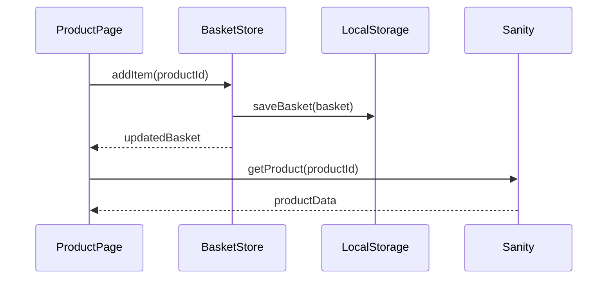

Goal: capture technical solution design in minimalest possible way
Criteria: 0 unnecessary verbiage, 0 unnecessary characters

// example only, don't take literally
# Technical Solution: Basket Controls

## Architecture
- ProductPage component renders add button
- BasketStore manages basket state
- LocalStorage persists basket
- Sanity API provides product data
...



## Types
```typescript
interface BasketItem {
  productId: string
  quantity: number
}

interface BasketState {
  items: BasketItem[]
  totalCount: number
}
```

## Behaviors
- When user clicks add, Store increments quantity → updates UI
- When user clicks remove, Store removes item → updates UI
- When basket loads, Store hydrates from LocalStorage → initializes state

## Edge Cases
- When LocalStorage is empty, Store starts with empty basket → no error
- When API fails, UI shows error message → graceful degradation

## ...
