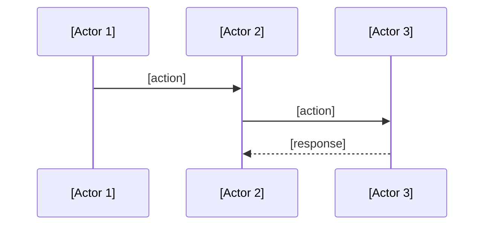

Goal: capture technical solution design in minimalest possible way
Criteria: 0 unnecessary verbiage, 0 unnecessary characters

# Technical Solution: [Name]

## Q & A Research & Design 
- what are the domains? 
- what minimal critical knowledge to i need?
- critical choices
- what are system boundaries, data flow, and dependencies chain
- who are actors
- how do they communicate, in what order
- what's the leanest solution with least complications possible
- what are the trade offs? what are the consequences? 

# Pre-requirements, dependencies chain checks and tasks (minimalest possible but reliable, skipping obvious ones)
- what does this solution rely on? (e.g. sanity schema must have <...> fields, a <...> dependency must be installed, etc., )

# Critical Checks
- what am i missing? 
- what illusions did i fall for?
- what did i not check? 
- what assumptions have i made?
- what is unnecessary that i failed to question and delete?
- what are the threats? what might complicate?
- what problems will arise? what will go slow? 
- what will be painful to verify?
- what will require painful rework?

## Architecture
- [Actor 1] does [single responsibility]
- [Actor 2] does [single responsibility]
- [Actor 3] does [single responsibility]
...



## Types
```typescript
interface [Name] {
  [field]: [type]
}
```

## Behaviors
- When [event], [actor] does [action] → [result]
- When [event], [actor] does [action] → [result]

## Edge Cases
- When [failure], system [fallback behavior]
- When [failure], system [fallback behavior]

## ...
