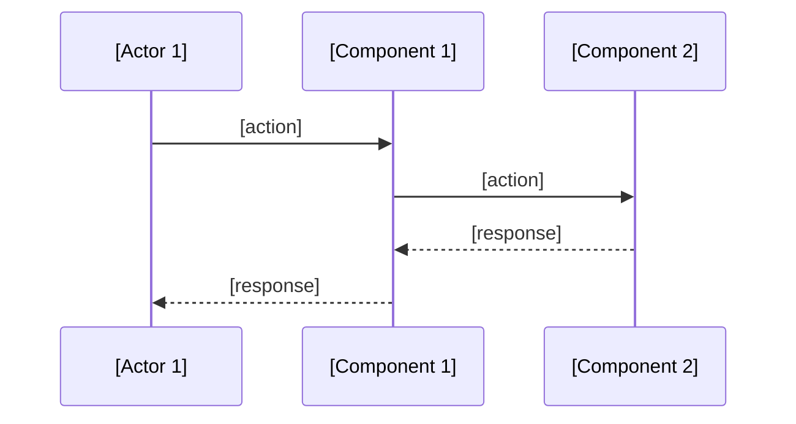

Goal: capture minimal upfront design in leanest possible way
Criteria: 0 unnecessary verbiage, 0 unnecessary characters

# Minimal Upfront Design: [Feature Name]

## Architecture
- **[Component 1]**: [responsibility]
- **[Component 2]**: [responsibility]
- **[Component 3]**: [responsibility]

## Files & Components
- `[path/to/file1.ts]`: [purpose]
- `[path/to/file2.ts]`: [purpose]
- `[path/to/file3.tsx]`: [purpose]

## Data Flow
[Component 1] → [Component 2] → [Component 3]
