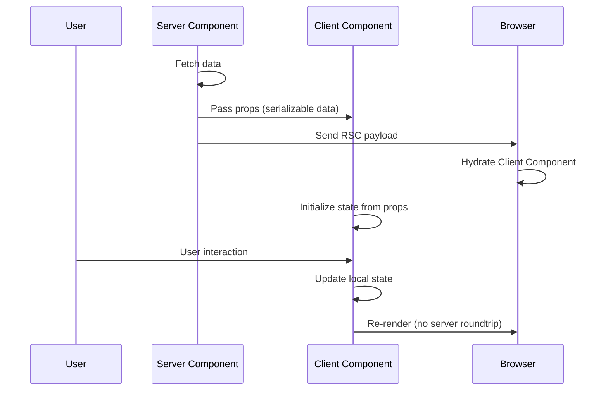

# Server Components + Client Components State Synchronization

## Research Scope Contract
- **Topic:** State synchronization between React Server Components and Client Components in Next.js App Router
- **First Principles:** Server Components render on server (no state), Client Components render on client (has state), data flows via props
- **Fundamentals:** Props passing, children pattern, serializable data
- **Scope Boundary:** Does not cover external state management libraries (Zustand, Redux)
- **Target Audience:** Next.js developers building App Router applications
- **Decay Risk:** Low (core RSC pattern is stable)

## First Principles Analysis

### Core Problem Being Solved
Server Components cannot use React hooks (useState, useEffect) or browser APIs, while Client Components need interactivity. State must flow between these boundaries without breaking the server/client split.

### Underlying Constraints
1. Server Components are stateless and render once on server
2. Client Components can use hooks and browser APIs
3. Data crossing the boundary must be serializable (no functions, classes, symbols)
4. Network boundary separates server rendering from client hydration

### Inherent Tradeoffs
| Approach | Wins | Loses | When to Use |
|----------|------|-------|-------------|
| Props passing | Simple, type-safe | Re-renders parent on change | Static data, one-way flow |
| Children pattern | Client controls state, Server renders content | Client must manage UI state | Interactive containers (modals, tabs) |
| Context providers | Global state access | Only works in Client Components | Theme, auth, user preferences |

### Failure Modes
1. **Misapplication:** Passing non-serializable data (functions, complex objects) across boundary
2. **Over-application:** Making everything Client Components (loses RSC benefits)
3. **Under-application:** Trying to use useState in Server Components (runtime error)

## Code Fundamentals

### Fundamental: Props Passing
**Claim:** Server Components can pass serializable data to Client Components via props

**Verification:**
- ✅ Located in our codebase: `app/(store)/basket/page.tsx` (passes product data to Client Components)
- ✅ Source inspected: Next.js docs "Passing data from Server to Client Components"

**Actual Behavior:**
```tsx
// Server Component
export default async function Page() {
  const post = await getPost(id)
  return <LikeButton likes={post.likes} />
}

// Client Component
'use client'
export default function LikeButton({ likes }: { likes: number }) {
  const [count, setCount] = useState(likes)
  // ...
}
```

**Edge Cases:**
- Functions cannot be passed as props (use Server Actions instead)
- Dates must be serialized (ISO strings)
- Circular references will fail

### Fundamental: Children Pattern
**Claim:** Server Components can be passed as children to Client Components to nest server-rendered UI within interactive containers

**Verification:**
- ✅ Source inspected: Next.js docs "Interleaving Server and Client Components"
- ✅ Pattern verified: Modal with Server Component child example

**Actual Behavior:**
```tsx
// Client Component
'use client'
export default function Modal({ children }: { children: React.ReactNode }) {
  const [isOpen, setIsOpen] = useState(false)
  return isOpen ? <div>{children}</div> : null
}

// Server Component
export default function Page() {
  return (
    <Modal>
      <Cart /> {/* Server Component */}
    </Modal>
  )
}
```

**Edge Cases:**
- Server Components render ahead of time on server
- Client Component hydration preserves client state
- RSC payload contains references for Client Component placement

## Best Practices (Verified)

### Practice: Prefer Props for One-Way Data Flow
**Consensus:** High (official Next.js recommendation)

**Supporting Evidence:**
- Next.js docs: "Passing data from Server to Client Components"
- React docs: RSC data flow patterns

**Counter-Evidence (Falsification Attempts):**
- None significant - this is the foundational pattern

**Verdict:** ✅ Recommended

**When to Use:** Static data, configuration, initial state
**When to Skip:** Complex state that needs bi-directional updates

### Practice: Use Children Pattern for Interactive Containers
**Consensus:** High (official Next.js recommendation)

**Supporting Evidence:**
- Next.js docs: "Interleaving Server and Client Components"
- Example: Cart inside Modal, Tabs with Server Component content

**Counter-Evidence (Falsification Attempts):**
- Can lead to prop drilling if overused

**Verdict:** ✅ Recommended

**When to Use:** Modals, tabs, accordions with Server Component content
**When to Skip:** Simple parent-child relationships

### Practice: Mark Minimal Client Boundaries
**Consensus:** High (performance best practice)

**Supporting Evidence:**
- Next.js docs: "Reducing JS bundle size"
- Performance: Smaller client bundles, faster hydration

**Counter-Evidence (Falsification Attempts):**
- Can increase component complexity (more files)

**Verdict:** ✅ Recommended

**When to Use:** Interactive components only (buttons, forms)
**When to Skip:** Static content that can be Server Components

## State Synchronization Flow



## Common Solutions Landscape

### Solution: Props Passing
**Prevalence:** Ubiquitous
**Type:** Idiomatic

**Pros:**
- Simple and type-safe with TypeScript
- Predictable one-way data flow
- Works with all serialization formats

**Cons:**
- Parent re-renders on prop changes
- Bi-directional updates need callbacks
- Props drilling for deep trees

**Real-World Pain Points:**
- Passing functions requires Server Actions
- Complex objects need serialization logic

**Recommendation:** Use for simple one-way data flow

### Solution: Children Pattern
**Prevalence:** Common
**Type:** Idiomatic

**Pros:**
- Client controls UI state (open/close, active tab)
- Server renders content efficiently
- Clear separation of concerns

**Cons:**
- Client Component must manage container state
- Server Component cannot access client state
- Requires careful component composition

**Real-World Pain Points:**
- State synchronization if multiple containers
- Prop drilling for container configuration

**Recommendation:** Use for interactive containers with Server Component content

### Solution: Context Providers
**Prevalence:** Common
**Type:** Idiomatic (with limitations)

**Pros:**
- Global state access across component tree
- Avoids prop drilling
- Works with theme, auth, user data

**Cons:**
- Only works in Client Components
- Requires Client Component wrapper
- Server Components cannot consume context

**Real-World Pain Points:**
- Context must be wrapped at root or layout
- Cannot use in Server Components directly

**Recommendation:** Use for global client-side state (theme, auth)

## Verification & Falsification Log

### Claims Verified
| Claim | Evidence | Method |
|-------|----------|--------|
| Props must be serializable | React docs (use-server) | Doc verification |
| Children pattern renders Server Components ahead of time | Next.js docs | Doc verification |
| Context not supported in Server Components | Next.js docs | Doc verification |

### Falsification Attempts
| Claim | Counter-Evidence | Verdict |
|-------|------------------|---------|
| Functions can be passed as props | React docs: functions not serializable | Abandoned |
| Server Components can use hooks | Runtime error in Next.js | Abandoned |

### Knowledge Decay Assessment
| Section | Risk | Review Date |
|---------|------|-------------|
| Props passing | Low | 2027-01-01 |
| Children pattern | Low | 2027-01-01 |
| Context limitations | Low | 2027-01-01 |

## Synthesis: Actionable Takeaways

### For Our Project
| Decision | Rationale | Implementation |
|----------|-----------|----------------|
| Use props passing for product data | Server fetches, Client displays | Basket page product rendering |
| Use children pattern for interactive containers | Modal/tabs with Server content | Cart modal, product filters |
| Keep Client boundaries minimal | Reduce JS bundle size | Only mark interactive components |

### Immediate Actions
1. Audit current Server/Client Component boundaries for minimal Client marking
2. Replace unnecessary prop drilling with children pattern where appropriate
3. Ensure all props crossing boundary are serializable

### Sources
- Next.js Server and Client Components: https://nextjs.org/docs/app/getting-started/server-and-client-components
- React use-server reference: https://react.dev/reference/react/use-server
- Next.js learn Server Components: https://nextjs.org/learn/react-foundations/server-and-client-components
- Research date: 2026-05-09
