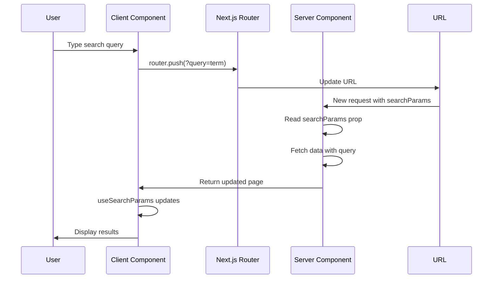

# URL-Based State Synchronization (searchParams)

## Research Scope Contract
- **Topic:** Using URL search parameters for state management in Next.js App Router
- **First Principles:** URL is the source of truth, state is derived from URL, changes update URL
- **Fundamentals:** useSearchParams hook, searchParams prop, Suspense boundaries, dynamic rendering
- **Scope Boundary:** Does not cover hash-based state or router.push for complex state
- **Target Audience:** Next.js developers building search, filters, pagination features
- **Decay Risk:** Low (URL state pattern is stable and recommended)

## First Principles Analysis

### Core Problem Being Solved
Client-side state (useState) is not bookmarkable, shareable, or SSR-friendly. URL search params provide a universal state mechanism that works across server and client.

### Underlying Constraints
1. URL state must be serializable as strings
2. Server Components receive searchParams as prop, Client Components use useSearchParams hook
3. Layouts (Server Components) do not receive searchParams (stale state risk)
4. useSearchParams causes client-side rendering in prerendered routes

### Inherent Tradeoffs
| Approach | Wins | Loses | When to Use |
|----------|------|-------|-------------|
| searchParams prop | Server-side access, SSR-friendly | Only in Page components | Server Components, initial render |
| useSearchParams hook | Client-side access, reactive | Causes CSR in prerendered routes | Client Components, dynamic updates |
| Suspense boundary | Allows partial prerendering | Adds complexity | Performance optimization |

### Failure Modes
1. **Misapplication:** Using useState instead of URL state for shareable filters
2. **Over-application:** Complex nested state in URL (hard to read/maintain)
3. **Under-application:** Not wrapping useSearchParams in Suspense (build fails)

## Code Fundamentals

### Fundamental: searchParams Prop (Server Components)
**Claim:** Server Component Pages receive searchParams as a prop for server-side access

**Verification:**
- ✅ Source inspected: Next.js docs "useSearchParams - Server Components"
- ✅ Official recommendation for Server Components

**Actual Behavior:**
```tsx
// Server Component Page
export default async function Page({
  searchParams,
}: {
  searchParams: Promise<{ query: string }>
}) {
  const { query } = await searchParams
  const data = await fetchData(query)
  return <Table data={data} />
}
```

**Edge Cases:**
- searchParams is a Promise in Next.js 15
- Layouts do not receive searchParams (stale state risk)
- Must be awaited before use

### Fundamental: useSearchParams Hook (Client Components)
**Claim:** Client Components use useSearchParams hook to read and update URL search params

**Verification:**
- ✅ Source inspected: Next.js docs "useSearchParams"
- ✅ Returns read-only URLSearchParams interface

**Actual Behavior:**
```tsx
'use client'
import { useSearchParams, useRouter } from 'next/navigation'

export default function SearchBar() {
  const searchParams = useSearchParams()
  const router = useRouter()
  const query = searchParams.get('query') || ''

  const handleSearch = (term: string) => {
    const params = new URLSearchParams(searchParams)
    params.set('query', term)
    router.push(`?${params.toString()}`)
  }

  return <input value={query} onChange={(e) => handleSearch(e.target.value)} />
}
```

**Edge Cases:**
- useSearchParams returns read-only interface (use router.push to update)
- Causes client-side rendering in prerendered routes
- Must wrap in Suspense for prerendered routes

### Fundamental: Suspense Boundary with useSearchParams
**Claim:** Wrapping useSearchParams in Suspense allows partial prerendering

**Verification:**
- ✅ Source inspected: Next.js docs "useSearchParams - Prerendering"
- ✅ Required for static pages in production

**Actual Behavior:**
```tsx
import { Suspense } from 'react'
import SearchBar from './search-bar'

function SearchBarFallback() {
  return <div>Loading...</div>
}

export default function Page() {
  return (
    <div>
      <Suspense fallback={<SearchBarFallback />}>
        <SearchBar />
      </Suspense>
      <h1>Dashboard</h1>
    </div>
  )
}
```

**Edge Cases:**
- Build fails without Suspense in static pages
- Development may appear to work without Suspense (on-demand rendering)
- Suspense boundary must be closest possible to useSearchParams

## Best Practices (Verified)

### Practice: Use URL State for Shareable Filters
**Consensus:** High (official Next.js recommendation)

**Supporting Evidence:**
- Next.js learn docs: "Why use URL search params?"
- Benefits: bookmarkable, SSR-friendly, analytics-ready

**Counter-Evidence (Falsification Attempts):**
- URL length limits (rare in practice)
- Complex nested state harder to model

**Verdict:** ✅ Recommended

**When to Use:** Search, filters, pagination, sorting
**When to Skip:** Temporary UI state (modals, dropdowns)

### Practice: Prefer searchParams Prop in Server Components
**Consensus:** High (performance best practice)

**Supporting Evidence:**
- Next.js docs: "If you're already in a Server Component Page, consider using the searchParams prop"
- Avoids unnecessary client-side rendering

**Counter-Evidence (Falsification Attempts):**
- None significant

**Verdict:** ✅ Recommended

**When to Use:** Server Component Pages, initial data fetching
**When to Skip:** Client Components needing reactive updates

### Practice: Wrap useSearchParams in Suspense
**Consensus:** High (production requirement)

**Supporting Evidence:**
- Next.js docs: "We recommend wrapping the Client Component that uses useSearchParams in a Suspense boundary"
- Build error without Suspense in static pages

**Counter-Evidence (Falsification Attempts):**
- Adds component complexity

**Verdict:** ✅ Recommended

**When to Use:** Prerendered routes with useSearchParams
**When to Skip:** Dynamic routes (use connection() instead)

## State Synchronization Flow



## Common Solutions Landscape

### Solution: searchParams Prop
**Prevalence:** Ubiquitous in Server Components
**Type:** Idiomatic

**Pros:**
- Server-side access (no hydration delay)
- SSR-friendly (initial HTML contains state)
- Type-safe with TypeScript
- No client-side JavaScript required

**Cons:**
- Only available in Page components
- Not reactive (requires navigation to update)
- Layouts cannot access (stale state risk)

**Real-World Pain Points:**
- Forgetting to await searchParams Promise (Next.js 15)
- Trying to use in Layouts (not available)

**Recommendation:** Use in Server Component Pages for initial data fetching

### Solution: useSearchParams Hook
**Prevalence:** Ubiquitous in Client Components
**Type:** Idiomatic

**Pros:**
- Reactive (updates on URL change)
- Client-side access
- Works with interactive components

**Cons:**
- Causes client-side rendering in prerendered routes
- Requires Suspense boundary for static pages
- Read-only (use router.push to update)

**Real-World Pain Points:**
- Build failures without Suspense
- Performance impact from unnecessary CSR

**Recommendation:** Use in Client Components for interactive filters

### Solution: Debouncing for Search Input
**Prevalence:** Common
**Type:** Performance optimization

**Pros:**
- Reduces URL updates
- Fewer server requests
- Better UX (no flickering)

**Cons:**
- Adds complexity
- Delayed state updates

**Real-World Pain Points:**
- Choosing correct debounce timing
- Syncing debounced state with URL

**Recommendation:** Use for search inputs (300-500ms debounce)

## Verification & Falsification Log

### Claims Verified
| Claim | Evidence | Method |
|-------|----------|--------|
| searchParams prop only in Pages | Next.js docs useSearchParams | Doc verification |
| Layouts do not receive searchParams | Next.js docs useSearchParams | Doc verification |
| useSearchParams requires Suspense in static pages | Next.js docs useSearchParams | Doc verification |
| searchParams is Promise in Next.js 15 | Next.js docs page convention | Doc verification |

### Falsification Attempts
| Claim | Counter-Evidence | Verdict |
|-------|------------------|---------|
| useSearchParams works without Suspense | Build error in production static pages | Abandoned |
| Layouts can use searchParams | Next.js docs: layouts don't receive searchParams | Abandoned |

### Knowledge Decay Assessment
| Section | Risk | Review Date |
|---------|------|-------------|
| searchParams prop | Low | 2027-01-01 |
| useSearchParams hook | Low | 2027-01-01 |
| Suspense requirements | Low | 2027-01-01 |

## Synthesis: Actionable Takeaways

### For Our Project
| Decision | Rationale | Implementation |
|----------|-----------|----------------|
| Use URL state for basket filters | Shareable, SSR-friendly | Product filters in basket page |
| Use searchParams prop in Server Components | Server-side access, performance | Initial basket data fetching |
| Wrap useSearchParams in Suspense | Production requirement | Search components in static routes |
| Debounce search inputs | Performance, UX | Product search functionality |

### Immediate Actions
1. Audit current search/filter implementations for URL state adoption
2. Add Suspense boundaries to all useSearchParams usage
3. Replace useState with URL state for shareable filters

### Sources
- Next.js useSearchParams API: https://nextjs.org/docs/app/api-reference/functions/use-search-params
- Next.js search and pagination: https://nextjs.org/learn/dashboard-app/adding-search-and-pagination
- Next.js page convention: https://nextjs.org/docs/app/api-reference/file-conventions/page
- Research date: 2026-05-09
