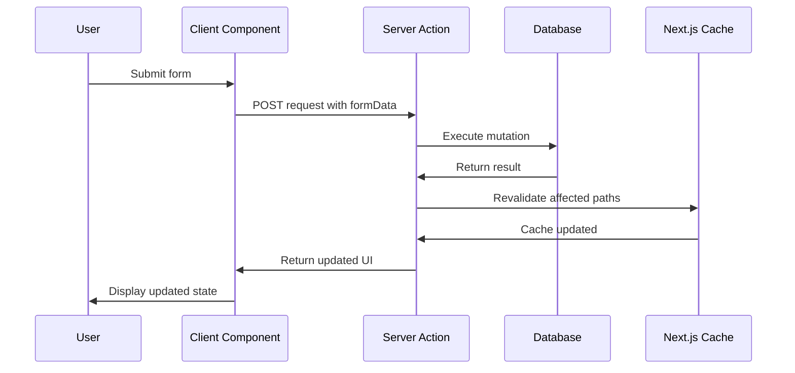

# Server Actions State Updates Synchronization

## Research Scope Contract
- **Topic:** State synchronization using Next.js Server Actions for mutations and form submissions
- **First Principles:** Server Actions execute on server, can be called from Server/Client Components, return updated UI and data in single roundtrip
- **Fundamentals:** "use server" directive, form action attribute, progressive enhancement, revalidation
- **Scope Boundary:** Does not cover API routes or traditional form handling
- **Target Audience:** Next.js developers building forms, mutations, and data updates
- **Decay Risk:** Low (Server Actions are stable and recommended)

## First Principles Analysis

### Core Problem Being Solved
Traditional form submissions require page refreshes or complex client-side state management. Server Actions provide a seamless way to handle mutations without losing the SPA experience.

### Underlying Constraints
1. Server Actions execute on server (cannot access client state directly)
2. Arguments and return values must be serializable
3. Only POST method can invoke Server Actions
4. Server Actions inherit runtime from page/layout they're used on

### Inherent Tradeoffs
| Approach | Wins | Loses | When to Use |
|----------|------|-------|-------------|
| Inline "use server" | Simple, colocation | Only in Server Components | Server Component forms |
| Module-level "use server" | Reusable, works in Client Components | Separate file | Shared actions across components |
| Pass as prop | Type-safe, explicit | Prop overhead | Client Component with Server Action |

### Failure Modes
1. **Misapplication:** Using Server Actions for data fetching (use Server Components instead)
2. **Over-application:** Complex client-side validation logic in Server Actions
3. **Under-application:** Not using progressive enhancement (forms break without JS)

## Code Fundamentals

### Fundamental: Inline Server Actions (Server Components)
**Claim:** Server Components can define inline Server Actions using "use server" directive in function body

**Verification:**
- ✅ Source inspected: Next.js docs "Server Actions and Mutations - Convention"
- ✅ Official pattern for Server Component forms

**Actual Behavior:**
```tsx
// Server Component
export default function Page() {
  async function create(formData: FormData) {
    'use server'
    const name = formData.get('name')
    await db.insert({ name })
    revalidatePath('/dashboard')
  }

  return <form action={create}><input name="name" /><button>Submit</button></form>
}
```

**Edge Cases:**
- Only works in Server Components
- Function must be async
- "use server" must be at top of function body

### Fundamental: Module-Level Server Actions
**Claim:** Module-level "use server" directive exports reusable Server Actions for both Server and Client Components

**Verification:**
- ✅ Source inspected: Next.js docs "Server Actions and Mutations - Convention"
- ✅ Required for Client Component usage

**Actual Behavior:**
```tsx
// actions.ts
'use server'
export async function create(formData: FormData) {
  const name = formData.get('name')
  await db.insert({ name })
  revalidatePath('/dashboard')
}

// Client Component
'use client'
import { create } from '@/app/actions'
export default function Form() {
  return <form action={create}><input name="name" /><button>Submit</button></form>
}
```

**Edge Cases:**
- Must be in separate file with "use server" at top
- All exported functions become Server Actions
- Can be imported in both Server and Client Components

### Fundamental: Server Actions as Props
**Claim:** Server Actions can be passed as props to Client Components

**Verification:**
- ✅ Source inspected: Next.js docs "Server Actions and Mutations - Convention"
- ✅ Official pattern for type-safe Client Component forms

**Actual Behavior:**
```tsx
// Server Component
async function updateItem(formData: FormData) {
  'use server'
  // ...
}

export default function Page() {
  return <ClientComponent updateItem={updateItem} />
}

// Client Component
'use client'
export default function ClientComponent({ updateItem }: { updateItem: (formData: FormData) => Promise<void> }) {
  return <form action={updateItem}>{/* ... */}</form>
}
```

**Edge Cases:**
- Only works with module-level "use server" actions
- Type-safe with TypeScript
- Allows Server Component to control which actions Client Component can use

## Best Practices (Verified)

### Practice: Use Server Actions for Form Submissions
**Consensus:** High (official Next.js recommendation)

**Supporting Evidence:**
- Next.js docs: "Server Actions are asynchronous functions that are executed on the server"
- Progressive enhancement built-in

**Counter-Evidence (Falsification Attempts):**
- None significant for forms

**Verdict:** ✅ Recommended

**When to Use:** Form submissions, mutations, data updates
**When to Skip:** Data fetching (use Server Components instead)

### Practice: Use Progressive Enhancement
**Consensus:** High (built-in feature)

**Supporting Evidence:**
- Next.js docs: "Server Components support progressive enhancement by default"
- Forms work without JavaScript

**Counter-Evidence (Falsification Attempts):**
- Client Components queue submissions if JS not loaded (not a failure)

**Verdict:** ✅ Recommended

**When to Use:** All forms with Server Actions
**When to Skip:** Never (built-in)

### Practice: Revalidate Data After Mutations
**Consensus:** High (caching best practice)

**Supporting Evidence:**
- Next.js docs: "Server Actions integrate with Next.js caching and revalidation"
- Ensures UI shows updated data

**Counter-Evidence (Falsification Attempts):**
- Requires understanding of cache keys

**Verdict:** ✅ Recommended

**When to Use:** After all mutations that affect cached data
**When to Skip:** Never (stale data is a bug)

## State Synchronization Flow



## Common Solutions Landscape

### Solution: Inline Server Actions
**Prevalence:** Common in Server Components
**Type:** Idiomatic

**Pros:**
- Simple and collocated
- No separate files
- Type-safe with TypeScript

**Cons:**
- Only works in Server Components
- Cannot be reused across components
- Harder to test in isolation

**Real-World Pain Points:**
- Trying to use in Client Components (error)
- Reuse requires extraction to module-level

**Recommendation:** Use for simple Server Component forms

### Solution: Module-Level Server Actions
**Prevalence:** Ubiquitous
**Type:** Idiomatic

**Pros:**
- Reusable across Server and Client Components
- Easier to test in isolation
- Centralized action logic

**Cons:**
- Requires separate file
- All exports become Server Actions
- Slight indirection

**Real-World Pain Points:**
- Forgetting "use server" directive
- Mixing utility functions with Server Actions

**Recommendation:** Use for shared actions and Client Component forms

### Solution: Server Actions with revalidatePath
**Prevalence:** Ubiquitous
**Type:** Idiomatic

**Pros:**
- Automatic cache invalidation
- Single roundtrip for mutation + data update
- No manual cache management

**Cons:**
- Requires understanding of cache structure
- Over-revalidation can hurt performance

**Real-World Pain Points:**
- Revalidating too aggressively (performance)
- Not revalidating (stale data)

**Recommendation:** Use revalidatePath after mutations affecting cached data

## Verification & Falsification Log

### Claims Verified
| Claim | Evidence | Method |
|-------|----------|--------|
| Server Actions use POST method only | Next.js docs behavior | Doc verification |
| Arguments must be serializable | React docs use-server | Doc verification |
| Progressive enhancement built-in | Next.js docs behavior | Doc verification |
| Inline actions only in Server Components | Next.js docs convention | Doc verification |

### Falsification Attempts
| Claim | Counter-Evidence | Verdict |
|-------|------------------|---------|
| Server Actions can use GET method | Next.js docs: only POST | Abandoned |
| Client Components can define inline Server Actions | Next.js docs: module-level only | Abandoned |

### Knowledge Decay Assessment
| Section | Risk | Review Date |
|---------|------|-------------|
| Server Actions convention | Low | 2027-01-01 |
| Revalidation patterns | Low | 2027-01-01 |
| Progressive enhancement | Low | 2027-01-01 |

## Synthesis: Actionable Takeaways

### For Our Project
| Decision | Rationale | Implementation |
|----------|-----------|----------------|
| Use module-level Server Actions for basket mutations | Reusable across components | Add to cart, remove, update quantity |
| Revalidate basket paths after mutations | Ensure UI shows updated data | revalidatePath('/basket') |
| Use progressive enhancement for forms | Works without JavaScript | All basket forms |
| Pass Server Actions as props for type safety | Explicit dependencies | Basket controls in Client Components |

### Immediate Actions
1. Extract basket mutations to module-level Server Actions
2. Add revalidatePath to all basket mutations
3. Audit forms for progressive enhancement compliance

### Sources
- Next.js Server Actions and Mutations: https://nextjs.org/docs/13/app/building-your-application/data-fetching/server-actions-and-mutations
- React use-server reference: https://react.dev/reference/react/use-server
- Next.js caching and revalidation: https://nextjs.org/docs/13/app/building-your-application/caching
- Research date: 2026-05-09
