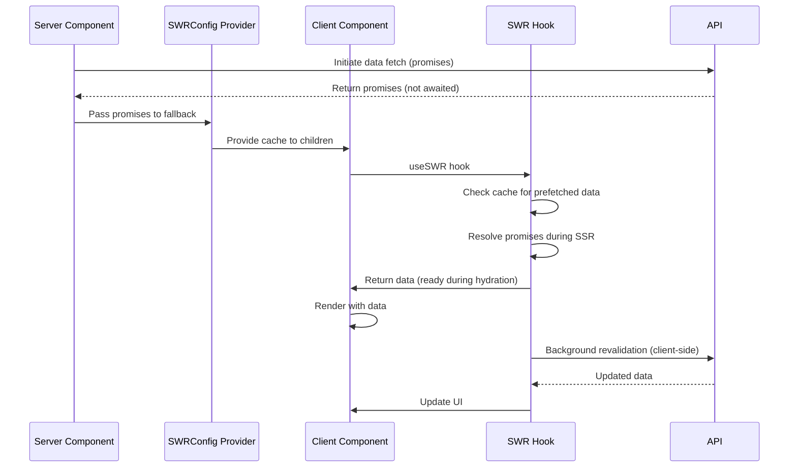

# React Query/SWR Data Fetching State Synchronization

## Research Scope Contract
- **Topic:** Data fetching state synchronization using React Query or SWR in Next.js App Router
- **First Principles:** Client-side data fetching libraries provide caching, revalidation, and synchronization
- **Fundamentals:** SWRConfig fallback, prefetching in Server Components, useSWR hooks in Client Components
- **Scope Boundary:** Focuses on SWR patterns (React Query follows similar patterns)
- **Target Audience:** Next.js developers using client-side data fetching libraries
- **Decay Risk:** Medium (library APIs evolve, but patterns are stable)

## First Principles Analysis

### Core Problem Being Solved
Server Components fetch data on server, but Client Components need client-side data fetching with caching, revalidation, and background updates.

### Underlying Constraints
1. SWR hooks (useSWR, useSWRInfinite) not available in Server Components
2. Server Components can import SWRConfig and serialization APIs
3. Promises can be passed across "use client" boundary
4. Data synchronization requires cache management

### Inherent Tradeoffs
| Approach | Wins | Loses | When to Use |
|----------|------|-------|-------------|
| Server-side prefetching | Initial HTML contains data, faster hydration | Server complexity | SEO-critical pages |
| Client-side only fetching | Simpler server code | Slower initial load | Non-SEO pages |
| SWRConfig fallback | Shared cache across components | Global state complexity | Apps with shared data |

### Failure Modes
1. **Misapplication:** Using SWR hooks in Server Components (runtime error)
2. **Over-application:** Prefetching everything (unnecessary server load)
3. **Under-application:** Not using Suspense boundaries (waterfall loading)

## Code Fundamentals

### Fundamental: Server Components with SWRConfig
**Claim:** Server Components can import SWRConfig and key serialization APIs, but not SWR hooks

**Verification:**
- ✅ Source inspected: SWR docs "Usage with Next.js - App Router"
- ✅ Official SWR recommendation for RSC

**Actual Behavior:**
```tsx
// Server Component (Layout or Page)
import { SWRConfig } from 'swr'
import { unstable_serialize } from 'swr'

export default async function Layout({ children }: { children: React.ReactNode }) {
  const userPromise = fetchUserFromAPI()
  
  return (
    <SWRConfig value={{
      fallback: {
        '/api/user': userPromise,
      },
    }}>
      {children}
    </SWRConfig>
  )
}
```

**Edge Cases:**
- useSWR hooks cause runtime error in Server Components
- unstable_serialize available in Server Components
- Promises passed to fallback are resolved during SSR

### Fundamental: Prefetching in Server Components
**Claim:** Data can be prefetched on server and passed as promises to Client Components via SWRConfig fallback

**Verification:**
- ✅ Source inspected: SWR docs "Prefetch Data in Server Components"
- ✅ Promises resolve automatically during SSR

**Actual Behavior:**
```tsx
// Server Component
import { SWRConfig } from 'swr'

export default async function Layout({ children }: { children: React.ReactNode }) {
  const userPromise = fetchUserFromAPI()
  const postsPromise = fetchPostsFromAPI()
  
  return (
    <SWRConfig value={{
      fallback: {
        '/api/user': userPromise,
        '/api/posts': postsPromise,
      },
    }}>
      {children}
    </SWRConfig>
  )
}
```

**Edge Cases:**
- Promises execute in parallel (don't await immediately)
- SWR resolves promises automatically during SSR
- Only UI boundaries consuming data are blocked during streaming

### Fundamental: Client Components with useSWR
**Claim:** Client Components marked with 'use client' can use SWR hooks for data fetching

**Verification:**
- ✅ Source inspected: SWR docs "Usage with Next.js - App Router"
- ✅ Standard SWR usage in Client Components

**Actual Behavior:**
```tsx
// Client Component
'use client'
import useSWR from 'swr'

export default function Page() {
  const { data: user } = useSWR('/api/user', fetcher)
  const { data: posts } = useSWR('/api/posts', fetcher)
  
  return (
    <div>
      <h1>{user.name}'s Posts</h1>
      <ul>
        {posts.map(post => <li key={post.id}>{post.title}</li>)}
      </ul>
    </div>
  )
}
```

**Edge Cases:**
- SWR automatically resolves prefetched promises
- Client-side SWR takes over after hydration
- Data ready during SSR and client hydration

## Best Practices (Verified)

### Practice: Prefetch Critical Data on Server
**Consensus:** High (performance best practice)

**Supporting Evidence:**
- SWR docs: "Data fetching can be initiated as early as possible on the server side"
- Faster initial load, better SEO

**Counter-Evidence (Falsification Attempts):**
- Increases server complexity
- May prefetch unnecessary data

**Verdict:** ✅ Recommended

**When to Use:** Critical data for initial render (user, posts, products)
**When to Skip:** Non-critical data, user-specific interactions

### Practice: Use SWRConfig for Shared Cache
**Consensus:** High (official SWR pattern)

**Supporting Evidence:**
- SWR docs: "Pass the promises to client components via SWRConfig fallback"
- Shared cache across component tree

**Counter-Evidence (Falsification Attempts):**
- Global state can cause unexpected re-renders

**Verdict:** ✅ Recommended

**When to Use:** Data shared across multiple components
**When to Skip:** Component-specific data

### Practice: Enable strictServerPrefetchWarning
**Consensus:** Medium (debugging aid)

**Supporting Evidence:**
- SWR docs: "Helping you identify which data fetching calls could benefit from server-side prefetching"
- Identifies missing prefetch opportunities

**Counter-Evidence (Falsification Attempts):**
- Console warnings in development

**Verdict:** ⚠️ Context-Dependent

**When to Use:** Development, optimization phase
**When to Skip:** Production

## Data Fetching Synchronization Flow



## Common Solutions Landscape

### Solution: Server-Side Prefetching
**Prevalence:** Common in production apps
**Type:** Idiomatic

**Pros:**
- Faster initial load (data in HTML)
- Better SEO (content in initial HTML)
- Streaming SSR with Suspense boundaries

**Cons:**
- Server complexity
- Potential over-fetching
- Requires understanding of cache keys

**Real-World Pain Points:**
- Identifying which data to prefetch
- Managing cache key collisions
- Debugging prefetch issues

**Recommendation:** Use for critical data needed for initial render

### Solution: Client-Side Only Fetching
**Prevalence:** Common in simple apps
**Type:** Idiomatic

**Pros:**
- Simpler server code
- No server-side complexity
- Standard SWR usage

**Cons:**
- Slower initial load (client fetches)
- Worse SEO (content not in initial HTML)
- Waterfall loading

**Real-World Pain Points:**
- Poor perceived performance
- SEO issues for content pages

**Recommendation:** Use for non-critical data or non-SEO pages

### Solution: Hybrid Approach
**Prevalence:** Common in production apps
**Type:** Idiomatic

**Pros:**
- Best of both worlds
- Critical data prefetched
- Non-critical data fetched client-side

**Cons:**
- More complex architecture
- Requires careful categorization

**Real-World Pain Points:**
- Deciding what to prefetch vs fetch client-side
- Cache key management

**Recommendation:** Use for apps with mixed criticality data

## Verification & Falsification Log

### Claims Verified
| Claim | Evidence | Method |
|-------|----------|--------|
| SWR hooks not available in Server Components | SWR docs App Router | Doc verification |
| Promises can be passed across "use client" boundary | SWR docs Prefetch Data | Doc verification |
| SWRConfig fallback accepts promises | SWR docs App Router | Doc verification |
| unstable_serialize available in Server Components | SWR docs App Router | Doc verification |

### Falsification Attempts
| Claim | Counter-Evidence | Verdict |
|-------|------------------|---------|
| useSWR works in Server Components | SWR docs: hooks not available in RSC | Abandoned |
| Prefetching requires awaiting promises | SWR docs: don't await immediately (parallel execution) | Abandoned |

### Knowledge Decay Assessment
| Section | Risk | Review Date |
|---------|------|-------------|
| SWRConfig fallback | Medium (API may evolve) | 2026-08-01 |
| Prefetching patterns | Low (stable pattern) | 2027-01-01 |
| Server Component limitations | Low (stable RSC behavior) | 2027-01-01 |

## Synthesis: Actionable Takeaways

### For Our Project
| Decision | Rationale | Implementation |
|----------|-----------|----------------|
| Use Server Components for initial data fetching | Simpler, no SWR needed | Product pages, basket page |
| Use SWR for client-side data fetching | Caching, revalidation | Real-time updates, user interactions |
| Consider SWRConfig for shared data | Cache efficiency | User data, cart data |
| Avoid SWR in Server Components | Runtime error | Use async/await instead |

### Immediate Actions
1. Audit current data fetching for Server vs Client Component appropriateness
2. Consider SWR for real-time basket updates
3. Evaluate if SWRConfig fallback needed for shared data

### Sources
- SWR Usage with Next.js: https://swr.vercel.app/docs/with-nextjs
- Next.js Fetching Data: https://nextjs.org/docs/app/getting-started/fetching-data
- React Server Components: https://react.dev/reference/rsc/use-client
- Research date: 2026-05-09
