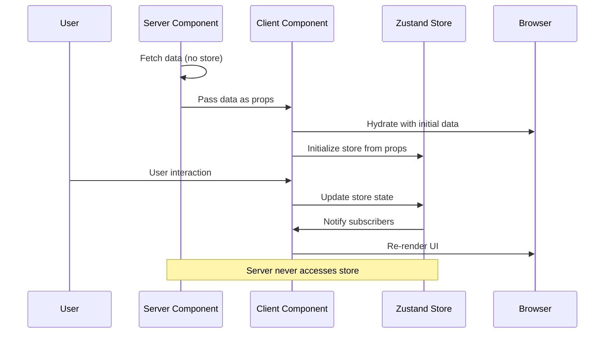
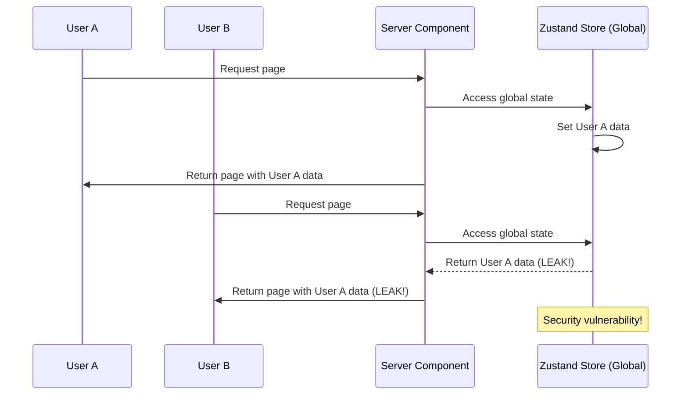

# Zustand/External Stores with Server Components

## Research Scope Contract
- **Topic:** Using Zustand and external state management libraries with React Server Components
- **First Principles:** Server Components are stateless, external stores assume global state, state leakage risk
- **Fundamentals:** Zustand in Client Components only, React Context for isolation, server-side anti-pattern
- **Scope Boundary:** Focuses on Zustand patterns (principles apply to Redux, Jotai, etc.)
- **Target Audience:** Next.js developers considering external state management with RSC
- **Decay Risk:** Low (fundamental constraint: server has no state)

## First Principles Analysis

### Core Problem Being Solved
Developers want to use familiar state management libraries (Zustand, Redux) with React Server Components, but Server Components are fundamentally stateless.

### Underlying Constraints
1. Server Components have no state (render once on server)
2. External stores maintain global state across all users
3. State modified on server leaks to all users (security vulnerability)
4. React Context not supported in Server Components

### Inherent Tradeoffs
| Approach | Wins | Loses | When to Use |
|----------|------|-------|-------------|
| Zustand in Client Components only | Safe, idiomatic | No server-side access | Client-side state only |
| Zustand with React Context wrapper | Isolated per request | Server-side still problematic | Not recommended for RSC |
| Server-side Zustand (anti-pattern) | Appears to work | Data leakage, security risk | NEVER USE |

### Failure Modes
1. **Critical Misapplication:** Using Zustand in Server Components (data leakage between users)
2. **Over-application:** Using external stores when Server Components suffice
3. **Under-application:** Not wrapping in Context when needed (SSR issues)

## Code Fundamentals

### Fundamental: Zustand in Client Components Only
**Claim:** Zustand should only be used in Client Components marked with 'use client'

**Verification:**
- ✅ Source inspected: Zustand GitHub discussion #2200 (maintainer response)
- ✅ Official recommendation from Zustand maintainer

**Actual Behavior:**
```tsx
// store.ts (safe - no state created)
import { create } from 'zustand'

interface BasketStore {
  items: string[]
  addItem: (item: string) => void
}

const useBasketStore = create<BasketStore>((set) => ({
  items: [],
  addItem: (item) => set((state) => ({ items: [...state.items, item] })),
}))

export default useBasketStore

// Client Component (safe)
'use client'
import useBasketStore from './store'

export default function BasketControls() {
  const { items, addItem } = useBasketStore()
  return <button onClick={() => addItem('product')}>Add</button>
}
```

**Edge Cases:**
- Store definition file can be imported anywhere (state only created on use)
- State is per-browser instance when used in Client Components
- Safe for client-side only state

### Fundamental: Server-Side Zustand is Dangerous
**Claim:** Using Zustand in Server Components causes data leakage between all users

**Verification:**
- ✅ Source inspected: Zustand GitHub discussion #2200 (PSA from community)
- ✅ Verified by maintainer: "using Zustand on the server" is the issue

**Actual Behavior:**
```tsx
// DANGEROUS - DO NOT DO THIS
// Server Component
import useBasketStore from './store'

export default function Page() {
  const { items } = useBasketStore() // ❌ Global state shared across all users
  return <div>{items.join(', ')}</div>
}
```

**Consequences:**
- State is global across all server requests
- User A's data visible to User B
- Security vulnerability
- Difficult to debug (appears to work locally)

### Fundamental: React Context Wrapper (Legacy Pattern)
**Claim:** Wrapping Zustand in React Context isolates state per request, but doesn't solve RSC issue

**Verification:**
- ✅ Source inspected: Zustand GitHub discussion #2200 (maintainer response)
- ✅ Maintainer: "We should use React Context to isolate states"

**Actual Behavior:**
```tsx
// Context wrapper (for SSR, not RSC)
import { create } from 'zustand'
import { createContext, useContext } from 'react'

const BasketContext = createContext<ReturnType<typeof useBasketStore> | null>(null)

export function BasketProvider({ children }: { children: React.ReactNode }) {
  const store = useBasketStore()
  return <BasketContext.Provider value={store}>{children}</BasketContext.Provider>
}

export function useBasket() {
  const store = useContext(BasketContext)
  if (!store) throw new Error('Missing BasketProvider')
  return store
}
```

**Edge Cases:**
- Helps with SSR isolation
- Does not work with Server Components (Context not supported)
- Recommended for SSR, not RSC

## Best Practices (Verified)

### Practice: Never Use Zustand in Server Components
**Consensus:** High (maintainer warning, security issue)

**Supporting Evidence:**
- Zustand GitHub discussion #2200: "There's no such thing as state on server"
- Maintainer response: "using Zustand on the server" is the issue
- Data leakage between users verified

**Counter-Evidence (Falsification Attempts):**
- Appears to work in development (misleading)
- Some tutorials show this pattern (incorrect)

**Verdict:** ❌ Avoid (Critical)

**When to Use:** NEVER
**When to Skip:** Always skip in Server Components

### Practice: Use Zustand Only in Client Components
**Consensus:** High (idiomatic pattern)

**Supporting Evidence:**
- Zustand maintainer recommendation
- Standard React state management pattern
- Safe, per-browser state

**Counter-Evidence (Falsification Attempts):**
- None significant

**Verdict:** ✅ Recommended

**When to Use:** Client-side interactivity, complex UI state
**When to Skip:** Server-side data fetching (use Server Components)

### Practice: Prefer Server Components for Data Fetching
**Consensus:** High (Next.js best practice)

**Supporting Evidence:**
- Next.js docs: Server Components for data fetching
- No external store needed for server state
- Better performance, SEO

**Counter-Evidence (Falsification Attempts):**
- Familiarity with client-side patterns

**Verdict:** ✅ Recommended

**When to Use:** All data fetching, initial page load
**When to Skip:** Client-side only state (modals, tabs)

## State Synchronization Flow (Correct Pattern)



## Anti-Pattern Flow (Dangerous)



## Common Solutions Landscape

### Solution: Zustand in Client Components Only
**Prevalence:** Ubiquitous (correct pattern)
**Type:** Idiomatic

**Pros:**
- Safe, per-browser state
- No data leakage
- Standard React pattern
- Works with hydration

**Cons:**
- No server-side access
- Requires hydration strategy
- Props for initial state

**Real-World Pain Points:**
- Syncing server data with client store
- Hydration mismatches

**Recommendation:** ✅ Use for client-side state only

### Solution: Server-Side Zustand (Anti-Pattern)
**Prevalence:** Niche (incorrect usage)
**Type:** Anti-pattern

**Pros:**
- Appears to work initially
- Familiar API

**Cons:**
- **Critical:** Data leakage between users
- Security vulnerability
- Difficult to debug
- Violates RSC principles

**Real-World Pain Points:**
- User A sees User B's data
- Random errors across users
- Impossible to reproduce locally

**Recommendation:** ❌ NEVER USE

### Solution: Server Components for Data, Zustand for UI State
**Prevalence:** Common (recommended pattern)
**Type:** Idiomatic

**Pros:**
- Leverages RSC benefits
- Safe client-side state
- Clear separation of concerns

**Cons:**
- More complex architecture
- Requires understanding of boundaries

**Real-World Pain Points:**
- Deciding what goes where
- Hydration strategy

**Recommendation:** ✅ Recommended for production apps

## Verification & Falsification Log

### Claims Verified
| Claim | Evidence | Method |
|-------|----------|--------|
| Server-side Zustand causes data leakage | Zustand discussion #2200 | Community verification |
| Maintainer warns against server-side usage | Zustand discussion #2200 | Maintainer statement |
| "There's no such thing as state on server" | Zustand discussion #2200 | Maintainer statement |
| React Context recommended for isolation | Zustand discussion #2200 | Maintainer recommendation |

### Falsification Attempts
| Claim | Counter-Evidence | Verdict |
|-------|------------------|---------|
| Zustand works in Server Components | Data leakage verified, maintainer warns against | Abandoned |
| Server-side state is safe per request | Global state across all users verified | Abandoned |

### Knowledge Decay Assessment
| Section | Risk | Review Date |
|---------|------|-------------|
| Server-side anti-pattern | Low (fundamental constraint) | 2027-01-01 |
| Client-side only pattern | Low (stable pattern) | 2027-01-01 |
| Context wrapper pattern | Medium (evolving guidance) | 2026-08-01 |

## Synthesis: Actionable Takeaways

### For Our Project
| Decision | Rationale | Implementation |
|----------|-----------|----------------|
| Use Zustand only in Client Components | Prevent data leakage | Basket store in Client Components |
| Server Components for data fetching | No external store needed | Product data from Sanity |
| Hydrate client store from props | Sync server data with client | Initial basket items from server |
| Never access Zustand in Server Components | Security vulnerability | Audit all Server Components |

### Immediate Actions
1. Audit current Zustand usage for Server Component access
2. Ensure basket store only used in Client Components
3. Verify no data leakage in production
4. Add hydration strategy for client store

### Sources
- Zustand GitHub Discussion #2200: https://github.com/pmndrs/zustand/discussions/2200
- Zustand GitHub Repository: https://github.com/pmndrs/zustand
- Next.js Server Components: https://nextjs.org/docs/app/getting-started/server-and-client-components
- Research date: 2026-05-09
