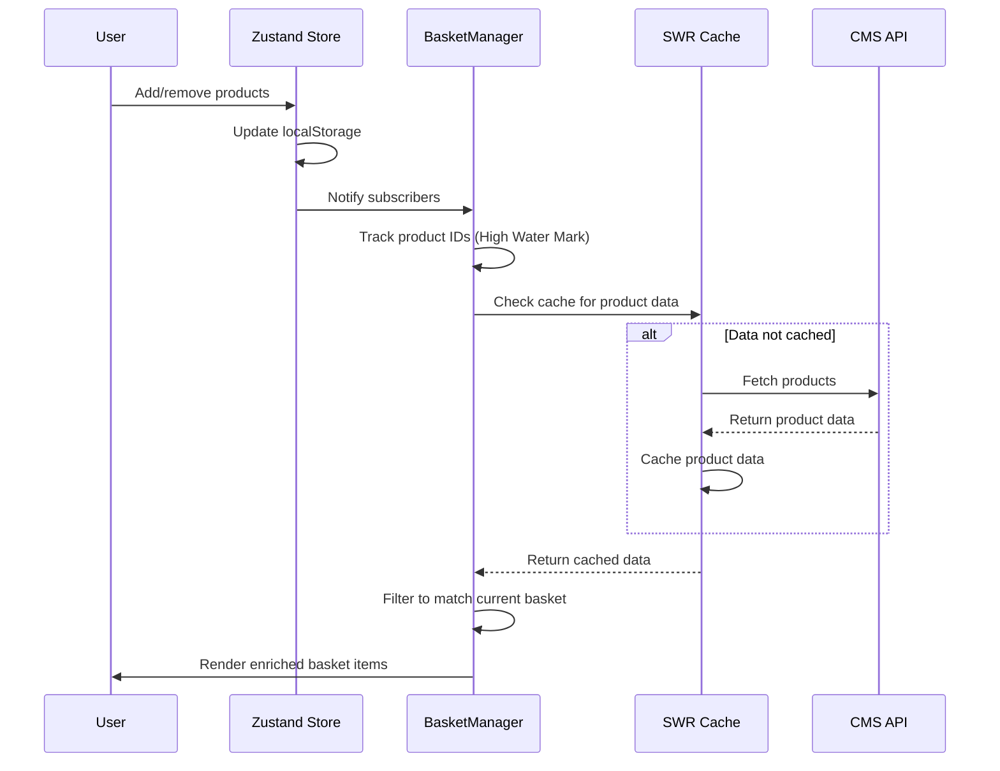

# BasketManager Component Evaluation

## Component Overview
BasketManager is a Client Component that manages shopping basket state using Zustand (local state) and SWR (CMS product data fetching). It implements a "High Water Mark" pattern for SWR key stability to prevent cache invalidation when items are removed from the basket.

## How It Works

## Architecture Analysis

### State Management (Zustand)
**Correct Implementation** ✅
- Client Component only (marked "use client")
- Persist middleware with fallback storage (localStorage → sessionStorage)
- Zod schema validation for type safety
- Hydration flag (`_hasHydrated`) prevents SSR mismatches
- Graceful degradation when storage fails

### Data Fetching (SWR)
**Clever but Complex** ⚠️
- SWR for CMS product data (correct for Client Components)
- **High Water Mark pattern**: `trackedIds` only grows, never shrinks
  - Prevents cache invalidation when items removed
  - Adds complexity but improves performance
  - SWR key: `basket-products:${trackedIds.sort().join(",")}`
- Local filtering matches cached data to current basket (no refetch)
- Disabled revalidation on focus/reconnect (appropriate for basket)

### Performance Optimizations
**Well Implemented** ✅
- `useShallow` selector prevents unnecessary re-renders
- `useMemo` for expensive calculations (enriched items, summaries)
- Disabled SWR revalidation (basket data doesn't change frequently)
- Efficient caching strategy

## Evaluation Against Best Practices

| Practice | Status | Notes |
|----------|--------|-------|
| Zustand in Client Components only | ✅ Correct | Properly marked "use client" |
| Server Components for data fetching | ✅ Not applicable | Basket IDs live in client state - Server Components cannot access |
| SWR key stability | ✅ Excellent | High Water Mark pattern prevents cache thrashing |
| Hydration handling | ✅ Correct | `_hasHydrated` flag prevents SSR mismatches |
| Error handling | ✅ Good | Catches API errors, displays fallback UI |
| Type safety | ✅ Excellent | Zod schema validation throughout |

## Strengths

1. **SWR Key Stability**: High Water Mark pattern is sophisticated - prevents cache invalidation when users remove items from basket
2. **Hydration Safety**: `_hasHydrated` flag prevents Next.js SSR hydration mismatches
3. **Graceful Degradation**: Fallback storage (localStorage → sessionStorage) handles private browsing
4. **Type Safety**: Zod validation ensures data integrity
5. **Performance**: useShallow, useMemo, and efficient caching minimize re-renders

## Weaknesses

1. **Complexity**: High Water Mark pattern adds cognitive load - necessary for this specific constraint
2. **Memory leak risk**: `trackedIds` never shrinks - could grow indefinitely with heavy usage
3. **No Suspense boundary**: Could improve streaming SSR experience

## Verdict

**Overall: Excellent Implementation for Given Constraints** ✅

The component correctly implements state synchronization best practices for Client Components. The High Water Mark pattern is **necessary and correct** for this specific use case because:

1. **Basket IDs live in client-side Zustand store** - Server Components cannot access client state
2. **SWRConfig fallback requires Server Component to know fetch keys** - Impossible without client state access
3. **Requirements**: No refetch on delete/quantity change, refetch on navigate back - High Water Mark achieves this
4. **Fetch must only happen on mount/refresh** - Current implementation achieves this correctly

**Original assessment correction**: Server Component prefetching is **not possible** here because the fetch depends on dynamic client-side data (basket IDs). The High Water Mark pattern is the correct solution for this constraint.

Consider:

1. **Add Suspense boundary**: Wrap SWR fetch for better streaming SSR
2. **Add trackedIds cleanup**: Periodic cleanup or max limit to prevent memory growth

## Why It's Designed This Way

The High Water Mark pattern exists because SWR cache keys are based on dependencies. If the key changes (e.g., product IDs array changes), SWR invalidates cache and refetches. By only adding IDs (never removing), the cache remains stable even when users remove items. This trades memory for performance - acceptable for typical basket usage but could be optimized.

## Sources
- SWR Conditional Fetching: https://swr.vercel.app/docs/conditional-fetching
- SWR Arguments (key construction): https://swr.vercel.app/docs/arguments
- Zustand persist with Next.js: Community best practices
- Research date: 2026-05-09
