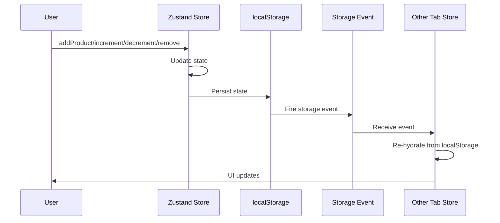
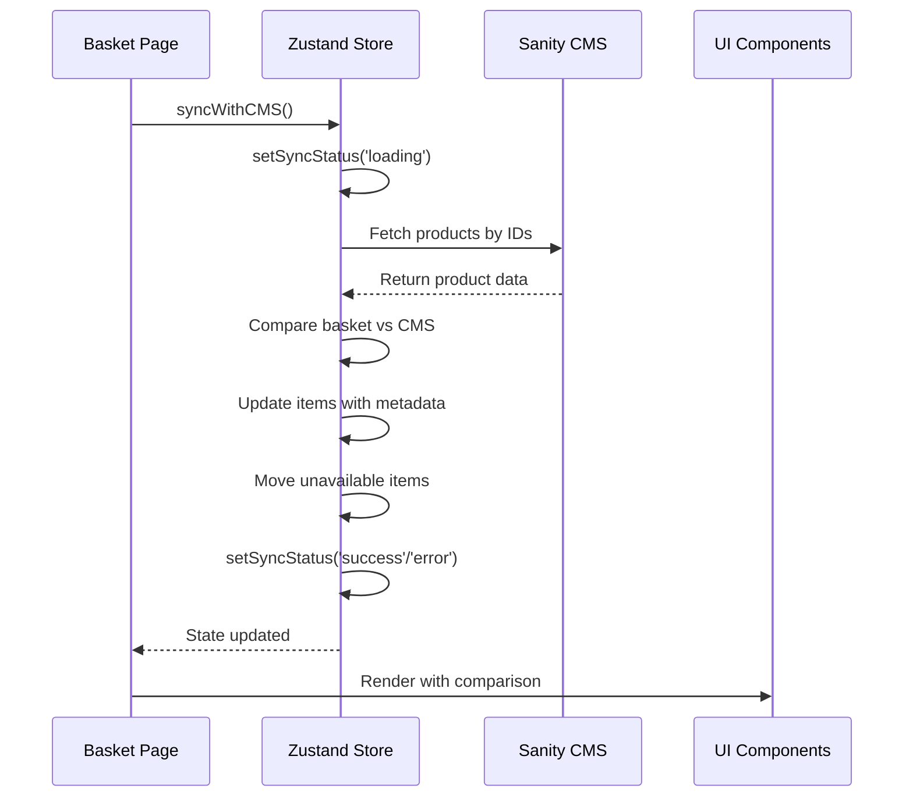

# Technical Diagrams: Basket Feature

## Non-Local Basket (with Cross-Tab Synchronization)

```mermaid
sequenceDiagram
    participant User as User
    participant Store as Zustand Store
    participant LocalStorage as localStorage
    participant Event as Storage Event
    participant OtherTab as Other Tab Store
    
    User->>Store: addProduct/increment/decrement/remove
    Store->>Store: Update state
    Store->>LocalStorage: Persist state
    LocalStorage->>Event: Fire storage event
    Event->>OtherTab: Receive event
    OtherTab->>OtherTab: Re-hydrate from localStorage
    OtherTab->>User: UI updates
```

## Basket Page: CMS Sync Flow

```mermaid
sequenceDiagram
    participant Page as Basket Page
    participant Store as Zustand Store
    participant Sanity as Sanity CMS
    participant UI as UI Components
    
    Page->>Store: syncWithCMS()
    Store->>Store: setSyncStatus('loading')
    Store->>Sanity: Fetch products by IDs
    Sanity-->>Store: Return product data
    Store->>Store: Compare basket vs CMS
    Store->>Store: Update items with metadata
    Store->>Store: Move unavailable items
    Store->>Store: setSyncStatus('success'/'error')
    Store-->>Page: State updated
    Page->>UI: Render with comparison
```