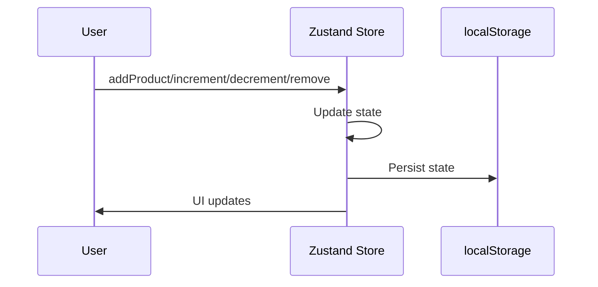
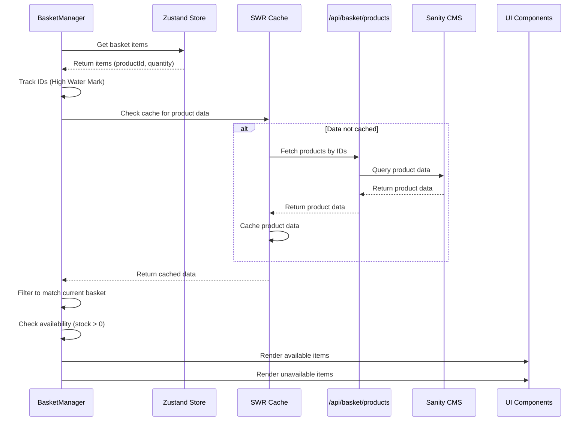

# Technical Diagrams: Basket Feature

## Non-Local Basket

```mermaid
sequenceDiagram
    participant User as User
    participant Store as Zustand Store
    participant LocalStorage as localStorage
    
    User->>Store: addProduct/increment/decrement/remove
    Store->>Store: Update state
    Store->>LocalStorage: Persist state
    Store->>User: UI updates
```

## Basket Page: CMS Fetch Flow

```mermaid
sequenceDiagram
    participant Manager as BasketManager
    participant Store as Zustand Store
    participant SWR as SWR Cache
    participant API as /api/basket/products
    participant CMS as Sanity CMS
    participant UI as UI Components

    Manager->>Store: Get basket items
    Store-->>Manager: Return items (productId, quantity)
    Manager->>Manager: Track IDs (High Water Mark)
    Manager->>SWR: Check cache for product data
    alt Data not cached
        SWR->>API: Fetch products by IDs
        API->>CMS: Query product data
        CMS-->>API: Return product data
        API-->>SWR: Return product data
        SWR->>SWR: Cache product data
    end
    SWR-->>Manager: Return cached data
    Manager->>Manager: Filter to match current basket
    Manager->>Manager: Check availability (stock > 0)
    Manager->>UI: Render available items
    Manager->>UI: Render unavailable items
```