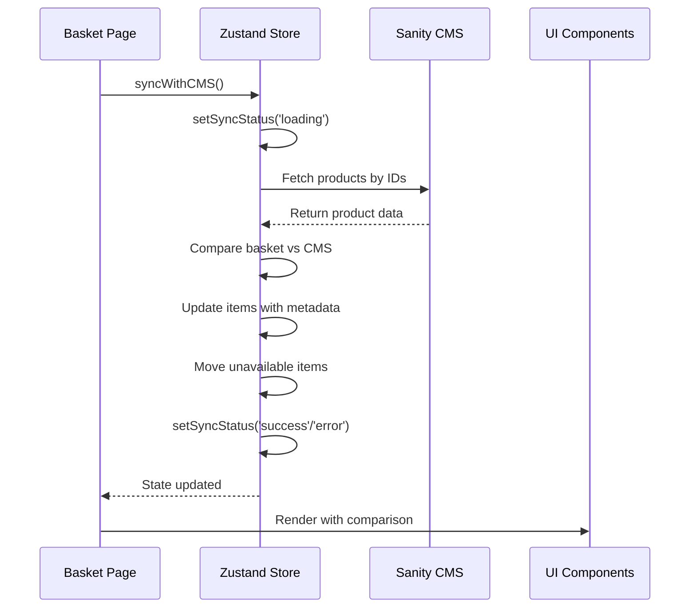

Goal: capture technical solution design in minimalest possible way
Criteria: 0 unnecessary verbiage, 0 unnecessary characters

# Technical Solution: Basket Page

## Q & A Research & Design
- **Domains:** Next.js, Zustand state management, Sanity CMS, sync status management
- **Critical knowledge:** Zustand store structure, Sanity client, syncWithCMS action, comparison logic, stored snapshot data
- **Critical choices:** Use existing Zustand store, Sanity CMS for data, metadata for comparison display, use stored displayPriceAtAdd and availableStockAtAdd for comparison
- **System boundaries:** Client-side state, Sanity CMS API, basket page UI, non-local basket provides snapshot data
- **Data flow:** Page load → syncWithCMS → Sanity fetch → compare with stored snapshots → update state → UI render
- **Actors:** Basket page component, Zustand store, Sanity client, UI components
- **Communication order:** Page → Store → Sanity → Store → UI
- **Leanest solution:** Existing Zustand + Sanity + stored snapshot comparison (no new dependencies)
- **Tradeoffs:** Sync on page load only (not real-time), but sufficient for basket page use case

## Critical Checks
- **Missing:** None - all requirements covered
- **Illusions:** None - Sanity + Zustand is proven pattern
- **Not checked:** Need to verify Sanity query performance for multiple products
- **Assumptions:** Sanity has product data with stock, reservedStock and price_data fields
- **Unnecessary:** Real-time sync (WebSocket), external comparison libraries
- **Threats:** Sanity API rate limits, sync timeout, stale data
- **Complications:** Comparison logic must handle edge cases (zero stock, price changes)
- **Painful verification:** Sync comparison accuracy requires manual testing
- **Rework risk:** Low - building on existing store structure

## Architecture
- **Basket Page Component** triggers sync on mount
- **Zustand Store** manages items, unavailable, syncStatus
- **syncWithCMS Action** fetches from Sanity, compares, updates state
- **Sanity Client** fetches product data via GROQ query
- **Metadata** stores old values for comparison display
- **Sync Status** controls loading states and checkout button



## Types
```typescript
interface BasketItemMetadata {
  old_displayPrice?: number
  old_availableStock?: number
}

interface BasketItem {
  productId: string
  quantity: number
  displayPriceAtAdd: number  // displayPrice when added (dollars, user-visible)
  availableStockAtAdd: number  // availableStock when added (stock - reservedStock)
  displayPrice?: number  // current displayPrice after sync
  availableStock?: number  // current availableStock after sync
  metadata?: BasketItemMetadata
}

type SyncStatus = 'idle' | 'loading' | 'error' | 'success'

interface BasketState {
  items: BasketItem[]
  unavailable: BasketItem[]
  hasHydrated: boolean
  syncStatus: SyncStatus
}

interface BasketActions {
  setSyncStatus: (status: SyncStatus) => void
  syncWithCMS: (cmsProducts: Array<{ _id: string; displayPrice: number; stock: number; reservedStock: number }>) => void
  addProduct: (productId: string, displayPriceAtAdd: number, availableStockAtAdd: number) => void
  removeProduct: (productId: string) => void
  incrementQuantity: (productId: string) => void
  decrementQuantity: (productId: string) => void
}

type BasketStore = BasketState & BasketActions
```

## Implementation
```typescript
import { create } from 'zustand'

interface BasketItemMetadata {
  old_displayPrice?: number
  old_availableStock?: number
}

interface BasketItem {
  productId: string
  quantity: number
  displayPriceAtAdd: number  // displayPrice when added (dollars, user-visible)
  availableStockAtAdd: number  // availableStock when added (stock - reservedStock)
  displayPrice?: number  // current displayPrice after sync
  availableStock?: number  // current availableStock after sync
  metadata?: BasketItemMetadata
}

type SyncStatus = 'idle' | 'loading' | 'error' | 'success'

interface BasketState {
  items: BasketItem[]
  unavailable: BasketItem[]
  hasHydrated: boolean
  syncStatus: SyncStatus
}

interface BasketActions {
  setSyncStatus: (status: SyncStatus) => void
  syncWithCMS: (cmsProducts: Array<{ _id: string; displayPrice: number; stock: number; reservedStock: number }>) => void
  addProduct: (productId: string, displayPriceAtAdd: number, availableStockAtAdd: number) => void
  removeProduct: (productId: string) => void
  incrementQuantity: (productId: string) => void
  decrementQuantity: (productId: string) => void
}

type BasketStore = BasketState & BasketActions

const useBasketStore = create<BasketStore>()((set, get) => ({
  items: [],
  unavailable: [],
  hasHydrated: false,
  syncStatus: 'idle',
  
  setSyncStatus: (status) => set({ syncStatus: status }),
  
  syncWithCMS: (cmsProducts) => {
    const items = get().items
    const unavailable: BasketItem[] = []
    const updatedItems: BasketItem[] = []
    
    items.forEach((item) => {
      const cmsProduct = cmsProducts.find((p) => p._id === item.productId)
      const cmsAvailableStock = cmsProduct ? cmsProduct.stock - cmsProduct.reservedStock : 0
      
      if (!cmsProduct || cmsAvailableStock === 0) {
        unavailable.push(item)
        return
      }
      
      const metadata: BasketItemMetadata = {}
      let updatedItem = { ...item }
      
      // Price comparison: stored displayPriceAtAdd vs current CMS displayPrice
      if (cmsProduct.displayPrice !== item.displayPriceAtAdd) {
        metadata.old_displayPrice = item.displayPriceAtAdd
        updatedItem.displayPrice = cmsProduct.displayPrice
      } else {
        updatedItem.displayPrice = item.displayPriceAtAdd
      }
      
      // Stock comparison: stored availableStockAtAdd vs current CMS availableStock
      if (cmsAvailableStock < item.quantity) {
        metadata.old_availableStock = item.quantity
        updatedItem.quantity = cmsAvailableStock
        updatedItem.availableStock = cmsAvailableStock
      } else {
        updatedItem.availableStock = cmsAvailableStock
      }
      
      if (Object.keys(metadata).length > 0) {
        updatedItem.metadata = metadata
      }
      
      updatedItems.push(updatedItem)
    })
    
    set({ items: updatedItems, unavailable, syncStatus: 'success' })
  },
  
  addProduct: (productId, displayPriceAtAdd, availableStockAtAdd) => {
    const items = get().items
    const existing = items.find((item) => item.productId === productId)
    if (existing) {
      set({ items: items.map((item) => item.productId === productId ? { ...item, quantity: item.quantity + 1 } : item) })
    } else {
      set({ items: [...items, { productId, quantity: 1, displayPriceAtAdd, availableStockAtAdd }] })
    }
  },
  
  removeProduct: (productId) => {
    set({ items: get().items.filter((item) => item.productId !== productId) })
  },
  
  incrementQuantity: (productId) => {
    set({ items: get().items.map((item) => item.productId === productId ? { ...item, quantity: item.quantity + 1 } : item) })
  },
  
  decrementQuantity: (productId) => {
    set({ items: get().items.map((item) => {
      if (item.productId === productId && item.quantity > 1) {
        return { ...item, quantity: item.quantity - 1 }
      }
      return item
    }).filter((item) => item.quantity > 0) })
  },
}))

// Selector for total cost
const selectTotalCost = (state: BasketState) => 
  state.items.reduce((sum, item) => sum + ((item.displayPrice ?? item.displayPriceAtAdd) * item.quantity), 0)
```

## Notes
- syncWithCMS compares stored snapshots (displayPriceAtAdd, availableStockAtAdd) with current CMS data
- Metadata stores old values for comparison display (strikethrough)
- CMS availableStock calculated as stock - reservedStock
- Unavailable items moved to separate array for separate display
- Sync status controls loading states and checkout button state
- Comparison logic handles price and stock discrepancies separately
