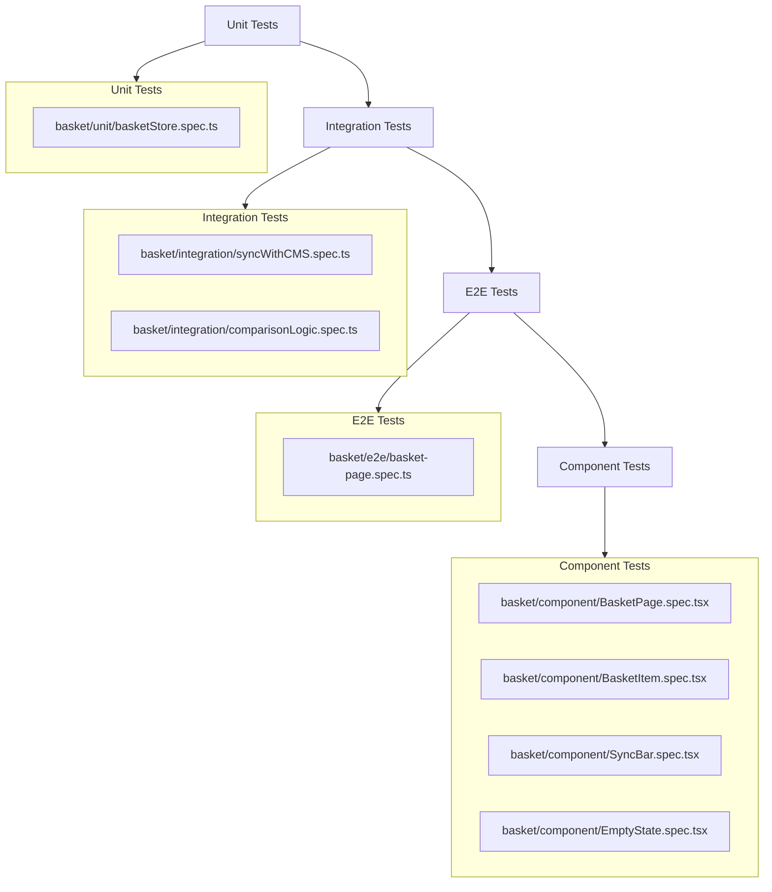

# Tests Plan: Basket Page

## Test Files

### Unit Tests
- **basket/unit/basketStore.spec.ts** - Tests store actions (syncWithCMS, incrementQuantity, decrementQuantity, removeProduct) and state management

### Integration Tests
- **basket/integration/syncWithCMS.spec.ts** - Tests CMS sync flow with mock Sanity client and state updates
- **basket/integration/comparisonLogic.spec.ts** - Tests price and stock comparison logic with various discrepancy scenarios

### E2E Tests
- **basket/e2e/basket-page.spec.ts** - Tests complete basket page user journey from load to pre-checkout

### Component Tests
- **basket/component/BasketPage.spec.tsx** - Tests basket page rendering, sync status, and total calculation
- **basket/component/BasketItem.spec.tsx** - Tests individual basket item rendering, quantity controls, and remove action
- **basket/component/SyncBar.spec.tsx** - Tests sync status bar display across loading, success, and error states
- **basket/component/EmptyState.spec.tsx** - Tests empty basket state display and browse products button
