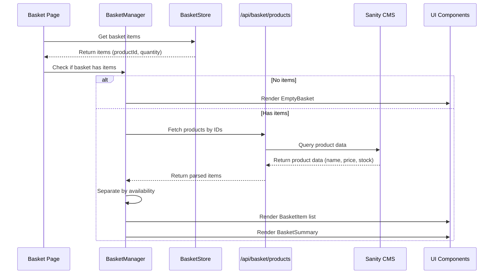
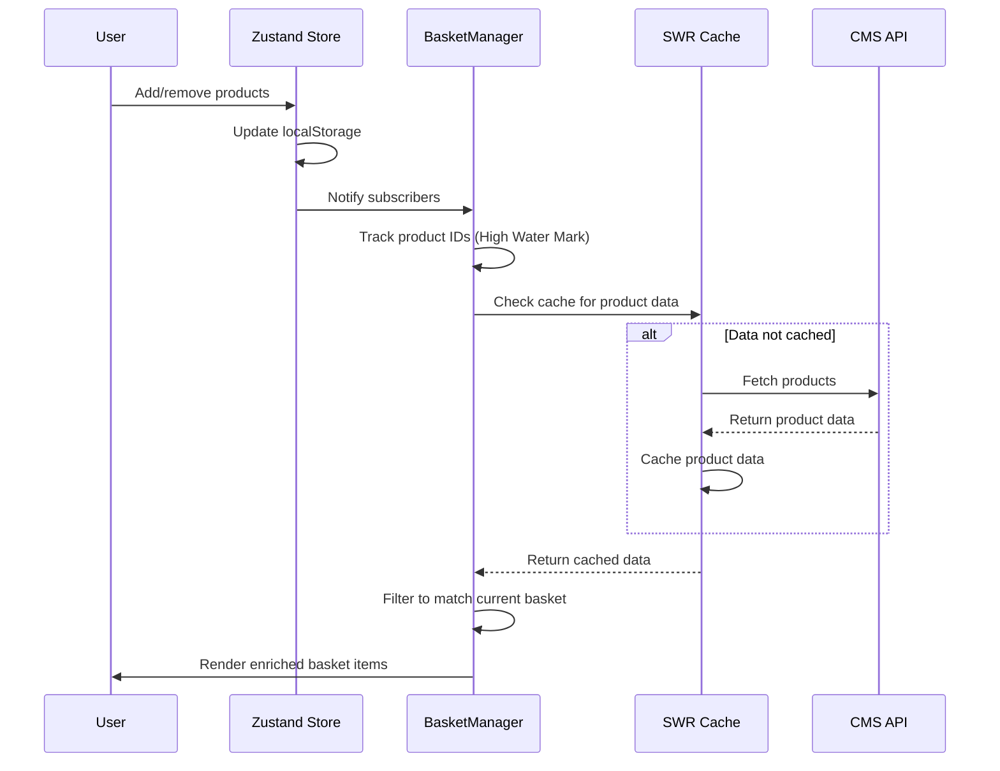

# Basket Page

## Overview

The basket page allows users to review their selected products, adjust quantities, remove items, and proceed to checkout. It displays live product data from the CMS including pricing and availability, providing a clear summary of the basket before checkout.

## Architecture

## State Synchronization Flow

## Key Components

- **BasketPage** (`app/(store)/basket/page.tsx`) - Route entry point with Suspense boundary
- **BasketManager** - Orchestrates data fetching, state management, and rendering logic
- **BasketItem** - Displays individual product with image, price, and controls
- **BasketControls** - Increment/decrement quantity and remove items
- **BasketSummary** - Shows subtotal, shipping, tax, and total with checkout button
- **EmptyBasket** - Empty state with call-to-action

## Data Flow

1. Page mounts and BasketManager reads from Zustand basket store
2. High Water Mark pattern tracks product IDs (useState only adds, never subtracts)
3. SWR fetches product data from `/api/basket/products` using dynamic key based on tracked IDs
4. CMS returns product data (price, stock, reservedStock)
5. Parser converts CMS data to display format (cents to dollars)
6. Availability handler separates items into available/unavailable
7. BasketManager renders items with live CMS data
8. Quantity mutations update basket store (tracked IDs unchanged, no re-fetch)
9. Adding items triggers render phase state update, SWR refetches with expanded ID list

## High Water Mark Pattern

BasketManager uses High Water Mark pattern to prevent unnecessary refetches and permanent loading states:

- **trackedIds (useState)**: Only ever adds product IDs, never subtracts
- **Render phase state update**: Synchronous state update avoids useEffect race conditions
- **Dynamic SWR key**: `basket-products:${trackedIds.sort().join(",")}` changes only when new IDs added
- **No refetch on**: Item deletion, quantity changes, navigation (component unmount resets trackedIds)
- **Refetch on**: New items added after mount (trackedIds expands, SWR key changes)

## Tech Stack

- **React 18** - UI framework
- **Next.js** - App router and server components
- **Zustand** - Client-side basket state management with localStorage persistence
- **SWR** - Data fetching and caching
- **Sanity CMS** - Product data source
- **TypeScript** - Type safety

## Why Client Component for Data Fetching

BasketManager uses Client Component for data fetching because:

1. **Basket IDs live in client-side Zustand store** - Server Components cannot access client state
2. **Fetch depends on dynamic client data** - Product IDs required for CMS fetch are in client store
3. **SWRConfig fallback requires Server Component to know fetch keys** - Impossible without client state access
4. **Requirements**: No refetch on delete/quantity change, refetch on navigate back - High Water Mark pattern achieves this

Server Component prefetching is not possible here. The High Water Mark pattern is the correct solution for this constraint.

## Related Documentation

- [PRD](./1. PRD.md) - Product requirements and definition of done
- [Technical Solution](./2. Minimal Viable Solution Design.md) - Detailed technical design
