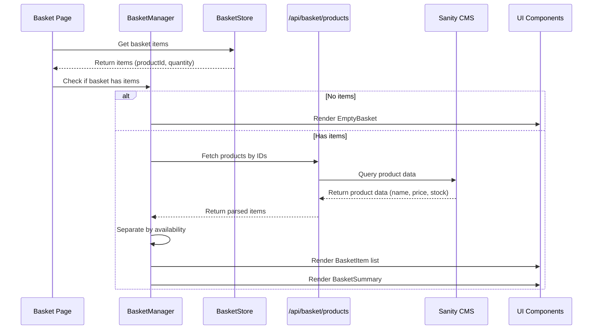

# Basket Page

## Overview

The basket page allows users to review their selected products, adjust quantities, remove items, and proceed to checkout. It displays live product data from the CMS including pricing and availability, providing a clear summary of the basket before checkout.

## Architecture

## Key Components

- **BasketPage** (`app/(store)/basket/page.tsx`) - Route entry point with Suspense boundary
- **BasketManager** - Orchestrates data fetching, state management, and rendering logic
- **BasketItem** - Displays individual product with image, price, and controls
- **BasketControls** - Increment/decrement quantity and remove items
- **BasketSummary** - Shows subtotal, shipping, tax, and total with checkout button
- **EmptyBasket** - Empty state with call-to-action

## Data Flow

1. Page mounts and BasketManager reads from Zustand basket store
2. If basket has items, SWR fetches product data from `/api/basket/products`
3. CMS returns product data (price, stock, reservedStock)
4. Parser converts CMS data to display format (cents to dollars)
5. Availability handler separates items into available/unavailable
6. BasketManager renders items with live CMS data
7. Quantity mutations update basket store and trigger re-fetch

## Tech Stack

- **React 18** - UI framework
- **Next.js** - App router and server components
- **Zustand** - Client-side basket state management with localStorage persistence
- **SWR** - Data fetching and caching
- **Sanity CMS** - Product data source
- **TypeScript** - Type safety

## Related Documentation

- [PRD](./1. PRD.md) - Product requirements and definition of done
- [Technical Solution](./2. Minimal Viable Solution Design.md) - Detailed technical design
