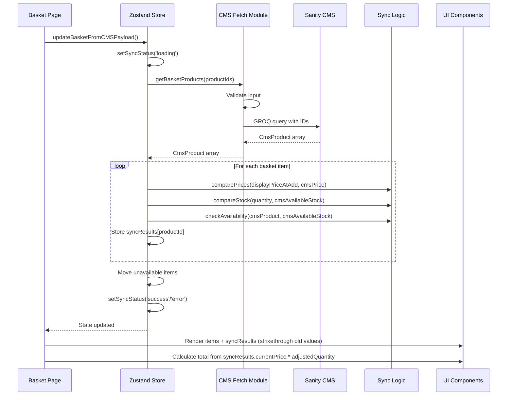

Goal: capture technical solution design in minimalest possible way
Criteria: 0 unnecessary verbiage, 0 unnecessary characters

# Design: Basket Page

## Q & A Research & Design
- **Domains:** Next.js, Zustand state management, Sanity CMS, sync status management
- **Critical knowledge:** Zustand store structure, Sanity client, updateBasketFromCMSPayload action, comparison logic functions, stored snapshot data
- **Critical choices:** Use existing Zustand store, Sanity CMS for data, metadata for comparison display, use stored displayPriceAtAdd and availableStockAtAdd for comparison, extract comparison logic into SRP functions
- **System boundaries:** Client-side state, Sanity CMS API, basket page UI, non-local basket provides snapshot data
- **Data flow:** Page load → updateBasketFromCMSPayload → Sanity fetch → comparePrices/compareStock/checkAvailability → updateBasketItem → update state → UI render
- **Actors:** Basket page component, Zustand store, Sanity client, comparison logic functions, UI components
- **Communication order:** Page → Store → Sanity → Logic Functions → Store → UI
- **Leanest solution:** Existing Zustand + Sanity + stored snapshot comparison + SRP comparison functions (no new dependencies)
- **Tradeoffs:** Sync on page load only (not real-time), but sufficient for basket page use case

# Pre-requirements and dependencies chain check

## Note what was checked in minimalest way possible
- Checked productType.ts schema: has price_data (currency, unit_amount in cents), stock, reservedStock fields
- Checked package.json: Zustand (^5.0.1) and Zod (^4.1.12) installed

## Then, note [ ] task to be solved for pre-requirements are missing in minimal but clear and complete way
- [x] Define price conversion utility (centsToDollars) for CMS price_data.unit_amount (exists: lib/utils/price.ts)
- [x] Implement getBasketProducts data fetcher with minimal GROQ query (exists: sanity-config/lib/products/getBasketProducts.ts)

## Critical Checks
- **Missing:** None - all requirements covered
- **Illusions:** None - Sanity + Zustand is proven pattern
- **Not checked:** Need to verify Sanity query performance for multiple products
- **Assumptions:** Sanity has product data with stock, reservedStock and price_data fields
- **Unnecessary:** Real-time sync (WebSocket), external comparison libraries
- **Threats:** Sanity API rate limits, sync timeout, stale data
- **Complications:** Comparison logic must handle edge cases (zero stock, price changes)
- **Painful verification:** Sync comparison accuracy requires manual testing
- **Rework risk:** Low - building on existing store structure

## Architecture

### UI Layer (serves PRD user experience + HTML Structure)
- **Basket Page Component** renders sync-bar, basket-table, basket-item, quantity-controls, unavailable-banner, basket-total, checkout-button, empty-state
- **Sync Bar Component** shows loading/success/error states with retry button
- **Basket Items Table Component** renders basket-item rows with comparison results (strikethrough old values)
- **Quantity Controls Component** increment/decrement/remove with disabled states (decrement disabled at quantity=1)
- **Checkout Button Component** disabled during sync, enabled after sync completes

### State Layer (manages UI state)
- **Zustand Store** manages: items, unavailable, syncResults, syncStatus
- **Items** array stores pure basket snapshots (productId, quantity, displayPriceAtAdd, availableStockAtAdd)
- **Unavailable** array stores out-of-stock items for separate display
- **SyncResults** object maps productId to comparison data (currentPrice, currentAvailableStock, hasPriceChange, hasStockChange, adjustedQuantity)
- **SyncStatus** ('idle' | 'loading' | 'error' | 'success') controls sync-bar and checkout button

### Data Layer (fetches data)
- **CMS Fetch Module** (see cms-fetch.md) handles request/response with clear typing
- **getBasketProducts Function** takes product IDs array, returns CmsProduct array
- **Request Type:** GetBasketProductsRequest = string[] (product IDs)
- **Response Type:** GetBasketProductsResponse = CmsProduct[] with price_data, stock, reservedStock
- **Sanity Client** executes GROQ query via sanityFetch
- **Error Handling:** Returns empty array on error with console logging

### Logic Layer (processes data)
- **updateBasketFromCMSPayload** orchestrates sync process on page mount
- **comparePrices** compares stored displayPriceAtAdd vs CMS displayPrice (dollars)
- **compareStock** compares stored quantity vs CMS availableStock
- **checkAvailability** determines if product unavailable (stock - reservedStock === 0)
- **updateBasketItem** updates item with comparison metadata (old_displayPrice, old_availableStock)
- **centsToDisplay** converts price_data.unit_amount (cents) to displayPrice (dollars)

