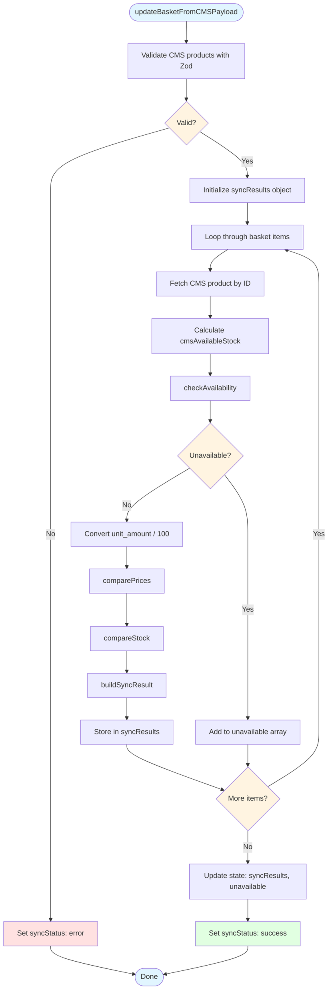

# Implementation: Basket Page



```typescript
import { create } from 'zustand'
import { z } from 'zod'

// Zod schema for CMS product data validation
const CmsProductSchema = z.object({
  _id: z.string(),
  price_data: z.object({
    currency: z.string(),
    unit_amount: z.number().nonnegative()
  }),
  stock: z.number().nonnegative(),
  reservedStock: z.number().nonnegative()
})

type CmsProduct = z.infer<typeof CmsProductSchema>

// Zod schema for BasketItem (pure snapshot of what user added)
const BasketItemSchema = z.object({
  productId: z.string().min(1),
  quantity: z.number().int().positive(),
  displayPriceAtAdd: z.number().nonnegative(),
  availableStockAtAdd: z.number().nonnegative()
})

// Infer TypeScript types from Zod schema
type BasketItem = z.infer<typeof BasketItemSchema>

// Sync results state (separate from basket snapshot)
type SyncResult = {
  currentPrice: number
  currentAvailableStock: number
  hasPriceChange: boolean
  hasStockChange: boolean
  adjustedQuantity: number
}

type SyncResults = Record<string, SyncResult>

type SyncStatus = 'idle' | 'loading' | 'error' | 'success'

interface BasketState {
  items: BasketItem[]
  unavailable: BasketItem[]
  syncResults: SyncResults
  hasHydrated: boolean
  syncStatus: SyncStatus
}

interface BasketActions {
  setSyncStatus: (status: SyncStatus) => void
  updateBasketFromCMSPayload: (cmsProducts: CmsProduct[]) => void
  addProduct: (productId: string, displayPriceAtAdd: number, availableStockAtAdd: number) => void
  removeProduct: (productId: string) => void
  incrementQuantity: (productId: string) => void
  decrementQuantity: (productId: string) => void
}

type BasketStore = BasketState & BasketActions

const useBasketStore = create<BasketStore>()((set, get) => ({
  items: [],
  unavailable: [],
  syncResults: {},
  hasHydrated: false,
  syncStatus: 'idle',

  setSyncStatus: (status) => set({ syncStatus: status }),

  updateBasketFromCMSPayload: (cmsProducts) => {
    // Validate CMS products input using Zod schema
    const result = z.array(CmsProductSchema).safeParse(cmsProducts)
    if (!result.success) {
      console.error('Invalid CMS products data:', result.error)
      set({ syncStatus: 'error' })
      return
    }

    const items = get().items
    const unavailable: BasketItem[] = []
    const syncResults: SyncResults = {}

    items.forEach((item) => {
      const cmsProduct = result.data.find((p) => p._id === item.productId)
      const cmsAvailableStock = cmsProduct ? cmsProduct.stock - cmsProduct.reservedStock : 0

      // Check availability
      if (!cmsProduct || cmsAvailableStock === 0) {
        unavailable.push(item)
        return
      }

      // Convert price_data.unit_amount (cents) to displayPrice (dollars)
      const cmsDisplayPrice = cmsProduct.price_data.unit_amount / 100

      // Price comparison
      const priceResult = {
        currentPrice: cmsDisplayPrice,
        hasPriceChange: cmsDisplayPrice !== item.displayPriceAtAdd
      }

      // Stock comparison
      const stockResult = {
        currentAvailableStock: cmsAvailableStock,
        hasStockChange: cmsAvailableStock < item.quantity,
        adjustedQuantity: cmsAvailableStock < item.quantity ? cmsAvailableStock : item.quantity
      }

      // Build sync result
      syncResults[item.productId] = {
        currentPrice: priceResult.currentPrice,
        currentAvailableStock: stockResult.currentAvailableStock,
        hasPriceChange: priceResult.hasPriceChange,
        hasStockChange: stockResult.hasStockChange,
        adjustedQuantity: stockResult.adjustedQuantity
      }
    })

    set({ syncResults, unavailable, syncStatus: 'success' })
  },

  addProduct: (productId, displayPriceAtAdd, availableStockAtAdd) => {
    const items = get().items
    const existing = items.find((item) => item.productId === productId)
    if (existing) {
      set({ items: items.map((item) => item.productId === productId ? { ...item, quantity: item.quantity + 1 } : item) })
    } else {
      set({ items: [...items, { productId, quantity: 1, displayPriceAtAdd, availableStockAtAdd }] })
    }
  },

  removeProduct: (productId) => {
    set({ items: get().items.filter((item) => item.productId !== productId) })
  },

  incrementQuantity: (productId) => {
    set({ items: get().items.map((item) => item.productId === productId ? { ...item, quantity: item.quantity + 1 } : item) })
  },

  decrementQuantity: (productId) => {
    set({ items: get().items.map((item) => {
      if (item.productId === productId && item.quantity > 1) {
        return { ...item, quantity: item.quantity - 1 }
      }
      return item
    }).filter((item) => item.quantity > 0) })
  },
}))

// Selector for total cost (calculated from syncResults, not basket snapshot)
const selectTotalCost = (state: BasketState) =>
  state.items.reduce((sum, item) => {
    const syncResult = state.syncResults[item.productId]
    if (syncResult) {
      return sum + (syncResult.currentPrice * syncResult.adjustedQuantity)
    }
    return sum + (item.displayPriceAtAdd * item.quantity)
  }, 0)
```

## Notes
- BasketItem is pure snapshot (productId, quantity, displayPriceAtAdd, availableStockAtAdd)
- SyncResults stores comparison data separately (currentPrice, currentAvailableStock, hasPriceChange, hasStockChange, adjustedQuantity)
- updateBasketFromCMSPayload builds syncResults object, does not modify basket items
- UI layer combines basket items + syncResults for display (strikethrough old values)
- Checkout calculation uses syncResults.currentPrice * adjustedQuantity
- CMS provides price_data.unit_amount in cents, converted to dollars (unit_amount / 100)
- Stored displayPriceAtAdd is in dollars (user-visible from non-local-basket)
- CMS availableStock calculated as stock - reservedStock
- Unavailable items moved to separate array for separate display
- Sync status controls loading states and checkout button state
- Comparison logic handles price and stock discrepancies separately

