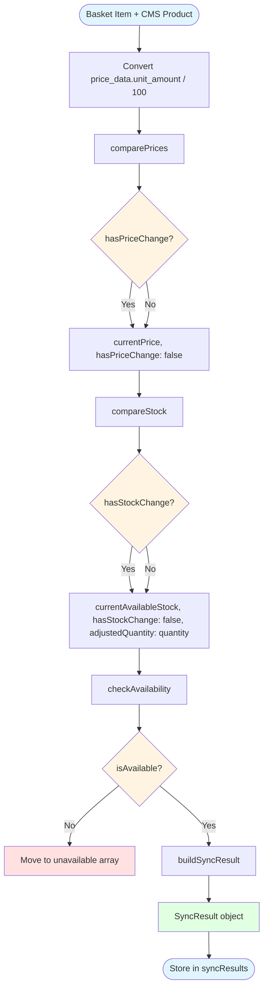

# Sync Logic: Basket Page Comparison Functions



## comparePrices(displayPriceAtAdd: number, cmsPrice: number)

Compares stored price (when added) with current CMS price.

**Input:**
- displayPriceAtAdd: Price when item was added to basket (dollars)
- cmsPrice: Current price from CMS (dollars)

**Output:**
```typescript
{
  currentPrice: number,
  hasPriceChange: boolean
}
```

**Logic:**
- currentPrice = cmsPrice
- hasPriceChange = (displayPriceAtAdd !== cmsPrice)

## compareStock(quantity: number, cmsAvailableStock: number)

Compares stored quantity with current CMS available stock.

**Input:**
- quantity: Quantity in basket
- cmsAvailableStock: Current available stock from CMS (stock - reservedStock)

**Output:**
```typescript
{
  currentAvailableStock: number,
  hasStockChange: boolean,
  adjustedQuantity: number
}
```

**Logic:**
- currentAvailableStock = cmsAvailableStock
- hasStockChange = (cmsAvailableStock < quantity)
- adjustedQuantity = hasStockChange ? cmsAvailableStock : quantity

## checkAvailability(cmsProduct: CmsProduct | null, cmsAvailableStock: number)

Determines if product is unavailable.

**Input:**
- cmsProduct: CMS product data or null if not found
- cmsAvailableStock: Current available stock from CMS

**Output:**
- boolean: true if unavailable, false if available

**Logic:**
- If !cmsProduct || cmsAvailableStock === 0: return true (unavailable)
- Otherwise: return false (available)

## buildSyncResult(basketItem: BasketItem, cmsProduct: CmsProduct, priceResult, stockResult)

Builds sync result object for UI display and checkout calculation.

**Input:**
- basketItem: Pure basket snapshot (productId, quantity, displayPriceAtAdd, availableStockAtAdd)
- cmsProduct: CMS product data
- priceResult: Result from comparePrices
- stockResult: Result from compareStock

**Output:**
```typescript
SyncResult:
{
  currentPrice: number,
  currentAvailableStock: number,
  hasPriceChange: boolean,
  hasStockChange: boolean,
  adjustedQuantity: number
}
```

**Logic:**
- currentPrice = priceResult.currentPrice
- currentAvailableStock = stockResult.currentAvailableStock
- hasPriceChange = priceResult.hasPriceChange
- hasStockChange = stockResult.hasStockChange
- adjustedQuantity = stockResult.adjustedQuantity

