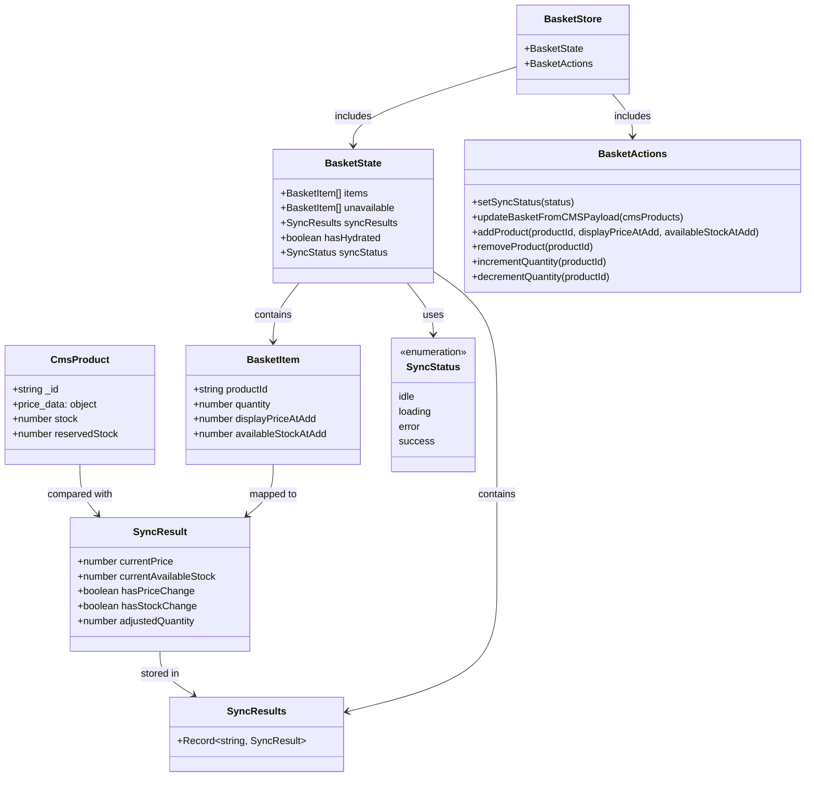

# Types: Basket Page



```typescript
import { z } from 'zod'

// Zod schema for CMS product data validation
const CmsProductSchema = z.object({
  _id: z.string(),
  price_data: z.object({
    currency: z.string(),
    unit_amount: z.number().nonnegative()
  }),
  stock: z.number().nonnegative(),
  reservedStock: z.number().nonnegative()
})

type CmsProduct = z.infer<typeof CmsProductSchema>

// Zod schema for BasketItem (pure snapshot of what user added)
const BasketItemSchema = z.object({
  productId: z.string().min(1),
  quantity: z.number().int().positive(),
  displayPriceAtAdd: z.number().nonnegative(),
  availableStockAtAdd: z.number().nonnegative()
})

// Infer TypeScript types from Zod schema
type BasketItem = z.infer<typeof BasketItemSchema>

// Sync results state (separate from basket snapshot)
type SyncResult = {
  currentPrice: number
  currentAvailableStock: number
  hasPriceChange: boolean
  hasStockChange: boolean
  adjustedQuantity: number
}

type SyncResults = Record<string, SyncResult>

type SyncStatus = 'idle' | 'loading' | 'error' | 'success'

interface BasketState {
  items: BasketItem[]
  unavailable: BasketItem[]
  syncResults: SyncResults
  hasHydrated: boolean
  syncStatus: SyncStatus
}

interface BasketActions {
  setSyncStatus: (status: SyncStatus) => void
  updateBasketFromCMSPayload: (cmsProducts: CmsProduct[]) => void
  addProduct: (productId: string, displayPriceAtAdd: number, availableStockAtAdd: number) => void
  removeProduct: (productId: string) => void
  incrementQuantity: (productId: string) => void
  decrementQuantity: (productId: string) => void
}

type BasketStore = BasketState & BasketActions
```
