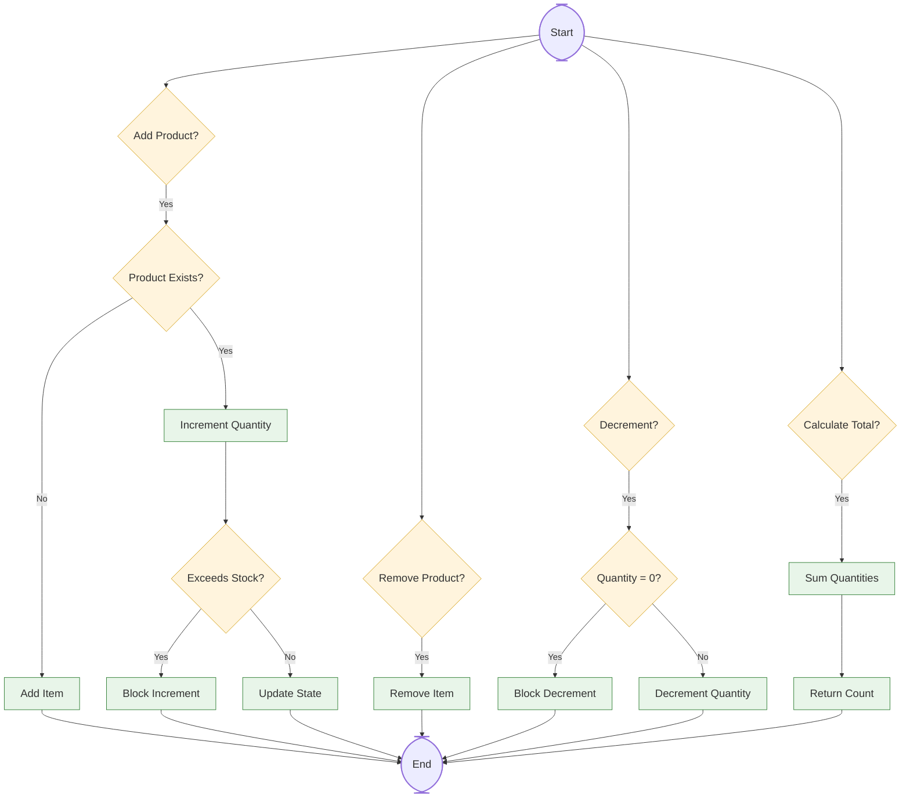

# Basket Core State Flow

```mermaid
graph TD
    Start([Start]) --> AddProduct{Add Product?}
    AddProduct -->|Yes| CheckExists{Product Exists?}
    CheckExists -->|No| AddItem[Add Item]
    CheckExists -->|Yes| Increment[Increment Quantity]
    AddItem --> End([End])
    Increment --> CheckStock{Exceeds Stock?}
    CheckStock -->|Yes| Block[Block Increment]
    CheckStock -->|No| UpdateState[Update State]
    Block --> End
    UpdateState --> End

    Start --> RemoveProduct{Remove Product?}
    RemoveProduct -->|Yes| RemoveItem[Remove Item]
    RemoveItem --> End

    Start --> Decrement{Decrement?}
    Decrement -->|Yes| CheckZero{Quantity = 0?}
    CheckZero -->|Yes| BlockDec[Block Decrement]
    CheckZero -->|No| DecrementQty[Decrement Quantity]
    BlockDec --> End
    DecrementQty --> End

    Start --> Calculate{Calculate Total?}
    Calculate -->|Yes| SumItems[Sum Quantities]
    SumItems --> ReturnTotal[Return Count]
    ReturnTotal --> End

    classDef large font-size:20px,padding:15px,stroke-width:2px;
    classDef logic fill:#fff4dd,stroke:#d4a017,font-size:20px;
    classDef state fill:#e1f5fe,stroke:#01579b,font-size:20px;
    classDef action fill:#e8f5e9,stroke:#2e7d32,font-size:20px;

    class CheckExists,CheckStock,CheckZero,AddProduct,RemoveProduct,Decrement,Calculate logic;
    class AddItem,Increment,Block,UpdateState,RemoveItem,BlockDec,DecrementQty,SumItems,ReturnTotal action;
    class Start,End large;
```
