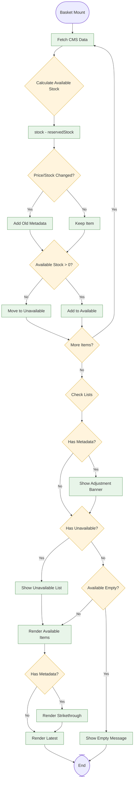

# Basket Latest Sync Flow

```mermaid
graph TD
    Start([Basket Mount]) --> FetchCMS[Fetch CMS Data]
    FetchCMS --> CalculateStock{Calculate Available Stock}
    CalculateStock --> UpdateStock[stock - reservedStock]

    UpdateStock --> CheckDiscrepancy{Price/Stock Changed?}
    CheckDiscrepancy -->|Yes| AddMetadata[Add Old Metadata]
    CheckDiscrepancy -->|No| KeepItem[Keep Item]

    AddMetadata --> CheckAvailable{Available Stock > 0?}
    CheckAvailable -->|No| MoveToUnavailable[Move to Unavailable]
    CheckAvailable -->|Yes| AddToAvailable[Add to Available]
    KeepItem --> CheckAvailable
    MoveToUnavailable --> CheckMore{More Items?}
    AddToAvailable --> CheckMore

    CheckMore -->|Yes| FetchCMS
    CheckMore -->|No| CheckLists{Check Lists}

    CheckLists --> HasMetadata{Has Metadata?}
    HasMetadata -->|Yes| ShowBanner[Show Adjustment Banner]
    HasMetadata -->|No| CheckUnavailable{Has Unavailable?}
    ShowBanner --> CheckUnavailable

    CheckUnavailable -->|Yes| ShowUnavailable[Show Unavailable List]
    CheckUnavailable -->|No| CheckEmpty{Available Empty?}
    ShowUnavailable --> RenderItems[Render Available Items]
    CheckEmpty -->|Yes| ShowEmpty[Show Empty Message]
    CheckEmpty -->|No| RenderItems

    RenderItems --> CheckStrikethrough{Has Metadata?}
    CheckStrikethrough -->|Yes| RenderOld[Render Strikethrough]
    CheckStrikethrough -->|No| RenderLatest[Render Latest]
    RenderOld --> RenderLatest
    RenderLatest --> End([End])
    ShowEmpty --> End

    classDef large font-size:20px,padding:15px,stroke-width:2px;
    classDef logic fill:#fff4dd,stroke:#d4a017,font-size:20px;
    classDef state fill:#e1f5fe,stroke:#01579b,font-size:20px;
    classDef action fill:#e8f5e9,stroke:#2e7d32,font-size:20px;

    class CalculateStock,CheckDiscrepancy,CheckAvailable,CheckMore,CheckLists,HasMetadata,CheckUnavailable,CheckEmpty,CheckStrikethrough logic;
    class FetchCMS,UpdateStock,AddMetadata,KeepItem,MoveToUnavailable,AddToAvailable,ShowBanner,ShowUnavailable,RenderItems,ShowEmpty,RenderOld,RenderLatest action;
    class Start,End large;
```
