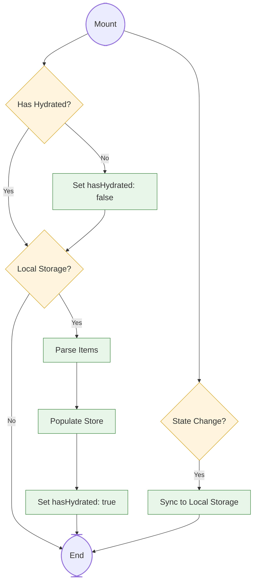

# Basket Persistence Flow

```mermaid
graph TD
    Start([Mount]) --> InitHydrated{Has Hydrated?}
    InitHydrated -->|No| SetFalse[Set hasHydrated: false]
    InitHydrated -->|Yes| CheckStorage{Local Storage?}
    SetFalse --> CheckStorage
    CheckStorage -->|No| End([End])
    CheckStorage -->|Yes| ParseItems[Parse Items]
    ParseItems --> Populate[Populate Store]
    Populate --> SetTrue[Set hasHydrated: true]
    SetTrue --> End

    Start --> StateChange{State Change?}
    StateChange -->|Yes| SyncToStorage[Sync to Local Storage]
    SyncToStorage --> End

    classDef large font-size:20px,padding:15px,stroke-width:2px;
    classDef logic fill:#fff4dd,stroke:#d4a017,font-size:20px;
    classDef state fill:#e1f5fe,stroke:#01579b,font-size:20px;
    classDef action fill:#e8f5e9,stroke:#2e7d32,font-size:20px;

    class InitHydrated,CheckStorage,StateChange logic;
    class SetFalse,ParseItems,Populate,SetTrue,SyncToStorage action;
    class Start,End large;
```
