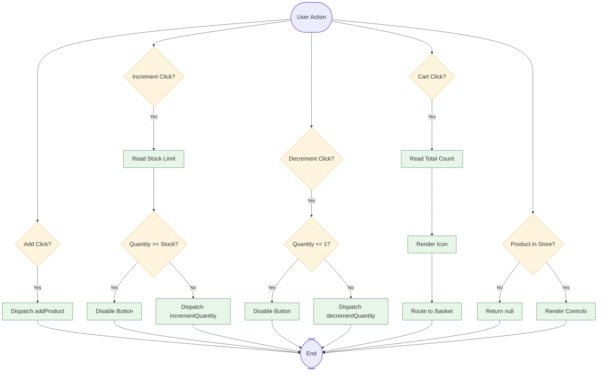

# Basket UI Controls Flow

```mermaid
graph TD
    Start([User Action]) --> AddClick{Add Click?}
    AddClick -->|Yes| DispatchAdd[Dispatch addProduct]
    DispatchAdd --> End([End])

    Start --> IncClick{Increment Click?}
    IncClick -->|Yes| ReadStock[Read Stock Limit]
    ReadStock --> CheckStock{Quantity >= Stock?}
    CheckStock -->|Yes| DisableInc[Disable Button]
    CheckStock -->|No| DispatchInc[Dispatch incrementQuantity]
    DisableInc --> End
    DispatchInc --> End

    Start --> DecClick{Decrement Click?}
    DecClick -->|Yes| CheckQty{Quantity <= 1?}
    CheckQty -->|Yes| DisableDec[Disable Button]
    CheckQty -->|No| DispatchDec[Dispatch decrementQuantity]
    DisableDec --> End
    DispatchDec --> End

    Start --> CartClick{Cart Click?}
    CartClick -->|Yes| ReadCount[Read Total Count]
    ReadCount --> RenderIcon[Render Icon]
    RenderIcon --> RouteBasket[Route to /basket]
    RouteBasket --> End

    Start --> CheckProduct{Product in Store?}
    CheckProduct -->|No| ReturnNull[Return null]
    CheckProduct -->|Yes| RenderControls[Render Controls]
    ReturnNull --> End
    RenderControls --> End

    classDef large font-size:20px,padding:15px,stroke-width:2px;
    classDef logic fill:#fff4dd,stroke:#d4a017,font-size:20px;
    classDef state fill:#e1f5fe,stroke:#01579b,font-size:20px;
    classDef action fill:#e8f5e9,stroke:#2e7d32,font-size:20px;

    class AddClick,IncClick,CheckStock,DecClick,CheckQty,CartClick,CheckProduct logic;
    class DispatchAdd,ReadStock,DisableInc,DispatchInc,DisableDec,DispatchDec,ReadCount,RenderIcon,RouteBasket,ReturnNull,RenderControls action;
    class Start,End large;
```
