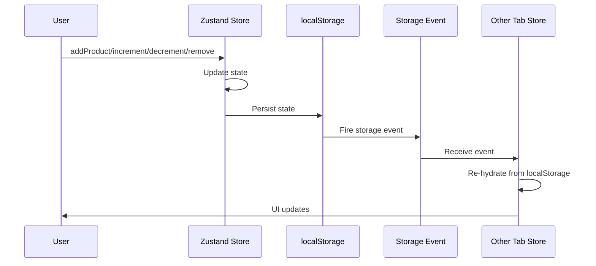

# Technical Solution: Non-Local Basket

## Pre-requirements
- [x] Add price_data (cents) field to Sanity product schema
- [x] Remove displayPrice and stripePriceId fields from Sanity product schema
- [x] Migrate existing products from displayPrice/stripePriceId to price_data
- [x] Update product components to use price_data and calculate displayPrice for UI
- [x] Verify all products have stock and reservedStock fields
- [x] Create GROQ to get required fields (price_data, stock, reservedStock) by product IDs

**Dependencies:** Zustand (^5.0.1), Zod (^4.1.12) - already installed

## Architecture
User → Zustand Store → localStorage → Storage Event → Other Tabs → Re-hydrate



## Typess
```typescript
import { z } from 'zod'

const BasketItemSchema = z.object({
  productId: z.string().min(1),
  quantity: z.number().int().positive(),
  displayPriceAtAdd: z.number().nonnegative(),
  availableStockAtAdd: z.number().nonnegative()
})

type BasketItem = z.infer<typeof BasketItemSchema>

interface BasketState {
  items: BasketItem[]
}

interface BasketActions {
  addProduct: (productId: string, displayPriceAtAdd: number, availableStockAtAdd: number) => void
  removeProduct: (productId: string) => void
  incrementQuantity: (productId: string) => void
  decrementQuantity: (productId: string) => void
}

type BasketStore = BasketState & BasketActions

interface BasketControlsProps {
  productId: string
  displayPriceAtAdd: number
  availableStockAtAdd: number
  isBasketPage: boolean
}
```

## Validation Strategy
- **Input:** Zod schema validates all inputs before storage
- **Read:** localStorage → sessionStorage → reset to empty state
- **Write:** localStorage → sessionStorage → graceful degradation
- **Hydration:** Zod validates data structure after read, reset on failure

## Implementation
**Location:** `store/basketStore.ts`

The store implements:
- Zustand with persist middleware
- Fallback storage (localStorage → sessionStorage)
- Zod validation on all operations
- Storage event listener for tab synchronization
- Re-hydration with validation on load
