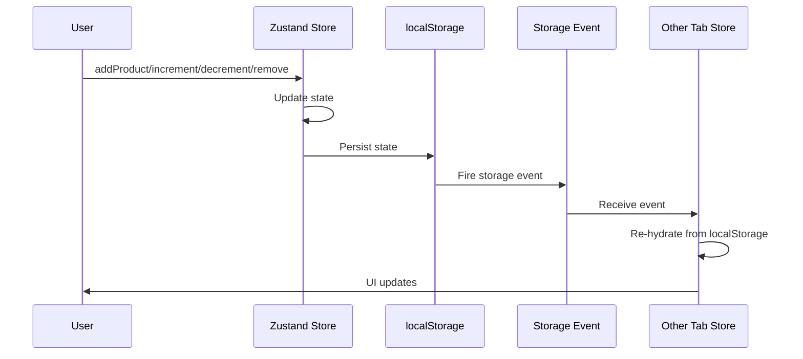

Goal: capture technical solution design in minimalest possible way
Criteria: 0 unnecessary verbiage, 0 unnecessary characters

# Technical Solution: Non-Local Basket

## Q & A Research & Design
- **Domains:** Next.js, Zustand state management, localStorage, cross-tab synchronization
- **Critical knowledge:** Zustand store structure, persist middleware, storage event API, product data availability
- **Critical choices:** Use Zustand (already in project), persist middleware for localStorage, storage events for cross-tab sync, store displayPriceAtAdd and availableStockAtAdd for comparison
- **System boundaries:** Client-side only, browser localStorage, same-origin tabs, product components provide data
- **Data flow:** Product component provides displayPrice/availableStock → Zustand store → localStorage → storage event → other tabs → Zustand store update
- **Actors:** User, Product component, Zustand store, localStorage, storage event listener
- **Communication order:** Product → Store → localStorage → Event → Other tabs
- **Leanest solution:** Zustand + persist middleware + storage events + snapshot data at add time (no extra dependencies)
- **Tradeoffs:** Storage events only fire on other tabs (not current tab), but sufficient for sync needs

# Pre-requirements and dependencies chain check - what is missing/unaligned and needs to be addressed first to make this solution possible?

## Note what was checked in minimalest way possible
- Checked productType.ts schema: has displayPrice, stock, reservedStock, stripePriceId fields
- Checked package.json: Zustand (^5.0.1) installed

## Then, note [ ] task to be solved for pre-requirements are missing in minimal but clear and complete way
- [x ] Add price_data (cents) field to Sanity product schema
- [x ] Remove displayPrice field from Sanity product schema
- [ x] Remove stripePriceId field from Sanity product schema
- [x ] Migrate existing products from displayPrice/stripePriceId to price_data (convert displayPrice to cents)
- [ x] Update product components to use price_data and calculate displayPrice for UI
- [x ] check if every product has stock and reservedStock field
- [x ] make new GROQ to get only the required fields based on basket product ids (price_data, stock, reserved stock) 

**Note:** price_data format confirmed with Stripe - uses cents (smallest currency unit). Formula: `Math.round(displayPrice * 100)` - already validated in existing migrateStripePriceIds.mjs script (line 70).

## Data flow trace
Sanity CMS (product data) → Product components (price_data, stock, reservedStock) → Calculate availableStock → addProduct action → Zustand store → localStorage/sessionStorage

## External system dependencies
- Sanity CMS: product schema requires price_data (cents number), stock, reservedStock fields
  - Current state: has displayPrice, stock, reservedStock, stripePriceId
  - Required state: price_data (cents), stock, reservedStock (no displayPrice, no stripePriceId)
  - Schema changes needed: Add price_data field, remove displayPrice and stripePriceId fields
  - Data migration required: Migrate existing products from displayPrice/stripePriceId to price_data (convert displayPrice to cents)
- Browser: localStorage/sessionStorage API support (modern browsers)
  - Current state: supported in modern browsers
  - Required state: supported in modern browsers
  - Gap: none
- Browser: storage event API support (modern browsers)
  - Current state: supported in modern browsers
  - Required state: supported in modern browsers
  - Gap: none

## Package dependencies
- Zustand (^5.0.1) - already installed in project
- Zod (^4.1.12) - already installed in project


## Critical Checks
- **Missing:** None - all requirements covered
- **Illusions:** None - localStorage with storage events is proven pattern
- **Not checked:** Need to verify Zustand persist middleware compatibility with project setup
- **Assumptions:** Project uses modern browser supporting storage events
- **Unnecessary:** BroadcastChannel (more complex than needed), external sync libraries
- **Threats:** localStorage quota limits, storage event timing issues
- **Complications:** Storage events don't fire on originating tab, but not an issue for sync
- **Painful verification:** Cross-tab sync requires manual testing across tabs
- **Rework risk:** Low - simple middleware addition

## Architecture
- **User** triggers add/increment/decrement/remove actions
- **Zustand Store** manages basket state and actions
- **Persist Middleware** saves state to localStorage on every change
- **Storage Event Listener** in other tabs detects localStorage changes
- **Store Update** in other tabs re-hydrates from localStorage



## Types
```typescript
import { z } from 'zod'

// Zod schema for validation
const BasketItemSchema = z.object({
  productId: z.string().min(1),
  quantity: z.number().int().positive(),
  displayPriceAtAdd: z.number().nonnegative(),
  availableStockAtAdd: z.number().nonnegative()
})

// Infer TypeScript types from Zod schema
type BasketItem = z.infer<typeof BasketItemSchema>

interface BasketState {
  items: BasketItem[]
}

interface BasketActions {
  addProduct: (productId: string, displayPriceAtAdd: number, availableStockAtAdd: number) => void
  removeProduct: (productId: string) => void
  incrementQuantity: (productId: string) => void
  decrementQuantity: (productId: string) => void
}

type BasketStore = BasketState & BasketActions

// Component props
interface BasketControlsProps {
  productId: string
  displayPriceAtAdd: number
  availableStockAtAdd: number
  isBasketPage: boolean // Determines remove button presence and decrement behavior
}
```

## Happy Path
- When user adds product, store validates inputs and saves to localStorage → success
- When user increments/decrements quantity, store updates localStorage → success
- When user opens new tab, storage event fires and tab re-hydrates from localStorage → success
- When user refreshes page, store loads from localStorage, validation passes → success
- When localStorage is available, persist middleware handles read/write automatically → success

## Validation
- Input validation: Zod schema validates productId (non-empty string), quantity (positive integer), displayPriceAtAdd (nonnegative), availableStockAtAdd (nonnegative)
- Read strategy validation: Try localStorage read, if fails (quota, security, corrupt data) try sessionStorage, if both fail reset to empty state
- Write strategy validation: Try localStorage write, if fails (quota, security) try sessionStorage, if both fail do nothing (graceful degradation)
- Hydration validation: After successful read, Zod schema validates data structure and values before hydration
- Schema validation: Zod provides runtime validation with detailed error messages
- On validation failure: Reset to empty state, log error

## Edge Cases
- When localStorage save fails (quota exceeded, security restriction, private mode), system falls back to sessionStorage → if fails, do nothing (graceful degradation)
- When localStorage read fails (quota exceeded, security restriction, corrupt data, unexpected format), system tries sessionStorage → if both fail, reset to empty state
- When storage event listener fails (browser restriction), system relies on manual page refresh for sync → degraded experience
- When hydration validation fails (data structure mismatch, invalid values), system resets to empty state → user sees empty basket
- When product data is stale (price/available stock changed since add), basket-page sync handles comparison → not handled here, handled on basket page

## Fallback Strategies
- localStorage → sessionStorage (on save failure) → graceful degradation (on session storage failure)
- Corrupt data → reset to empty state
- Validation failure → reset to empty state
- Cross-tab sync failure → manual refresh required

## Implementation
```typescript
import { create } from 'zustand'
import { persist, createJSONStorage } from 'zustand/middleware'
import { z } from 'zod'

// Zod schema for validation
const BasketItemSchema = z.object({
  productId: z.string().min(1),
  quantity: z.number().int().positive(),
  displayPriceAtAdd: z.number().nonnegative(),
  availableStockAtAdd: z.number().nonnegative()
})

// Infer TypeScript types from Zod schema
type BasketItem = z.infer<typeof BasketItemSchema>

interface BasketState {
  items: BasketItem[]
}

interface BasketActions {
  addProduct: (productId: string, displayPriceAtAdd: number, availableStockAtAdd: number) => void
  removeProduct: (productId: string) => void
  incrementQuantity: (productId: string) => void
  decrementQuantity: (productId: string) => void
}

type BasketStore = BasketState & BasketActions

// Custom storage with fallback to sessionStorage
const createFallbackStorage = () => {
  const storage = {
    getItem: (name: string) => {
      try {
        return localStorage.getItem(name)
      } catch (e) {
        console.warn('localStorage getItem failed, trying sessionStorage', e)
        try {
          return sessionStorage.getItem(name)
        } catch (e2) {
          console.warn('sessionStorage getItem failed', e2)
          return null
        }
      }
    },
    setItem: (name: string, value: string) => {
      try {
        localStorage.setItem(name, value)
      } catch (e) {
        console.warn('localStorage setItem failed, trying sessionStorage', e)
        try {
          sessionStorage.setItem(name, value)
        } catch (e2) {
          console.warn('sessionStorage setItem failed, graceful degradation', e2)
        }
      }
    },
    removeItem: (name: string) => {
      try {
        localStorage.removeItem(name)
      } catch (e) {
        console.warn('localStorage removeItem failed, trying sessionStorage', e)
        try {
          sessionStorage.removeItem(name)
        } catch (e2) {
          console.warn('sessionStorage removeItem failed', e2)
        }
      }
    }
  }
  return storage
}

const useBasketStore = create<BasketStore>()(
  persist(
    (set, get) => ({
      items: [],
      addProduct: (productId, displayPriceAtAdd, availableStockAtAdd) => {
        // Input validation using Zod schema
        const result = BasketItemSchema.safeParse({
          productId,
          quantity: 1,
          displayPriceAtAdd,
          availableStockAtAdd
        })
        if (!result.success) {
          console.error('Invalid input:', result.error)
          return
        }

        const items = get().items
        const existing = items.find((item) => item.productId === productId)
        if (existing) {
          set({ items: items.map((item) => item.productId === productId ? { ...item, quantity: item.quantity + 1 } : item) })
        } else {
          set({ items: [...items, result.data] })
        }
      },
      removeProduct: (productId) => {
        set({ items: get().items.filter((item) => item.productId !== productId) })
      },
      incrementQuantity: (productId) => {
        set({ items: get().items.map((item) => item.productId === productId ? { ...item, quantity: item.quantity + 1 } : item) })
      },
      decrementQuantity: (productId) => {
        set({ items: get().items.map((item) => {
          if (item.productId === productId && item.quantity > 1) {
            return { ...item, quantity: item.quantity - 1 }
          }
          return item
        }).filter((item) => item.quantity > 0) })
      },
    }),
    {
      name: 'basket-storage',
      storage: createJSONStorage(() => createFallbackStorage()),
      onRehydrateStorage: () => (state) => {
        // Hydration validation using Zod schema
        if (state) {
          const result = z.array(BasketItemSchema).safeParse(state.items)
          if (!result.success) {
            console.error('Invalid basket state from storage, resetting to empty:', result.error)
            state.items = []
          }
        }
      },
    }
  )
)

// Selector for total count
const selectTotalItemsCount = (state: BasketState) => 
  state.items.reduce((sum, item) => sum + item.quantity, 0)
```

## Notes
- Persist middleware automatically handles localStorage read/write with custom fallback storage
- Storage events fire automatically when localStorage changes in other tabs
- Custom fallback storage tries localStorage first, falls back to sessionStorage on failure, graceful degradation if both fail
- Validation functions check input types and values before storage
- Hydration validation checks localStorage data structure before loading
- On validation failure, basket resets to empty state
- Simple, robust, professional solution with minimal dependencies and comprehensive error handling
